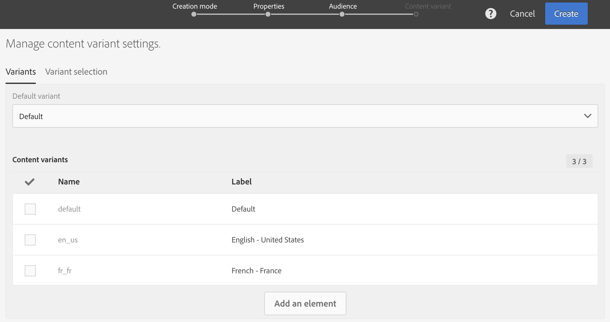

# 建立多語言電子郵件{#creating-a-multilingual-email}

您可以向具有不同首選語言的配置檔案發送多語言電子郵件：每個配置檔案都將收到電子郵件的變體，使用其首選語言。

為此，請檢查您是否有可用的多語言電子郵件模板。 如果不是，請瞭解如何在 [此部分](../../channels/using/multilingual-messages-template.md)。

觀眾基於具有完成的優選語言資訊的簡檔。

1. 基於 [多語言模板](../../channels/using/multilingual-messages-template.md)。

   

1. 定義電子郵件的一般屬性與目標對象，就像標準電子郵件一樣。請參閱[建立對象](../../audiences/using/creating-audiences.md)區段。

1. 在建立嚮導的第四步中，定義變型選項。 如果 [多語言模板](../../channels/using/multilingual-messages-template.md) 已包含所有正確的參數，您可以直接按一下 **[!UICONTROL Create]** 按鈕

   

   如果需要，請使用 **[!UICONTROL Add an element]** 按鈕 **[!UICONTROL Default]** 不能刪除變型。 設定為時 **[!UICONTROL default]**。 [個人資料的首選語言](../../audiences/using/creating-profiles.md) 的下界。 也可以設定 **[!UICONTROL Default]** 變種到其他語言。

1. 確認建立電子郵件：然後將顯示電子郵件儀表板。
1. 為每個變型定義電子郵件內容。 根據您所選取的範本，您可以定義多個主旨、數個寄件者名稱或數個不同內容。使用下拉菜單在元素的不同變型之間導航。 如需詳細資訊，請參閱[內容編輯器](../../designing/using/designing-content-in-adobe-campaign.md)區段。

   

1. Test並驗證您的消息。 請參閱 [發送證明](../../sending/using/sending-proofs.md) 的子菜單。
1. 安排發送 **[!UICONTROL Send after confirmation option]**。
1. 發送電子郵件後，您可以訪問其日誌和報告來衡量您的市場活動的成功。 如需報告的詳細資訊，請參閱[本區段](../../reporting/using/about-dynamic-reports.md)。

