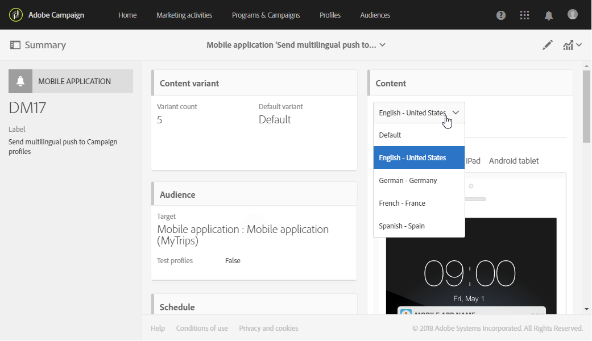

# 建立多語言推播通知{#creating-a-multilingual-push-notification}

## 關於多語言推播通知 {#about-multilingual-push-notification}

根據使用者偏好的語言和地區傳送訊息，以個人化您的推播通知內容。 您可以直接在內容編輯器中匯入多語言推播通知內容變體，並在單一傳送中傳送多語言推播通知。

此功能可運用收件者描述檔中指定的偏好語言，或是行動應用程式訂閱者的系統語言偏好設定，視推播通知的傳送範本而定。 如果未為特定使用者填入語言偏好設定，系統會使用在建立多語言推播通知時定義的預設變數。 如需如何管理您的設定檔和訂閱者的詳細資訊，請參閱本 [指南](../../audiences/using/get-started-profiles-and-audiences.md)。

若要在推播通知傳遞中使用多語言內容變體，請遵循下列步驟：

* [步驟1: 上傳多語言內容變體](#step-1--upload-multilingual-content-variant)
* [步驟2: 使用多語言內容變體預覽並完成推播通知](#step-2--preview-and-finalize-a-push-notification-using-multilingual-content-variants)
* [步驟3: 傳送及分析多語言推播通知傳送](#step-3--send-and-analyze-multilingual-push-notification-delivery)

## 步驟1: 上傳多語言內容變體 {#step-1--upload-multilingual-content-variant}

在個人化您的多語言推播通知之前，我們首先需要將內容變體上傳至多語言傳送範本，並建立傳送。

>[!NOTE]
>
>如果要為每個語言變體手動建立變體，也可以跳過此步驟。

1. 在中，單 **[!UICONTROL Marketing activities]**&#x200B;擊按鈕，然 **[!UICONTROL Create]** 後選擇 **[!UICONTROL Push notification]**。
1. 如果您要 **[!UICONTROL Send multilingual push to Campaign profiles]****[!UICONTROL Send multilingual push to app subscriber]** 鎖定已訂閱您行動應用程式的Adobe Campaign設定檔，或範本，以傳送推播通知給選擇從行動應用程式接收通知的所有使用者，請選取範本。

   

1. 輸入您的推播通知屬性，並在欄位中選取您的行動應用 **[!UICONTROL Associate a Mobile App to a delivery]** 程式。

   請注意，下拉式清單將同時顯示SDK V4和Adobe Experience Platform SDK應用程式。

1. 在視窗 **[!UICONTROL Audiences]** 中，拖放查詢以微調您的觀眾。

   添加的查詢取決於所選模板： 如果您選擇范 **[!UICONTROL Send multilingual push to Campaign profiles]** 本，則可以查詢行動應用程式的已知收件者。 而如果您選擇范 **[!UICONTROL Send multilingual push to app subscriber]** 本，則可以查詢已選擇加入之特定應用程式的所有訂閱者。
   >[!NOTE]
   >
   >如果您以特定語言為目標對象，則需要在CSV檔案中列出每個目標語言。

   

1. 在視窗 **[!UICONTROL Manage Content Variants]** 中，拖放您的檔案或從電腦選取檔案。

   檔案必須是UTF8編碼，而且必須有特定的版面，您可以按一下選項找 **[!UICONTROL Download the sample file]** 到。 您也應使用正確的語法來設定值。 如需檔案格式和支援地區設定的詳細資訊，請參閱此 [技術](https://helpx.adobe.com/campaign/kb/acs-generate-csv-multilingual-push.html)。

   

1. 上傳檔案後，語言變數會自動填入標籤 **[!UICONTROL Variants]** 中。 請注意，如果未為目標 **[!UICONTROL Default variant]** 使用者指定偏好的語言，您可以在檔案中提供預設內容變體。

   

1. 此標 **[!UICONTROL Variant selection]** 簽將提供指令碼，以決定要根據傳送範本來考慮的語言偏好設定。 這是現成可用的指令碼，不需要您進行任何變更。
1. 如果您想要新增更多未出現在匯入檔案中的變數，可以按一下按鈕並視需要新增 **[!UICONTROL Add an element]** 多種新的語言變數。

   新增從檔案上傳的變數以外的變數，將不會將任何內容連結至此語言。 您必須直接在傳送控制面板中編輯內容。

   

1. 完成 **[!UICONTROL Create]** 配置時按一下。 您隨時都可以回到視窗， **[!UICONTROL Content variant]** 並從傳送控制面板進行一些變更。

   

您現在可以開始個人化多語言推播通知。

## 步驟2: 使用多語言內容變體預覽並完成推播通知 {#step-2--preview-and-finalize-a-push-notification-using-multilingual-content-variants}

上傳包含內容變體的檔案後，您現在可以預覽推播通知傳送的不同變體。

除了從檔案上傳的變數外，您也可以建立和編輯更多變數。

1. 在傳送 **[!UICONTROL Content]** 控制面板的視窗中，下拉式清單可讓您根據所選的語言預覽推播通知內容。

   

1. 如果未針對特定語言指定內容變體，請按一下預覽下方的鐘形圖示，開始將內容新增至此語言變體。

   按一下視 **[!UICONTROL Content]** 窗，推播通知會代表下拉式清單中所選語言的內容。 在此視窗中所做的變更只會影響一種語言。

1. 您也可以按一下內容變體，進一步自訂內容變體，例如使用個人化欄位。

   如需如何自訂推播通知的詳細資訊，請參閱本 [節](../../channels/using/customizing-a-push-notification.md)。

   

1. 如果要 **[!UICONTROL Content variant]** 添加或刪除語言變體，請按一下窗口。

   請注意，新增語言後，您必須手動將內容新增至連結至新增語言的推播通知。

   

您的多語言推播通知傳送現在已準備好可傳送。

## 步驟3: 傳送及分析多語言推播通知傳送 {#step-3--send-and-analyze-multilingual-push-notification-delivery}

您的多語言內容變體推播通知現在已準備好傳送給您的使用者。

1. 若要開始準備傳送，請按一下 **[!UICONTROL Prepare]** 按鈕。
1. 當準備完成時，無警告，您可以按一下按 **[!UICONTROL Confirm]** 鈕開始傳送多語言推播。

   

1. 成功傳送推播通知後，按一下 **[!UICONTROL Reports]** 圖示 **[!UICONTROL Dynamic reports]** 並分析傳送的成功。

   

1. Select **[!UICONTROL Push notification report]**.
1. 將維度拖放至 **[!UICONTROL Variant]** 您的面板，開始篩選資料。

   

您現在可以測量多語言推播通知傳送對收件人的影響。

**相關主題：**

* [推播通知報告](../../reporting/using/push-notification-report.md)
* [在工作流程中傳送推播通知](../../automating/using/push-notification-delivery.md)
* [使用單一工作流程觸及多語言觀眾](https://helpx.adobe.com/campaign/kb/simplify-campaign-management.html#Engageyourcustomersateverystep)
