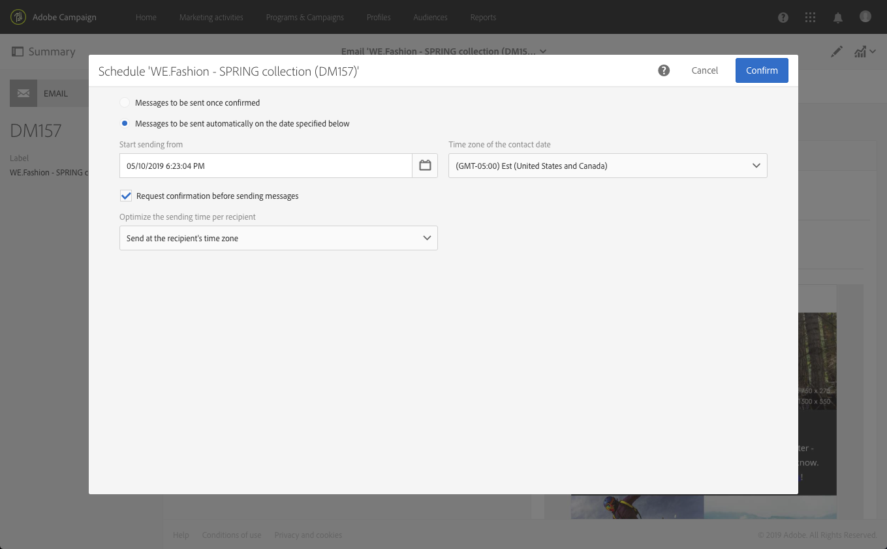

# 建立電子郵件{#creating-an-email}

您可以從[促銷活動](../../start/using/marketing-activities.md#creating-a-marketing-activity)、從Adobe Campaign [首頁](../../start/using/interface-description.md#home-page)或[行銷活動清單](../../start/using/marketing-activities.md#about-marketing-activities)建立電子郵件。 您也可以從工作流程建立單一傳送和循環寄送的電子郵件。

 [在影片中探索此功能](#video)

1. 開始建立電子郵件行銷活動後，請選取您要使用的範本。

   依預設，您可以從多個範本中選擇每個行銷活動。 這可讓您根據您的需求預先設定某些參數，並指派品牌給您的傳送。 有關詳細資訊，請參閱[管理模板](../../start/using/marketing-activity-templates.md)。

   

   >[!NOTE]
   >
   >預設會隱藏後續與 A/B 測試範本。如果要顯示左側的框（**[!UICONTROL Filter]**&#x200B;橫向面板），請選中它們。

1. 輸入電子郵件的一般屬性。 您可以在&#x200B;**Label**&#x200B;欄位中輸入名稱，並編輯ID。 活動名稱及其ID都會出現在介面中，但訊息收件者看不到。

   您可以新增使用者可在行銷活動內容中看到的說明。

   

   >[!NOTE]
   >
   >您可以從首頁或行銷活動清單中在父促銷活動中建立電子郵件。 從已建立的促銷活動中選取它。

1. 根據您的業務條件定義訊息的目標。 請參閱[關於配置檔案](../../audiences/using/about-profiles.md)。

   您也可以定義將驗證訊息的測試設定檔。 請參閱[管理測試設定檔](../../audiences/using/managing-test-profiles.md)。

   

1. 使用[電子郵件設計器](../../designing/using/designing-content-in-adobe-campaign.md)定義並個人化郵件內容、發件人姓名和主旨。 如需詳細資訊，請參閱[關於電子郵件內容設計](../../designing/using/designing-content-in-adobe-campaign.md)。

   

   您可以直接使用預先定義的內容範本，或使用Dreamweaver或Adobe Experience Manager來設計訊息。 如果您不想當設計人員，也可以上傳已為您準備好的內容，或從URL匯入現有內容。 請參閱「[選擇現有內容](../../designing/using/using-existing-content.md)」。

1. 預覽您的訊息。 請參閱「[預覽訊息](../../sending/using/previewing-messages.md)」。
1. 確認建立電子郵件。

   >[!NOTE]
   >
   >若要儲存您的電子郵件，您必須先對內容進行一些編輯。 如果此時按一下&#x200B;**[!UICONTROL Cancel]**，將無法完成嚮導，並且將不建立您的電子郵件。

   接著會顯示電子郵件控制面板。 它允許您檢查消息並準備send[。](../../sending/using/preparing-the-send.md)

   右上角的&#x200B;**[!UICONTROL Edit properties]**&#x200B;按鈕可讓您編輯電子郵件的屬性。 例如，您可以設定電子郵件，以便在傳送準備時計算其標籤。  [本節](../../administration/using/configuring-email-channel.md#list-of-email-properties)列出了可用參數。

   

1. 排程傳送。請參閱[排程訊息](../../sending/using/about-scheduling-messages.md)。

   

1. 準備訊息以分析其目標。 請參閱[準備send](../../sending/using/confirming-the-send.md)。

   

   >[!NOTE]
   >
   >您可以設定全域跨通道疲勞規則，這會從促銷活動自動排除過度請求的設定檔。有關詳細資訊，請參閱[疲勞規則](../../sending/using/fatigue-rules.md)。

1. 傳送校樣以檢查並驗證您的訊息，並監控其收件匣呈現。請參閱[傳送校樣](../../sending/using/sending-proofs.md)。

   

1. 傳送訊息並透過訊息儀表板和記錄來檢查其傳送。 請參閱[發送消息](../../sending/using/confirming-the-send.md)。

   

1. 使用傳送報表評估訊息的影響。 如需有關報告的詳細資訊，請參閱[本節](../../reporting/using/about-dynamic-reports.md)。

**相關主題**：

* [建立個人](https://helpx.adobe.com/tw/campaign/kb/acs-get-started-with-emails.html) 化電子郵件逐步指南
* [Adobe Campaign與Dreamweaver整合](../../designing/using/using-integrations.md#editing-content-in-dreamweaver)
* [與Adobe Experience Manager整合](../../integrating/using/integrating-with-experience-manager.md)

## 教學課程影片{#video}

此影片示範如何建立電子郵件。

>[!VIDEO](https://video.tv.adobe.com/v/23721?quality=12)

其他Campaign Standard操作說明影片可在[這裡](https://experienceleague.adobe.com/docs/campaign-standard-learn/tutorials/overview.html?lang=zh-Hant)取得。
