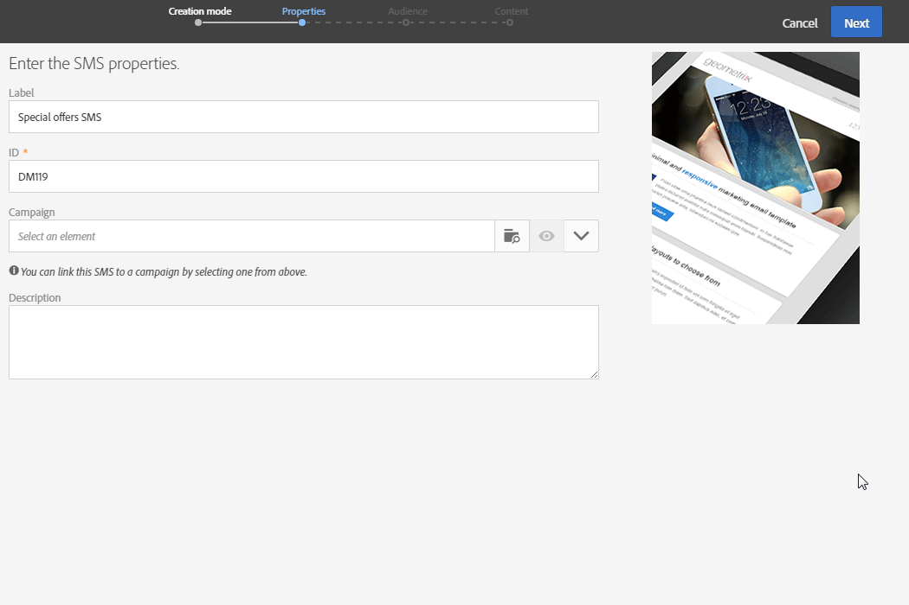

# 建立 SMS 訊息{#creating-an-sms-message}

建立簡訊傳送與建立一般電子郵件非常類似。下列步驟將說明此通道的特定設定。如需其他選項的詳細資訊，請參閱[建立電子郵件](../../channels/using/creating-an-email.md)。

在 [SMS 設定](../../administration/using/configuring-sms-channel.md)區段中會詳細說明進階 SMS 參數。

若要建立 SMS 訊息並傳送至行動電話，您需要：

* 在 **[!UICONTROL Mobile (SMS)]** 通道上使用 **[!UICONTROL Bulk delivery]** 模式設定的 **[!UICONTROL Routing]** 外部帳戶。如需詳細資訊，請參閱[區段](../../administration/using/configuring-sms-channel.md#defining-an-sms-routing)區段。
* 正確連結至此外部帳戶的傳遞範本。

1. 建立 SMS 傳送。您可從 Adobe Campaign [首頁](../../start/using/interface-description.md#home-page)、[促銷活動](../../start/using/marketing-activities.md#creating-a-marketing-activity)或[行銷活動清單](../../start/using/programs-and-campaigns.md#creating-a-campaign)中執行此作業。

   您也可以在工作流程中新增 SMS 活動。如需詳細資訊，請參閱[工作流程](../../automating/using/sms-delivery.md)指南。

   建立訊息時，將顯示精靈，引導您完成最重要的步驟。透過精靈定義的內容，仍然可以從訊息控制面板進行編輯。

1. 選取您要使用的範本。您可以選取現成的 SMS 範本或您自己的範本。

   

   若要傳送至行動電話，傳遞範本必須正確連結至傳送外部帳戶的 SMS。

1. 輸入 SMS 的一般屬性。

   

   活動標籤及其 ID 都會顯示在介面中，但訊息收件者看不到這些內容。

1. 指定您要設定為目標的對象。您可以定義並結合規則，以選取現有對象或直接設定目標母體。

   

1. 將內容新增至 SMS。您也可以在 SMS 建立完成後，按一下傳送控制面板的 **[!UICONTROL Content]** 區段來定義內容。請參閱[關於 SMS 內容設計](../../channels/using/about-sms-and-push-content-design.md)。

   如果您已將個人化欄位或條件文字插入 SMS 訊息的內容，則訊息的長度可能會因收件者而異。事實上，這些因素可能會引進 GSM 編碼未考慮的字元。這就是為什麼在實施個人化後，必須評估訊息長度的原因。請參閱[個人化 SMS 訊息](../../channels/using/personalizing-sms-messages.md)。

   

1. 確認建立訊息。之後會顯示其控制面板。
1. 排程傳送。SMS 可在訊息準備後手動傳送，或是在排程日期自動傳送。請參閱[排程訊息](../../sending/using/about-scheduling-messages.md)。
1. 準備訊息以分析其有效性、個人化和目標。

   

   >[!NOTE]
   >
   >您可以設定全域跨通道疲勞規則，這會從促銷活動自動排除過度請求的設定檔。請參閱[疲勞規則](../../sending/using/fatigue-rules.md)。

1. 傳送校樣以檢查並驗證您的訊息，並監控其收件匣呈現。請參閱[傳送校樣](../../sending/using/sending-proofs.md)區段。
1. 確認訊息的傳送。傳送將依據您定義的排程開始進行。

   

已傳送訊息。您可以透過訊息控制面板和記錄來檢查傳送。

傳送完成後，您就可以開始使用內建或自訂傳遞報告來衡量訊息的影響。

**相關主題：**

* [關於 SMS 和推播內容版本](../../channels/using/about-sms-and-push-content-design.md)
* [管理範本](../../start/using/marketing-activity-templates.md)
* [建立 SMS 傳送](https://docs.adobe.com/content/help/zh-Hant/campaign-standard-learn/tutorials/communication-channels/mobile/sms/sms-delivery.translate.html)影片。

