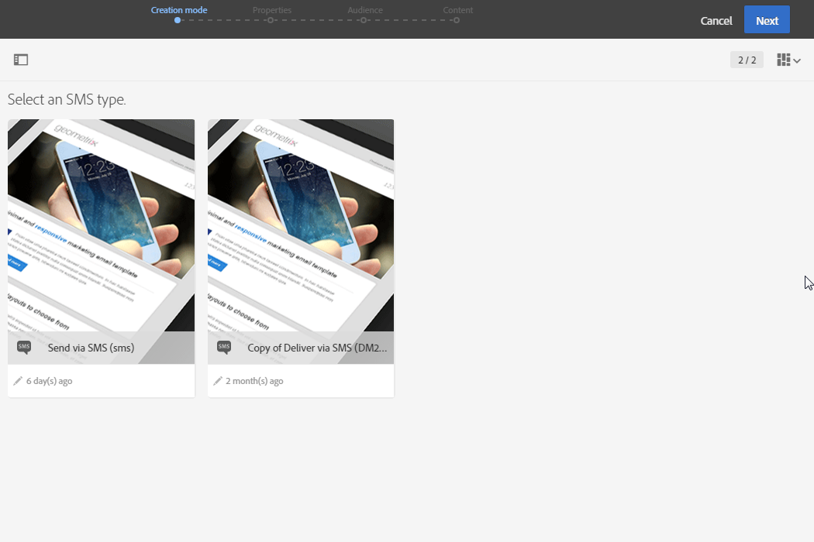
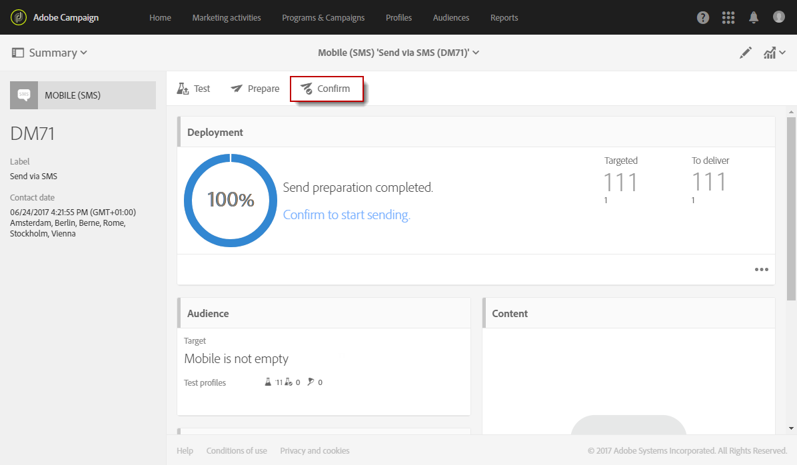

# Creating an SMS message{#creating-an-sms-message}

建立SMS傳送非常類似於建立一般電子郵件。下列步驟說明此渠道專屬的組態。Refer to [Creating an email](../../channels/using/creating-an-email.md) for more information on other options.

Advanced SMS parameters are detailed in the [SMS configuration](../../administration/using/configuring-sms-channel.md) section.

若要建立SMS訊息並傳送至行動電話，您需要：

* **[!UICONTROL Routing]****[!UICONTROL Mobile (SMS)]** 在頻道上設定 **[!UICONTROL Bulk delivery]** 模式的外部帳戶。For more on this, refer to the [Routing](../../administration/using/configuring-sms-channel.md#defining-an-sms-routing) section.
* 已正確連結至此外部帳戶的傳送範本。

1. 建立SMS傳送。You can do it from the Adobe Campaign [home page](../../start/using/interface-description.md#home-page), in a [campaign](../../start/using/marketing-activities.md#creating-a-marketing-activity) or in the [marketing activity list](../../start/using/programs-and-campaigns.md#creating-a-campaign).

   您也可以在工作流程中新增SMS活動。For more on this, refer to the [Workflows](../../automating/using/sms-delivery.md) guide.

   建立訊息時，會顯示精靈以逐步引導您進行最重要的步驟。透過精靈定義的項目仍然可以從訊息控制面板進行編輯。

1. 選擇您要使用的範本。您可以選擇現成可用的SMS範本或其中一個範本。

   

   若要傳遞至行動電話，傳送範本必須正確連結至SMS路由外部帳戶。

1. 輸入SMS的一般屬性。

   

   活動標籤及其ID都會出現在介面中，但訊息收件者看不到。

1. 指定您要定位的對象。您可以透過定義和結合規則，選取現有對象或直接定位人口。

   

1. 將內容新增至SMS。You can also define the content by clicking the **[!UICONTROL Content]** section of the delivery dashboard, once the SMS creation is finalized. See [About SMS content design](../../designing/using/about-sms-and-push-content-design.md).

   如果您在SMS訊息的內容中插入個人化欄位或條件文字，訊息的長度可能會隨著收件者而有所不同。事實上，這些因素可能會引入GSM編碼未考量的字元。這就是為甚麼在個人化完成後，必須評估訊息長度的原因。See [Personalizing SMS messages](../../channels/using/personalizing-sms-messages.md).

   

1. 確認建立訊息。接著會顯示其控制面板。
1. 排程傳送。SMS可在訊息準備後手動傳送，或在排程日期自動傳送。See [Scheduling messages](../../sending/using/about-scheduling-messages.md).
1. 準備訊息以分析其有效性、個人化和目標。

   

   >[!NOTE]
   >
   >您可以設定全域跨通道疲勞規則，自動排除促銷活動中被覆蓋的設定檔。See [Fatigue rules](../../administration/using/fatigue-rules.md).

1. 傳送校樣以檢查並驗證您的訊息，並監控其收件匣演算。See the [Sending proof](../../sending/using/managing-test-profiles-and-sending-proofs.md#sending-proofs) section.
1. 確認訊息傳送。傳送將依您定義的排程開始。

   

傳送訊息。您可以透過訊息控制面板和記錄檔檢查其傳遞情況。

傳送完成後，您可以開始測量訊息與內建或自訂傳送報表的影響。

**相關主題：**

* [關於SMS和推播內容版本](../../designing/using/about-sms-and-push-content-design.md)
* [管理範本](../../start/using/about-templates.md)
* [建立SMS傳送](https://helpx.adobe.com/campaign/kt/acs/using/acs-creating-a-sms-delivery-feature-video-use.html) 視訊

