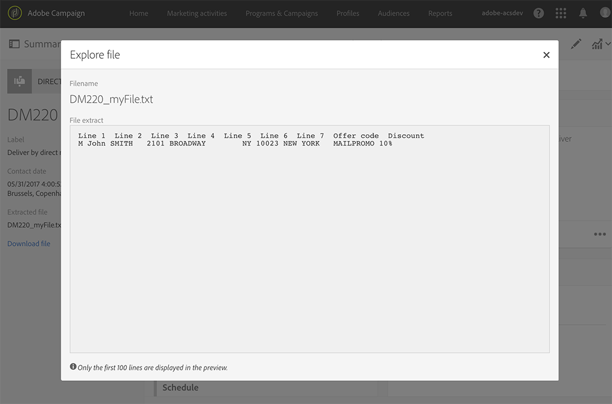

# 建立直接郵件{#creating-the-direct-mail}

建立直接郵件傳送與建立一般電子郵件非常類似。 下列步驟將說明此渠道的特定配置。 如需其 [他選項的詳細資訊](../../channels/using/creating-an-email.md) ，請參閱建立電子郵件。

1. 建立新的直接郵件傳送。 您可以從Adobe Campaign首頁、促銷活 [動或行銷活動清單](../../start/using/interface-description.md#home-page), [建立一](../../start/using/marketing-activities.md#creating-a-marketing-activity) 個促銷活動 。

   >[!NOTE]
   >
   >您也可以在工作流程中新增直接郵件活動。 如需詳細資訊，請參閱「工作 [流程](../../automating/using/direct-mail-delivery.md) 」指南。

   

1. 選擇現成可用的範本或您 **[!UICONTROL Direct mail]**自己的範本之一。 有關模板的詳細資訊，請參閱「管[理模板](../../start/using/marketing-activity-templates.md)」部分。

   

1. 輸入傳送的一般屬性。

   

1. 定義要包含在擷取檔案中的對象，以及測試和陷印設定檔。 See [Defining the direct mail audience](../../channels/using/defining-the-direct-mail-audience.md).

   

   >[!NOTE]
   >
   >對象定義與定義一般電子郵件對象非常類似。 請參閱 [建立觀眾](../../audiences/using/creating-audiences.md)。

1. 編輯檔案的內容：欄，以包含每個描述檔、檔案結構、頁首和頁尾。 See [Defining the direct mail content](../../channels/using/defining-the-direct-mail-content.md).

   

1. 按一下傳送 **[!UICONTROL Schedule]**控制面板的區段，以定義連絡人日期。 對於直接郵件，聯絡日期是強制的。 如需詳細資訊，請參閱[排程傳送](../../sending/using/about-scheduling-messages.md)。

   

1. 如果您新增測試設定檔(請參 [閱新增測試和陷印設定檔](../../channels/using/defining-the-direct-mail-audience.md#adding-test-and-trap-profiles))，您可以在準備最終檔案之前先測試傳送。 它可讓您建立僅包含所選測試設定檔的範例檔案。

   按一下以 **[!UICONTROL Test]**產生範例檔案。 按一**[!UICONTROL Summary]**&#x200B;下左上角的，然後選取 **[!UICONTROL Proofs]**。 在螢幕的左側，選擇校樣並按一下**[!UICONTROL Download file]**。

   >[!NOTE]
   >
   >必 **[!UICONTROL Export]**須具備此角色，才能允許Adobe Campaign匯出檔案並供下載。 請聯絡您的管理員。

   

1. 在您定義傳送內容、對象和連絡人日期後，按一下傳送控 **[!UICONTROL Prepare]**制面板上的按鈕。

   

   套用類型學規則。 例如，所有未指定的郵遞區號都會從目標中排除。 這就是為什麼您需要確定您已勾選設定檔資 **[!UICONTROL Address specified]**訊中的方塊(請參閱[Recommendations](../../channels/using/about-direct-mail.md#recommendations))。 如果您已在直接郵**[!UICONTROL Maximum volume of message]** 件屬性中或在模板級別定義了，則也將在此處應用。

   

   >[!NOTE]
   >
   >您可以設定全域跨通道疲勞規則，自動從促銷活動中排除過度徵求的個人檔案。 請參 [閱疲勞規則](../../administration/using/fatigue-rules.md)。

1. 按一下 **[!UICONTROL Explore file]**以預覽檔案的前100行。

   

   您可在畫面左側存取完整檔案，以供本機下載。 下載檔案會在功能表中產生記錄 **[!UICONTROL Export audits]**項目。 有關導出審計的詳細資訊，請參閱「審[計導出](../../administration/using/auditing-export-logs.md)」部分。

   >[!NOTE]
   >
   >必 **[!UICONTROL Export]**須具備此角色，才能允許Adobe Campaign匯出檔案並供下載。 請聯絡您的管理員。

   如果您需要變更傳送內容，您只需按一下按鈕， **[!UICONTROL Regenerate file]**即可將變更納入考量。 不必再做準備了。

   

1. 若要確認檔案是最終檔案，請按一下傳送控 **[!UICONTROL Confirm]**制面板中的。

   

您現在可以將解壓縮檔案傳送至直效郵件提供者。 對於此，您有幾個選項：

* 透過一般電子郵件傳送，並附上檔案
* 透過Campaign傳送：在促銷活動工作流程中 [執行直](../../automating/using/direct-mail-delivery.md) 接郵件， **[!UICONTROL Transfer file]**並新增以透過FTP傳送檔案。 請參閱[傳輸檔案](../../automating/using/transfer-file.md)。

提供者會擷取錯誤位址的清單，並傳送此資訊給Adobe Campaign,Adobe Campaign會自動將錯誤位址列入黑名單。 See [Return to sender](../../channels/using/return-to-sender.md).
