# 建立直接郵件{#creating-the-direct-mail}

建立直接郵件傳送與建立一般電子郵件非常類似。 下列步驟將說明此通道的特定設定。 如需其他選項的詳細資訊，請參閱[建立電子郵件](../../channels/using/creating-an-email.md)。

>[!NOTE]
>
>您也可以在工作流程中新增直接郵件活動。 如需詳細資訊，請參閱[工作流程](../../automating/using/direct-mail-delivery.md)指南。

1. 建立新的直接郵件傳送。 您可以從 Adobe Campaign [首頁](../../start/using/interface-description.md#home-page)、[行銷活動](../../start/using/marketing-activities.md#creating-a-marketing-activity)或[行行銷活動清單](../../start/using/programs-and-campaigns.md#creating-a-campaign)建立一個傳送。

   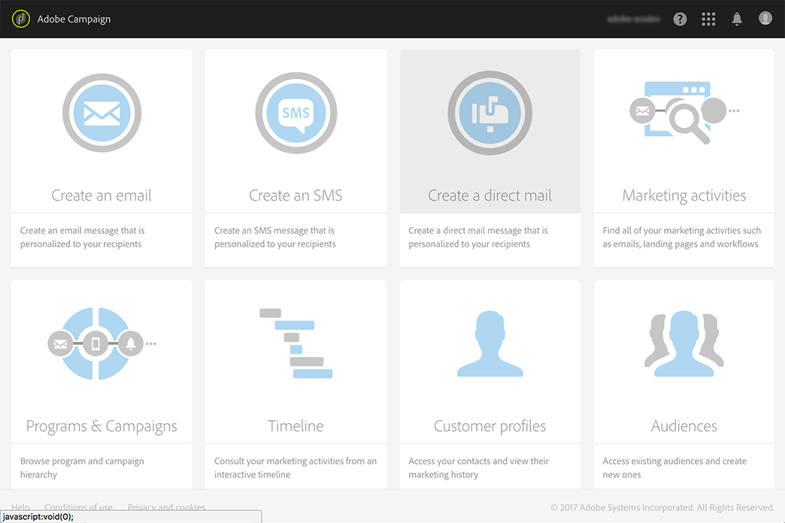

1. 選取現成可用的 **[!UICONTROL Direct mail]** 範本或其中一個您專屬的範本。 有關範本的詳細資訊，請參閱[管理範本](../../start/using/marketing-activity-templates.md)區段。

   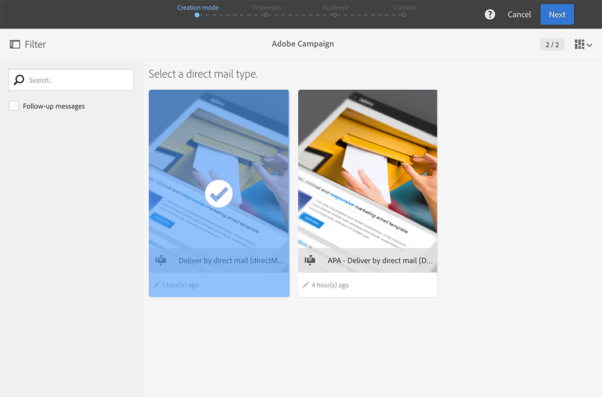

1. 輸入傳送的一般屬性。

   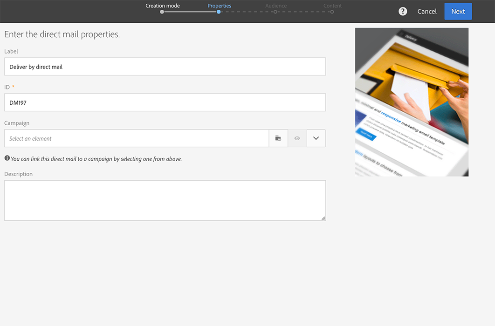

   >[!NOTE]
   >
   >活動名稱及其ID都會顯示在介面中，但訊息收件者看不到它們。
   >
   >確認ID欄位未包含任何空白以避免出現任何差異，例如，在與Adobe Analytics整合時。

1. 定義要包含在擷取檔案中的客群，以及測試和捕捉器輪廓。 [定義直接郵件客群](../../channels/using/defining-the-direct-mail-audience.md).

   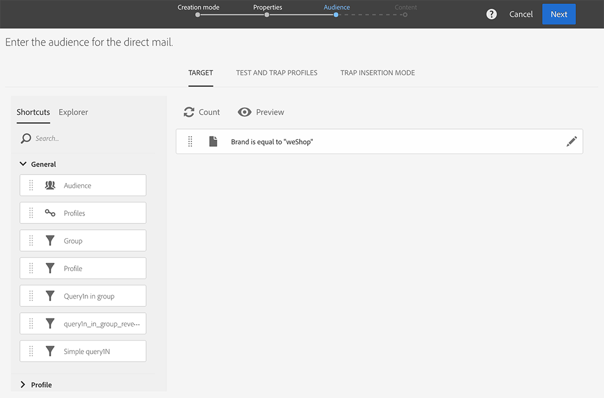

   >[!NOTE]
   >
   >客群定義與定義一般電子郵件客群非常類似。 請參閱[建立客群](../../audiences/using/creating-audiences.md)。

1. 編輯檔案的內容：欄以包含每個輪廓、檔案結構、頁首和頁尾。 [定義直接郵件內容](../../channels/using/defining-the-direct-mail-content.md).

   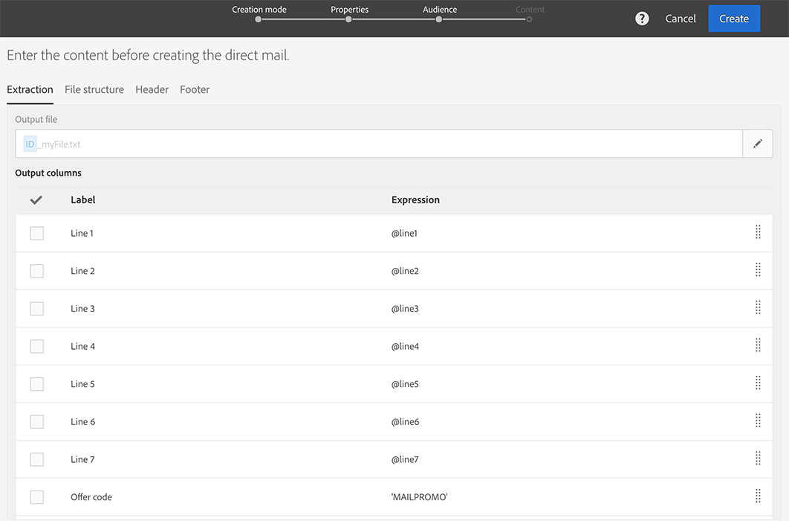

1. 按一下傳送控制面板的 **[!UICONTROL Schedule]** 區段，以定義聯絡人日期。 對於直接郵件，聯絡日期是必填欄位。 如需詳細資訊，請參閱[排程傳送](../../sending/using/about-scheduling-messages.md)。

   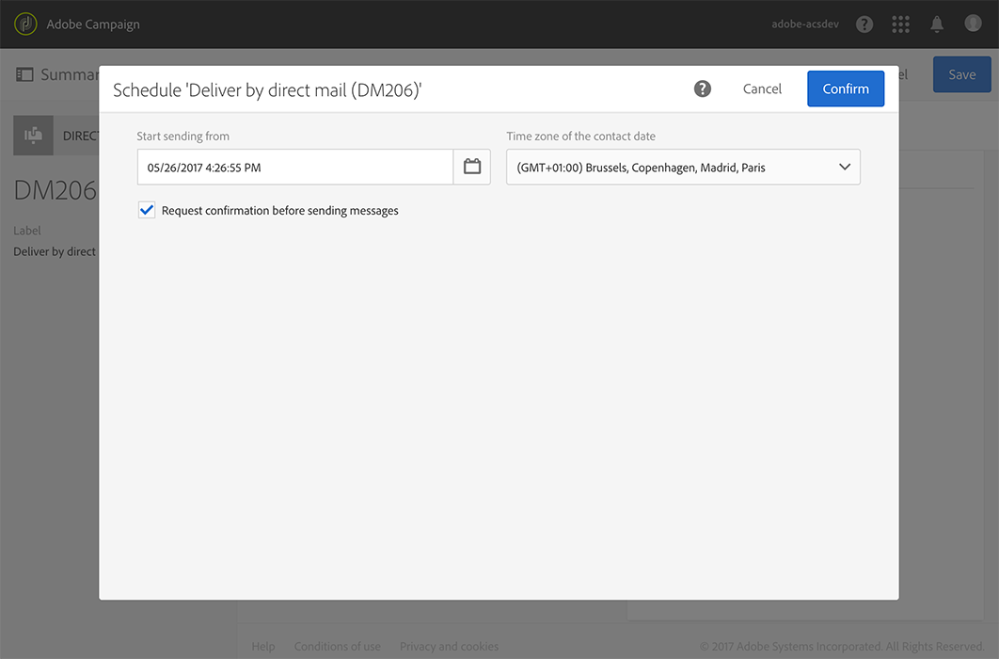

1. 如果您新增測試輪廓（請參閱[新增測試和捕捉器輪廓](../../channels/using/defining-the-direct-mail-audience.md#adding-test-and-trap-profiles)），您可以在準備最終檔案之前先測試傳送。 它可讓您建立僅包含所選測試輪廓的範例檔案。

   按一下 **[!UICONTROL Test]** 以產生範例檔案。 按一下左上角的&#x200B;**[!UICONTROL Summary]**，然後選取&#x200B;**[!UICONTROL Proofs]**。 在畫面左側，選取校樣並按一下 **[!UICONTROL Download file]**。

   >[!NOTE]
   >
   >必須具備　**[!UICONTROL Export]**　角色，才能讓　Adobe Campaign　匯出檔案並供下載。 請聯絡您的管理員。

   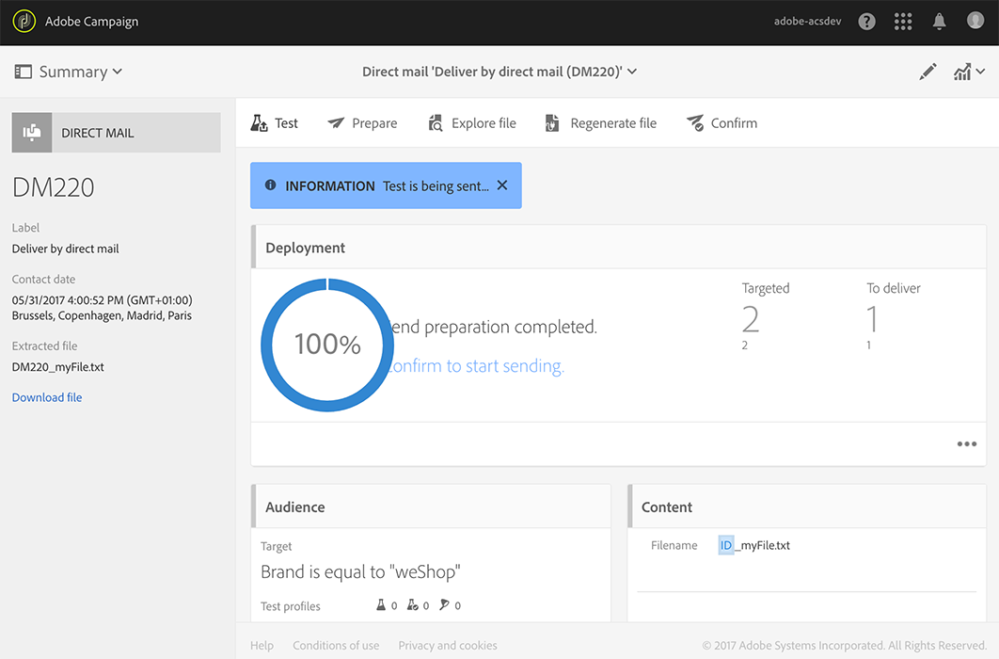

1. 在您定義傳送內容、客群和聯絡人日期後，按一下傳送控制面板上的　**[!UICONTROL Prepare]**　按鈕。

   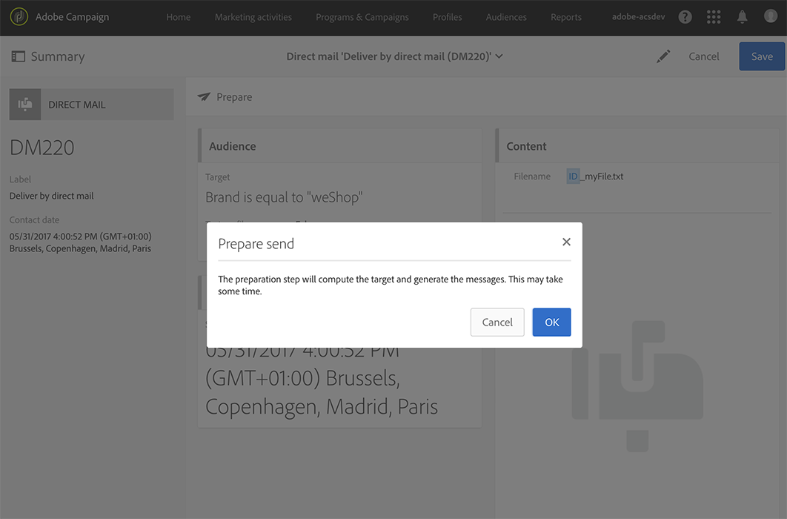

   套用類型規則。 例如，所有未指定的郵遞區號都會從目標中排除。 這就是為什麼您需要確定您已核取輪廓資訊中的　**[!UICONTROL Address specified]**　方塊（請參閱[建議](../../channels/using/about-direct-mail.md#recommendations)）。 如果您已在直接郵件屬性中或在範本層別定義　**[!UICONTROL Maximum volume of message]**，則也將在此處套用。

   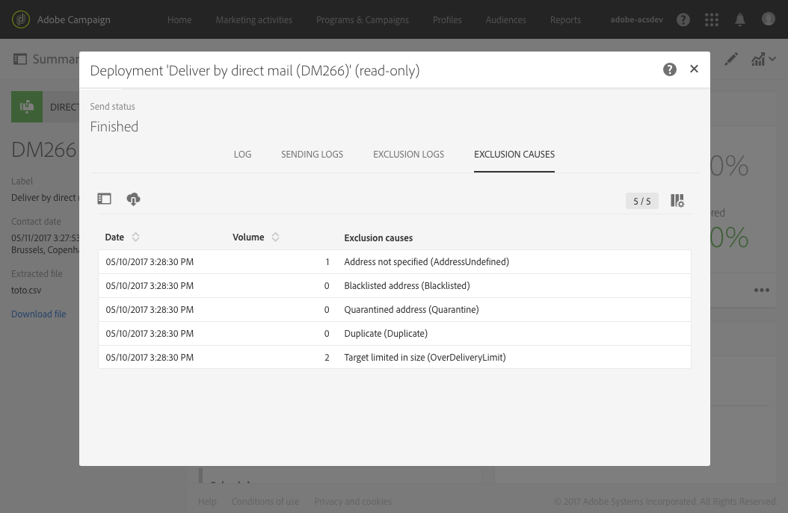

   >[!NOTE]
   >
   >您可以設定全域跨通道疲勞規則，這會從促銷活動自動排除過度請求的輪廓。 請參閱[疲勞規則](../../sending/using/fatigue-rules.md)。

1. 按一下 **[!UICONTROL Explore file]** 以預覽檔案的前　100　行。

   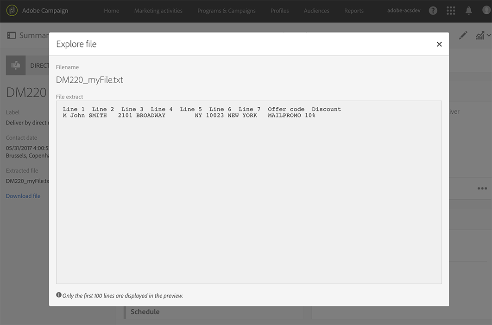

   您可在畫面左側存取完整檔案，以供本機下載。 下載檔案會在　**[!UICONTROL Export audits]**　功能表中產生記錄項目。 有關匯出稽核的詳細資訊，請參閱[稽核匯出](../../administration/using/auditing-export-logs.md)區段。

   >[!NOTE]
   >
   >必須具備　**[!UICONTROL Export]**　角色，才能讓　Adobe Campaign　匯出檔案並供下載。 請聯絡您的管理員。

   如果您需要變更傳送內容，您只需按一下　**[!UICONTROL Regenerate file]**　按鈕，即可將變更納入考量。 不需要再做準備。

   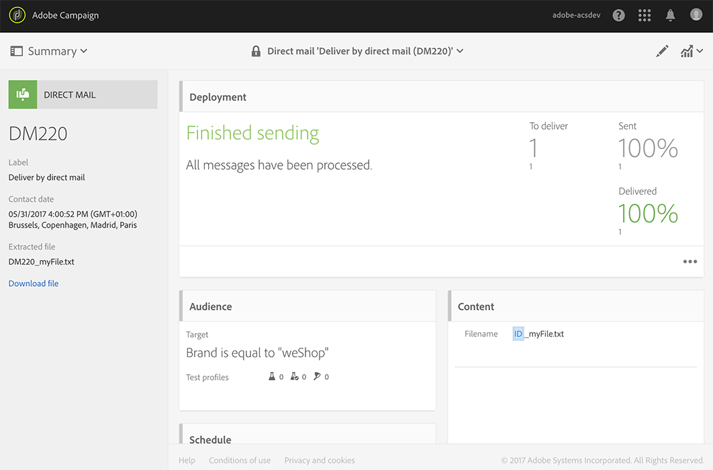

1. 若要確認檔案是最終檔案，請按一下傳送控制面板中的　**[!UICONTROL Confirm]**。

   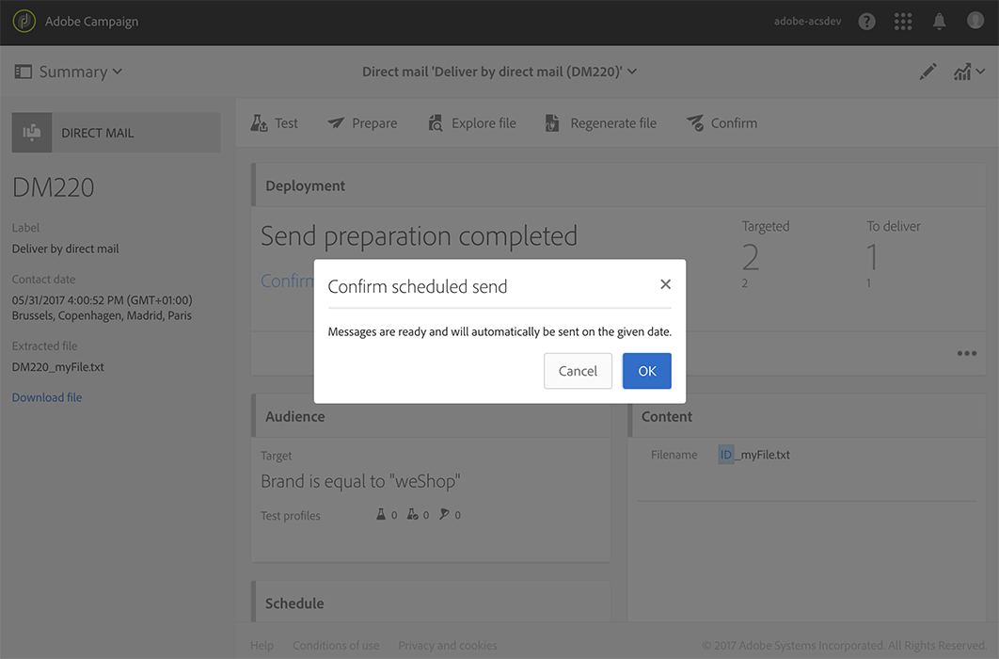

您現在可以將解壓縮檔案傳送至直效郵件提供者。 對於此，您有幾個選項：

* 透過一般電子郵件傳送，並附上檔案
* 透過　Campaign　傳送：在促銷活動[工作流程](../../automating/using/direct-mail-delivery.md)中執行直接郵件，並新增　**[!UICONTROL Transfer file]**　以透過　FTP　傳送檔案。 請參閱[傳輸檔案](../../automating/using/transfer-file.md)。

提供者會擷取錯誤位址清單，並將此資訊傳送至Adobe Campaign，由後者自動封鎖錯誤位址。 請參閱[返回至寄件者](../../channels/using/return-to-sender.md)。
