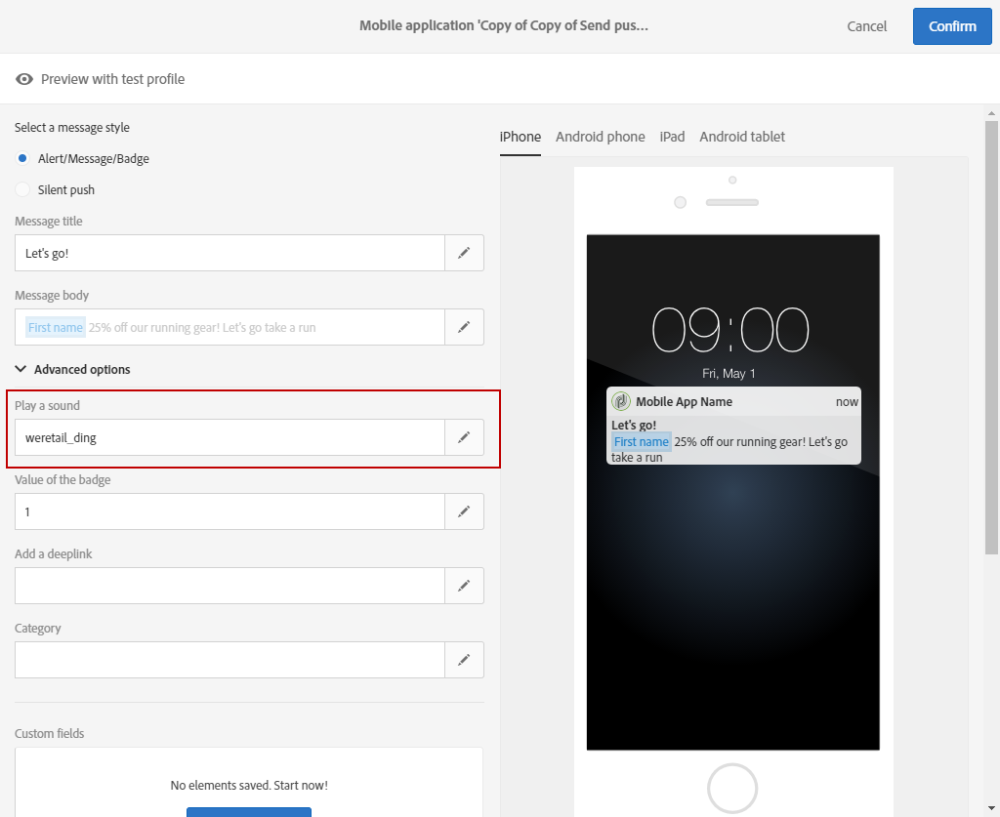

# 自訂推播通知{#customizing-a-push-notification}

為了微調您的推播通知，Adobe Campaign 可讓您在設計推播通知時存取一組進階選項。

若要在 Adobe Campaign 中設定行動應用程式，請參閱下列技術[瞭解 Campaign 標準推播通知裝載結構](https://helpx.adobe.com/tw/campaign/kb/understanding-campaign-standard-push-notifications-payload-struc.html)。

**相關內容：**

* [推播通知報告](../../reporting/using/push-notification-report.md)
* [在工作流程中傳送推播通知](../../automating/using/push-notification-delivery.md)

## 播放音效 {#play-a-sound}

函式 **[!UICONTROL Play a sound]** 可讓應用程式在應用程式未執行時，透過推播通知的傳送，在裝置上播放音效。

音效會提醒使用者推播通知，讓其更具可見性。若要在行動應用程式中加入音效：

1. 開啟推播通知並存取 **[!UICONTROL Advanced options]** 區段。
1. 在 **[!UICONTROL Play a sound]** 欄位中，輸入未加上副檔名的音效檔案檔案檔案名稱，以便在收到通知時由行動裝置播放。

   如需支援媒體格式的詳細資訊，請參閱 [Apple](https://support.apple.com/kb/PH16864?locale=en_US) 和 [Android](https://developer.android.com/guide/topics/media/media-formats) 文件。

   

1. 如果已在行動應用程式的套件中定義檔案，則傳送通知時會播放音效檔案。否則，會播放裝置的預設音效。

然後，使用者只有在手機未靜音時，才會收到推播通知和音效。

## 重新整理徽章值 {#refresh-the-badge-value}

徽章可用來直接在應用程式圖示上顯示新未讀取資訊的數量。當使用者開啟或從應用程式讀取新內容時，徽章值就會消失。

在裝置上收到通知時，它可以重新整理或新增相關應用程式的徽章值。若要從伺服器端傳送徽章值：

1. 開啟推播通知並存取 **[!UICONTROL Advanced options]** 區段。
1. 標章值必須是整數，可以以不同方式更新：

   * 要刷新徽章，請在 **[!UICONTROL Value of the badge]** 欄位中輸入0。這會從應用程式圖示中移除徽章。
   * 要新增徽章值，請在 **[!UICONTROL Value of the badge]** 欄位中輸入任何數字。當使用者收到推播通知時，此號碼會自動出現在標章中。
   * 如果欄位空白或不包含整數，則徽章值不會變更。

   在此，我們在 **[!UICONTROL Value of the badge]** 欄位中輸入 1，讓使用者知道他們的應用程式中有新資訊。

   

1. 在傳送訊息後，使用者會收到推播通知，其應用程式會自動顯示新的徽章值。

   

## 新增深層連結 {#add-a-deeplink}

開發人員可讓您將使用者直接導向到應用程式內的內容（而非開啟網頁瀏覽器頁面）。

開發人員可以包含自訂應用程式內體驗的個人化資料。例如，收件者的名字會自動填入應用程式所導向的頁面上。

若要在推播通知中新增深層連結：

1. 開啟推播通知並存取 **[!UICONTROL Advanced options]** 區段。
1. 在 **[!UICONTROL Add a deeplink]** 欄位中輸入連結。

   

1. 在傳送您的訊息後，使用者將會收到推播通知，並透過與通知互動（例如點選或按一下動作呼叫按鈕）來存取應用程式中的特定頁面。

   

## 定義動作 {#define-an-action}

您可以新增類別ID（如果行動應用程式中有的話），然後顯示動作按鈕。這些通知可讓使用者以更快的方式回應通知，執行不同的工作，而不需在應用程式中開啟或導覽。

使用者手機上顯示的對話方塊需要決定繼續。當使用者選取其中一個動作時，系統會通知應用程式，以便執行任何相關的工作。

若要在推播通知中新增類別：

1. 開啟推播通知並存取 **[!UICONTROL Advanced options]** 區段。
1. 在 **[!UICONTROL Category]** 欄位中輸入預先定義的類別名稱，以在收到推播通知時顯示可操作的按鈕。

   行動應用程式開發人員必須定義類別ID和按鈕在應用程式中的預期行為。如需詳細資訊，請參閱 [Apple Developer 檔案](https://developer.apple.com/library/content/documentation/NetworkingInternet/Conceptual/RemoteNotificationsPG/SupportingNotificationsinYourApp.html)（**設定類別和可操作通知區段**）或 [Android Developer 檔案](https://developer.android.com/guide/topics/ui/notifiers/notifications.html)。

   

1. 傳送推播通知後，使用者會收到該通知，並必須使用先前設定的可操作按鈕採取動作。

   

根據使用者的動作，應用程式會收到通知，以便執行任何相關的工作。

## 新增到期日 {#add-expiration-date}

設定推播通知的到期日可讓您設定特定的到期日，而Apple ([APNS](https://developer.apple.com/documentation/usernotifications/setting_up_a_remote_notification_server/sending_notification_requests_to_apns)) 或 Android ([FCM](https://firebase.google.com/docs/cloud-messaging/concept-options)) 將不再傳送訊息。

若要將到期日期新增至推播通知：

1. 核取 **[!UICONTROL Expire message]** 選項。

   >[!NOTE]
   >
   >透過選取 **[!UICONTROL Expire message]** 選項，持續時間會自動設定為 0。如果您未變更值，APNS 和 FCM 都會嘗試立即傳送訊息。如果失敗，則不會重新發送消息。

1. 在 **[!UICONTROL Duration]** 欄位中，選取推播通知的有效性。

   

1. 在傳送推播通知後，如果使用者由於手機未開機或沒有訊號而未立即收到，推播仍會在到期日時段內傳送。

請注意，如果推播通知在到期日之前尚未傳送，則會捨棄它。

## 新增自訂欄位 {#add-custom-fields}

自訂欄位可讓您以索引鍵值配對的形式，在裝載中傳遞自訂資料。此選項可用來將其他資料傳送至應用程式，而不是預先定義的索引鍵。

若要這麼做：

1. 開啟推播通知並存取 **[!UICONTROL Advanced options]** 區段。
1. 在 **[!UICONTROL Custom fields]** 類別中，按一下 **[!UICONTROL Add an element]** 按鈕。
1. 輸入 **[!UICONTROL Keys]**，然後再輸入與每個鍵相關聯的　**[!UICONTROL Values]**。

   

1. 自訂欄位的處理與用途完全由行動應用程式決定。在下列推播通知中，應用程式已使用自訂欄位來顯示推播通知的按鈕標籤。

   

## 新增豐富型媒體內容 {#add-rich-media-content}

豐富式媒體內容可讓您提供更佳的使用者參與度，這表示您的使用者更傾向於開啟您的推播通知。

您可以包含影像、gif、音訊或視訊檔案，這些檔案將會播放或顯示在通知本身中。您的應用程式使用者將不需要開啟應用程式即可檢視。

若要在推播通知中加入多媒體：

1. 開啟推播通知並存取 **[!UICONTROL Advanced options]** 區段。
1. 在 **[!UICONTROL Rich media content URL]** 欄位中輸入檔案的URL，以取得各種格式：iOS 和 Android。

   若是 iOS 10 或更新版本，您可以插入影像、gif、音訊和視訊檔案。對於舊版 iOS，推播通知將會顯示而不含豐富內容。如需如何在 iOS 裝置上顯示 Adobe Campaign 推播通知影像的詳細步驟，請參閱本[頁面](https://helpx.adobe.com/tw/campaign/kb/display-image-push.html)。

   對於 Android，您只能包含影像。

   

1. 傳送訊息後，使用者會收到您的推播通知，並可檢視多媒體內容。

   

## 變更 iOS 的通知行為 {#change-the-notification-behavior-for-ios}

若是 iOS 10 或更新版本，推播通知的區段中還提供 **[!UICONTROL Advanced options]** 兩個其他選項：**[!UICONTROL Mutable content]** 和 **[!UICONTROL Content available]**。

當核取 **[!UICONTROL Mutable content]** 選項及/或新增多媒體內容 URL 時，可變內容旗標將會在推播裝載中傳送，並可讓 iOS SDK 提供的通知服務應用程式擴充功能修改推播通知內容。有關詳細資訊，請參閱 [Apple 開發人員文件](https://developer.apple.com/library/content/documentation/NetworkingInternet/Conceptual/RemoteNotificationsPG/ModifyingNotifications.html)。

然後，您就可以運用行動應用程式擴充功能，進一步修改從 Adobe Campaign 傳送的推播通知的內容或簡報。例如，使用者可運用此選項來：

* 解密以加密格式傳送的資料
* 下載影像或其他媒體檔案，並將它們新增為通知的附件
* 變更通知的正文或標題文字
* 向通知新增執行緒識別碼

核取 **[!UICONTROL Content available]** 後，可用內容旗標將會在推播裝載中傳送，以確保應用程式在收到推播通知時立即喚醒，這表示應用程式將能夠存取裝載資料。即使應用程式在背景執行，而且不需要任何使用者互動（例如點選推播通知），這仍然有效，但是，如果應用程式未執行，則不適用。如需詳細資訊，請參閱 [Apple開發人員檔案](https://developer.apple.com/library/content/documentation/NetworkingInternet/Conceptual/RemoteNotificationsPG/CreatingtheNotificationPayload.html)。

## 變更Android的通知行為 {#change-the-notification-behavior-for-android}

若是Android，您可以在 **Rich media content URL** 欄位中輸入 URL。而使用 iOS 版本時，對於 Android，您只能包含影像，而不能包含 gif、音訊或視訊檔案。

核取 **[!UICONTROL High priority]** 方塊可讓您設定推播通知的高優先順序或一般優先順序。如需訊息優先順序的詳細資訊，請參閱 [Google 開發人員檔案](https://firebase.google.com/docs/cloud-messaging/concept-options#setting-the-priority-of-a-message)。

