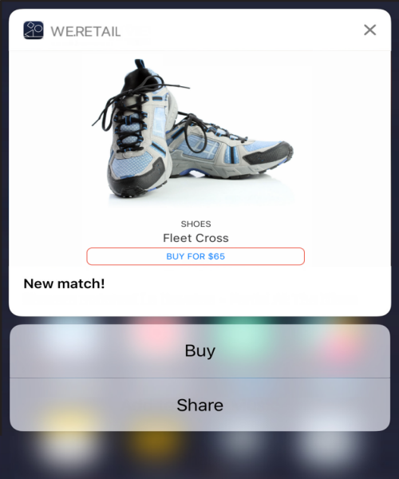

# Customizing a push notification{#customizing-a-push-notification}

若要微調推播通知，Adobe Campaign可讓您在設計推播通知時，存取一組進階選項。

As an expert user, to configure mobile applications in Adobe Campaign, refer to the following technote [Understanding Campaign Standard Push Notifications Payload Structure](https://helpx.adobe.com/campaign/kb/understanding-campaign-standard-push-notifications-payload-struc.html).

**相關內容：**

* [推播通知報表](../../reporting/using/push-notification-report.md)
* [在工作流程中傳送推播通知](../../automating/using/push-notification-delivery.md)

## Play a sound {#play-a-sound}

The function **[!UICONTROL Play a sound]** gives the application the ability to play sounds on your device with the delivery of a push notification, when the app isn't running.

音效會提醒使用者推播通知，使其更具可見度。若要在行動應用程式中加入音效：

1. Open the push notification and access the **[!UICONTROL Advanced options]** section.
1. **[!UICONTROL Play a sound]** 在欄位中輸入音效檔的檔案名稱，而不需在收到通知時由行動裝置播放。

   For more information on supported media formats, refer to [Apple](https://support.apple.com/kb/PH16864?locale=en_US) and [Android](https://developer.android.com/guide/topics/media/media-formats.html) documentations.

   

1. 如果檔案是在行動應用程式套件中定義，則音效檔會播放。否則，會播放裝置的預設音效。

然後只有當手機未靜音時，使用者才會收到推播通知和音效。

## Refresh the badge value {#refresh-the-badge-value}

徽章可用來直接顯示在應用程式圖示的新未讀取資訊數目上。當使用者開啓或讀取應用程式中的新內容時，徽章值就會消失。

在裝置上收到通知時，它可以重新整理或新增相關應用程式的徽章值。從伺服器端傳送徽章值：

1. Open the push notification and access the **[!UICONTROL Advanced options]** section.
1. 標章值必須是整數，而且可以更新不同的方式：

   * To refresh the badge, enter 0 in the **[!UICONTROL Value of the badge]** field. 這樣會移除應用程式圖示中的徽章。
   * To add a badge value, enter any number in the **[!UICONTROL Value of the badge]** field. 當使用者收到推播通知時，此編號會自動出現在徽章中。
   * 如果欄位空白或不包含整數，則徽章值不會變更。
   Here, we entered 1 in the **[!UICONTROL Value of the badge]** field to let the users know that they have a new information in their application.

   

1. 傳送訊息後，使用者將會收到推播通知，而他們的應用程式會自動顯示新的徽章值。

   

## Add a deeplink {#add-a-deeplink}

深層連結可讓您直接將使用者帶入應用程式內的內容(而非開啓網頁瀏覽器頁面)。

深層連結可以包含自訂的應用程式內體驗個人化資料。例如，收件者的名字會自動填入應用程式導向的頁面上。

若要在推播通知中新增深層連結：

1. Open the push notification and access the **[!UICONTROL Advanced options]** section.
1. Enter the link in the **[!UICONTROL Add a deeplink]** field.

   

1. 傳送訊息後，使用者將會收到推播通知，並透過與通知(例如點選或按一下動作按鈕的呼叫)互動的方式，在應用程式中存取特定頁面。

   

## Define an action {#define-an-action}

您可以在行動應用程式中新增類別ID，然後顯示動作按鈕。這些通知可讓使用者以更快的方式回應通知，而不需在應用程式中開啓或導覽。

使用者手機上出現的對話方塊需要決定繼續。當使用者選取其中一個動作時，系統會通知應用程式，使它能夠執行任何相關工作。

若要在推播通知中新增類別：

1. Open the push notification and access the **[!UICONTROL Advanced options]** section.
1. Enter a predefined category name in the **[!UICONTROL Category]** field to display actionable buttons when the push notification is received.

   行動應用程式開發人員必須定義應用程式中的類別ID和按鈕的預期行為。For more on this, refer to the [Apple Developer documentation](https://developer.apple.com/library/content/documentation/NetworkingInternet/Conceptual/RemoteNotificationsPG/SupportingNotificationsinYourApp.html) (**Configuring Categories and Actionable Notifications** section) or the [Android Developer documentation](https://developer.android.com/guide/topics/ui/notifiers/notifications.html).

   

1. 傳送推播通知後，使用者就會收到它，並必須使用先前設定的按鈕進行動作。

   

根據使用者的動作，應用程式會收到通知，以便執行任何相關工作。

## Add custom fields {#add-custom-fields}

自訂欄位可讓您以關鍵值配對的形式，在裝載中傳遞自訂資料。此選項可用來將其他資料傳遞至應用程式，而非預先定義的按鍵。

若要這麼做：

1. Open the push notification and access the **[!UICONTROL Advanced options]** section.
1. In the **[!UICONTROL Custom fields]** category, click the **[!UICONTROL Add an element]** button.
1. Enter your **[!UICONTROL Keys]** then the **[!UICONTROL Values]** associated with each key.

   

1. 自訂欄位的處理與目的完全取決於行動應用程式。在推播通知下方，應用程式已使用自訂欄位來顯示推播通知的按鈕標籤。

   

## Add rich media content {#add-rich-media-content}

豐富型媒體內容可讓您更好地參與使用者互動，讓使用者更願意開啓推播通知。

您可以包含在通知本身播放或顯示的影像、gif、音訊或視訊檔案。您的應用程式使用者不需要開啓應用程式就能看到它。

若要在推播通知中加入豐富型媒體：

1. Open the push notification and access the **[!UICONTROL Advanced options]** section.
1. Enter the URL of your file in the **[!UICONTROL Rich media content URL]** field for each format: iOS and Android.

   對於iOS10或更高版本，您可以插入影像、gif、音訊和視訊檔案。對於舊版的iOS版本，不需要豐富的內容就能顯示推播通知。For detailed steps on how to display an image from an Adobe Campaign push notification on an iOS device, refer to this [page](https://helpx.adobe.com/campaign/kb/display-image-push.html).

   對於Android，您只能包含影像。

   

1. 傳送您的訊息後，使用者將會收到您的推播通知，並可檢視多媒體內容。

   

## Change the notification behavior for iOS {#change-the-notification-behavior-for-ios}

For iOS 10 or higher, two additional options are available in the **[!UICONTROL Advanced options]** section of push notifications: **[!UICONTROL Mutable content]** and **[!UICONTROL Content available]**.

When the **[!UICONTROL Mutable content]** option is checked and/or a Rich media content URL is added, the mutable-content flag will be sent in the push payload and will allow the push notification content to be modified by a notification service application extension provided in iOS SDK. For more on this, refer to [Apple developer documentation](https://developer.apple.com/library/content/documentation/NetworkingInternet/Conceptual/RemoteNotificationsPG/ModifyingNotifications.html).

然後您可以利用行動應用程式擴充功能進一步修改從Adobe Campaign傳送的推播通知內容或簡報。例如，使用者可以將此選項運用於：

* 解密以加密格式傳送的資料
* 下載影像或其他媒體檔案，並將它們新增為通知的附件
* 變更通知的內文或標題文字
* 新增執行緒識別碼至通知

**[!UICONTROL Content available]** 勾選時，內容可用標幟會在推送裝載中傳送，以確保應用程式在收到推播通知時會立即喚醒，這表示應用程式可以存取裝載資料。即使應用程式在背景執行，而且不需要使用者互動(例如點選推播通知)，這項作業也會運作，但如果應用程式未執行，則不會套用這項功能。For more on this, refer to the [Apple developer documentation](https://developer.apple.com/library/content/documentation/NetworkingInternet/Conceptual/RemoteNotificationsPG/CreatingtheNotificationPayload.html).

## Change the notification behavior for Android {#change-the-notification-behavior-for-android}

For Android, you can enter the URL of your file in the **Rich media content URL** field. 雖然有iOS版本，但適用於Android，您只能包含影像而非gif、音訊或視訊檔案。

**[!UICONTROL High priority]** 核取方塊可讓您為推播通知設定高或正常優先順序。For more information on message priority, refer to the [Google developer documentation](https://firebase.google.com/docs/cloud-messaging/concept-options#setting-the-priority-of-a-message).

