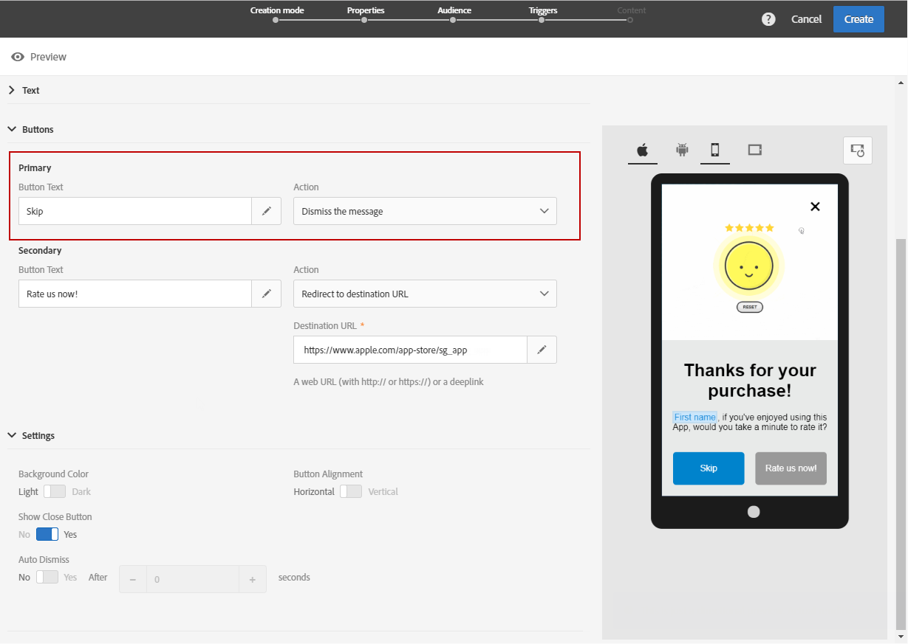

# 自訂應用程式內訊息{#customizing-an-in-app-message}

為了微調您的應用程式內訊息，Adobe Campaign可讓您在設計應用程式內時存取一組進階選項。

應用程式內內容編輯器可讓您在兩種應用程式內訊息模式之間進行選擇：

* [訊息範本](#customizing-with-a-message-template):此範本可讓您使用影像或影片和動作按鈕完全自訂應用程式內。
* [自訂訊息](#customizing-with-a-custom-html-message):此範本可讓您匯入自訂HTML。

**相關主題：**

* [傳送您的應用程式內訊息](../../channels/using/preparing-and-sending-an-in-app-message.md#sending-your-in-app-message)
* [應用程式內報告](../../reporting/using/in-app-report.md)
* [實作本機通知追蹤](https://helpx.adobe.com/campaign/kb/local-notification-tracking.html)

## 使用訊息範本自訂 {#customizing-with-a-message-template}

### 版面 {#layout}

下拉 **[!UICONTROL Layout]** 式清單提供4種不同的選項，供您根據訊息需求選擇：

* **[!UICONTROL Full page]**:這種版面類型涵蓋您觀眾裝置的整個螢幕。

   它支援媒體（影像、視訊）、文字和按鈕元件。

* **[!UICONTROL Large modal]**:此版面會出現在大型的警報樣式視窗中，而您的應用程式仍會顯示在背景。

   它支援媒體（影像、視訊）、文字和按鈕元件。

* **[!UICONTROL Small modal]**:此版面會以小型警報類型視窗的形式顯示，而您的應用程式仍會顯示在背景中。

   它支援媒體（影像、視訊）、文字和按鈕元件。

* **[!UICONTROL Alert]**:此類型的版面會以原生作業系統警告訊息的形式顯示。

   它只能支援文字和按鈕元件。

* **[!UICONTROL Local notification]**:此類型的版面會以橫幅訊息的形式顯示。

   它只能支援音效、文字和目的地。 有關本機通知的詳細資訊，請參 [閱自訂本機通知訊息類型](#customizing-a-local-notification-message-type)。

每種版面類型都可在不同的裝置(例如手機、平板電腦、平台（例如Android或iOS）上預覽，並可在內容編輯器的右窗口中檢視方向（例如橫向或縱向）。

### 媒體 {#media}

下拉 **[!UICONTROL Media]** 式清單可讓您將媒體新增至應用程式內訊息，為使用者建立引人入勝的體驗。

1. 在影像和 **[!UICONTROL Media Type]** 視訊之間選擇您的影像。
1. 對於媒 **[!UICONTROL Image]** 體類型，請根據支援的格式，在欄 **[!UICONTROL Media URL]** 位中輸入您的URL。

   如有需要，您也可以輸入到設備脫 **[!UICONTROL Bundled image]** 機時可使用的路徑。

   

1. 對於媒 **[!UICONTROL Video]** 體類型，請在欄位中輸入您的 **[!UICONTROL Media URL]** URL。

   然後，輸入您 **[!UICONTROL Video poster]** 要在觀眾裝置上下載視訊時使用，或直到使用者點選播放按鈕為止。

   

### 文字 {#text}

如有需要，您也可以將訊息標題和內容新增至應用程式內訊息。 為了更好地個人化您的應用程式內訊息，您可以在內容中新增不同的個人化欄位、內容區塊和動態文字。

1. 在下拉 **[!UICONTROL Text]** 式清單中，在欄位中新增標 **[!UICONTROL Message title]** 題。

   

1. 在欄位中新增您的 **[!UICONTROL Message content]** 內容。
1. 若要進一步個人化您的文字，請按一  下圖示以新增個人化欄位。

   

1. 輸入您的訊息內容，並視需要新增個人化欄位。

   For more information on personalization field, refer to this [section](../../designing/using/personalization.md#inserting-a-personalization-field).

   

1. 在預覽視窗中檢查您的訊息內容。

   

### 按鈕 {#buttons}

您最多可以在應用程式內訊息中加入兩個按鈕。

1. 在下拉 **[!UICONTROL Buttons]** 式清單中，在類別中輸入第一個按鈕的文 **[!UICONTROL Primary]** 字。

   

1. 選擇這兩個操作中的哪 **[!UICONTROL Dismiss]** 個， **[!UICONTROL Redirect]** 並將分配給您的主按鈕。
1. 在類別 **[!UICONTROL Secondary]** 中，視需要輸入文字，新增第二個按鈕至您的應用程式內。
1. 選擇與第二個按鈕關聯的動作。
1. 如果您選擇 **[!UICONTROL Redirect]** 了動作，請在欄位中輸入網頁URL或 **[!UICONTROL Destination URL]** 深入。

   

1. 在欄位中輸入您的Web URL或 **[!UICONTROL Destination URL]** 深入連結，如果您選擇 **[!UICONTROL Redirect]** 動作
1. 在預覽視窗中或按一下「預覽」按鈕，檢查您的訊息內容。

   請參閱「 [預覽應用程式內訊息](#previewing-the-in-app-message) 」頁面。

   

### 設定 {#settings}

1. 在類別 **[!UICONTROL Settings]** 中，選擇亮色和暗色之間的背景顏色。
1. 選擇是否顯示關閉按鈕，並提供選 **[!UICONTROL Show close button]** 項，讓使用者可以關閉應用程式內訊息。
1. 選取按鈕對齊方式是水準或垂直於選 **[!UICONTROL Button alignment]** 項。
1. 選擇您的應用程式內訊息是否可在數秒後自動關閉。

   

## 自定義本地通知消息類型 {#customizing-a-local-notification-message-type}

本機通知只能由應用程式在特定時間觸發，且視事件而定。 他們會提醒使用者，即使沒有網際網路的存取權，應用程式中也會發生什麼事。
若要瞭解如何追蹤本機通知，請參閱本 [頁](https://helpx.adobe.com/campaign/kb/local-notification-tracking.html)。

要自定義本地通知，請執行以下操作：

1. 在您的 **[!UICONTROL Content]** 頁面中，選 **[!UICONTROL Local notification]** 擇類別 **[!UICONTROL Layout]** 中

   

1. 在「類 **[!UICONTROL Text]** 別」下，鍵入 **[!UICONTROL Message title]** 和 **[!UICONTROL Message content]**。

   

1. 在類別 **[!UICONTROL Advanced option]** 的欄位中，選 **[!UICONTROL Wait to display]** 擇觸發事件後，本機通知在螢幕上顯示的時間（秒）。
1. 在欄位 **[!UICONTROL Sound]** 中，輸入副檔名為的音效檔名，在收到本機通知時，由行動裝置播放。

   如果檔案已定義在行動應用程式的套件中，則傳送通知時會播放音效檔。 否則，會播放裝置的預設音效。

   

1. 指定當使用者在欄位中與您的本機通知互動時，重新導向的 **[!UICONTROL Deeplink URL]** 目標。
1. 若要以鍵值配對的形式在裝載中傳遞自訂資料，您可以將自訂欄位新增至本機通知。 在類別 **[!UICONTROL Custom fields]** 中，按一下按 **[!UICONTROL Create an element]** 鈕。
1. 然後輸 **[!UICONTROL Keys]** 入與每 **[!UICONTROL Values]** 個密鑰關聯的。

   請注意，自訂欄位的處理與用途完全取決於行動應用程式。

1. 在類別 **[!UICONTROL Apple options]** 中，填入欄位以新 **[!UICONTROL Category]** 增自訂動作的類別ID（若Apple行動應用程式有提供）。

## 使用自訂HTML訊息自訂 {#customizing-with-a-custom-html-message}

>[!NOTE]
>
>自訂HTML訊息不支援內容個人化。

此模 **[!UICONTROL Custom message]** 式可讓您直接匯入您預先設定的HTML訊息。

若要這麼做，您只需從電腦拖放或選取檔案即可。

您的檔案必須有特定的版面配置，您可以按一下「下載范 **例檔案」選項** 。

您也可以在Adobe Campaign中找到成功匯入的自訂HTML需求清單。

匯入HTML後，您就可以在預覽視窗中，在不同的裝置上找到檔案的預覽。

## 預覽應用程式內訊息 {#previewing-the-in-app-message}

在傳送應用程式內訊息之前，您可以使用測試設定檔進行測試，以檢查目標對象收到您的傳送內容後會看到什麼。

1. Click the **[!UICONTROL Preview]** button.

   

1. 按一下按 **[!UICONTROL Select a test profile]** 鈕並選取其中一個測試設定檔，以開始預覽您的傳送。 For more information on test profiles, refer to this [section](../../sending/using/managing-test-profiles-and-sending-proofs.md).
1. 在不同的裝置（例如Android、iPhone手機或甚至平板電腦）上檢查您的訊息。 您也可以檢查您的個人化欄位是否擷取正確的資料。

   

1. 您現在可以傳送訊息，並透過傳送報表來評估其影響。 For more on reporting, refer to [this section](../../reporting/using/in-app-report.md).

