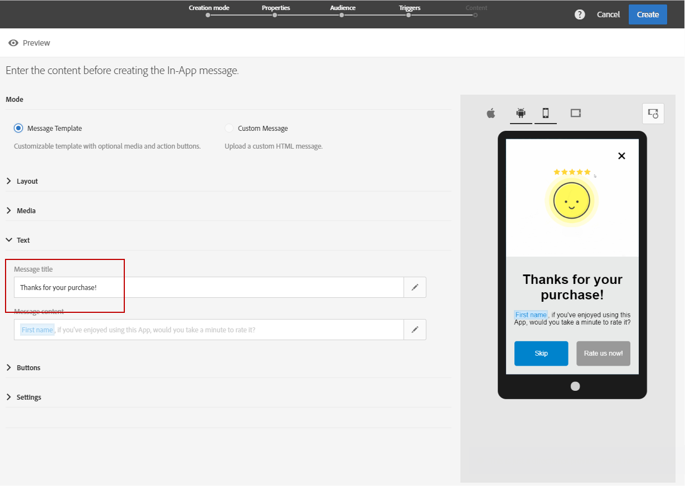

# Customizing an In-App message{#customizing-an-in-app-message}

若要微調應用程式內訊息，Adobe Campaign可讓您在設計應用程式內時，存取一組進階選項。

應用程式內內容編輯器可讓您選擇兩種應用程式內訊息模式：

* [訊息範本](../../channels/using/customizing-an-in-app-message.md#customizing-with-a-message-template)：此範本可讓您使用影像或影片和動作按鈕完全自訂您的應用程式內。
* [自訂訊息](../../channels/using/customizing-an-in-app-message.md#customizing-with-a-custom-html-message)：此範本可讓您匯入自訂HTML。

**相關主題：**

* [傳送您的應用程式內訊息](../../channels/using/preparing-and-sending-an-in-app-message.md#sending-your-in-app-message)
* [應用程式內報告](../../reporting/using/in-app-report.md)

## Customizing with a message template {#customizing-with-a-message-template}

### Layout {#layout}

**[!UICONTROL Layout]** 下拉式清單提供四種不同的選項，可根據您的訊息需求選擇：

* **[!UICONTROL Full page]**：這種版面類型涵蓋您的觀眾裝置的整個螢幕。

   它支援媒體(影像、視訊)、文字和按鈕元件。

* **[!UICONTROL Large modal]**：此版面配置會出現在大型警報樣式視窗中，您的應用程式仍會顯示在背景中。

   它支援媒體(影像、視訊)、文字和按鈕元件。

* **[!UICONTROL Small modal]**：此版面會顯示為小型警報類型視窗，您的應用程式仍會顯示在背景中。

   它支援媒體(影像、視訊)、文字和按鈕元件。

* **[!UICONTROL Alert]**：此類型的版面會顯示為原生OS警告訊息。

   它只能支援文字和按鈕元件。

* **[!UICONTROL Local notification]**：此類型的版面會顯示為橫幅訊息。

   它只能支援音效、文字和目的地。For more on local notification, refer to [Customizing a local notification message type](../../channels/using/customizing-an-in-app-message.md#customizing-a-local-notification-message-type).

每種版面類型都可以在不同裝置(例如手機、平板電腦、平台等)上預覽，例如Android或iOS和iOS和方向，或在內容編輯器的右視窗中進行portra。

### Media {#media}

**[!UICONTROL Media]** 下拉式清單可讓您新增媒體至應用程式內訊息，為使用者建立引人入勝的體驗。

1. Select your **[!UICONTROL Media Type]** between image and video.
1. **[!UICONTROL Image]** 對於媒體類型，請根據支援的格式輸入 **[!UICONTROL Media URL]** 欄位中的URL。

   If needed, you can also enter the path to a **[!UICONTROL Bundled image]** which can be used if the device is offline.

   

1. For the **[!UICONTROL Video]** media type, enter your URL in the **[!UICONTROL Media URL]** field.

   Then, enter your **[!UICONTROL Video poster]** to be used while the video is downloading on the audience devices or until users tap the play button.

   

### Text {#text}

如有需要，您也可以新增訊息標題和內容至應用程式內訊息。若要更好地個人化應用程式內訊息，您可以在內容中新增不同的個人化欄位、內容區塊和動態文字。

1. In the **[!UICONTROL Text]** drop-down, add a title in the **[!UICONTROL Message title]** field.

   

1. Add your content in the **[!UICONTROL Message content]** field.
1. To further personalize your text, click the  icon to add personalization fields.

   

1. 輸入訊息內容，並視需要新增個人化欄位。

   For more information on personalization field, refer to this [section](../../designing/using/inserting-a-personalization-field.md).

   

1. 在預覽視窗中檢查您的訊息內容。

   

### Buttons {#buttons}

您最多可以新增兩個按鈕至應用程式內訊息。

1. In the **[!UICONTROL Buttons]** drop-down, enter the text of your first button in the **[!UICONTROL Primary]** category.

   

1. Choose which of the two actions **[!UICONTROL Dismiss]** and **[!UICONTROL Redirect]** will be assigned to your primary button.
1. **[!UICONTROL Secondary]** 在類別中，輸入文字時，視需要新增第二個按鈕至應用程式中。
1. 選取與第二個按鈕相關聯的動作。
1. If you chose the **[!UICONTROL Redirect]** action, enter your web URL or deeplink in the **[!UICONTROL Destination URL]** field.

   

1. Enter your web URL or deeplink in the **[!UICONTROL Destination URL]** field, if you chose the **[!UICONTROL Redirect]** action,
1. 在預覽視窗中查看您的訊息內容，或按一下「預覽」按鈕。

   Refer to the [Previewing the In-App message](../../channels/using/customizing-an-in-app-message.md#previewing-the-in-app-message) page.

   

### Settings {#settings}

1. **[!UICONTROL Settings]** 在類別中，選取光線和深色之間的背景顏色。
1. Choose to display or not a close button with the **[!UICONTROL Show close button]** option to provide users a way to dismiss the In-App message.
1. Select if your button alignment will be horizontal or vertical with the **[!UICONTROL Button alignment]** option.
1. 選擇您的應用程式內訊息是否可在數秒後自動關閉。

   

## Customizing a local notification message type {#customizing-a-local-notification-message-type}

本機通知只能由應用程式在特定時間，視事件而觸發。他們會提醒使用者，即使沒有網際網路，他們的應用程式仍會發生某事。

若要自訂本機通知：

1. From your **[!UICONTROL Content]** page, select **[!UICONTROL Local notification]** in the **[!UICONTROL Layout]** category

   

1. Under the **[!UICONTROL Text]** category, type down your **[!UICONTROL Message title]** and **[!UICONTROL Message content]**.

   

1. **[!UICONTROL Advanced option]** 在類別下方 **[!UICONTROL Wait to display]** ，選擇在觸發事件後，在螢幕上顯示本機通知的時間長度長度。
1. **[!UICONTROL Sound]** 在欄位中，輸入在接收本機通知時，行動裝置播放的音效檔檔案名稱。

   如果檔案是在行動應用程式套件中定義，則音效檔會播放。否則，會播放裝置的預設音效。

   

1. Specify a destination to redirect your users when they interact with your local notification in the **[!UICONTROL Deeplink URL]** field.
1. 若要以關鍵值配對形式傳遞裝載中的自訂資料，您可以在本機通知中新增自訂欄位。In the **[!UICONTROL Custom fields]** category, click the **[!UICONTROL Create an element]** button.
1. Enter your **[!UICONTROL Keys]** then the **[!UICONTROL Values]** associated with each key.

   請注意，自訂欄位的處理與目的完全取決於行動應用程式。

1. **[!UICONTROL Apple options]** 在類別中，填寫 **[!UICONTROL Category]** 欄位以新增自訂動作的類別ID(如果您在Apple行動應用程式中可用)。

## Customizing with a custom HTML message {#customizing-with-a-custom-html-message}

>[!NOTE]
>
>自訂HTML訊息不支援內容個人化。

**[!UICONTROL Custom message]** 模式可讓您直接匯入其中一個預先設定的HTML訊息。

若要這麼做，您只需拖放或從電腦選取檔案即可。

Your file must have a specific layout which can be found by clicking the **Download the sample file** option.

您也可以找到在Adobe Campaign中成功匯入的自訂HTML需求清單。

匯入HTML後，您可以在預覽視窗中的不同裝置上找到檔案預覽。

## Previewing the In-App message {#previewing-the-in-app-message}

在傳送應用程式內訊息之前，您可以使用測試設定檔來測試您的測試設定檔，以檢查目標對象何時收到您的傳送內容。

1. Click the **[!UICONTROL Preview]** button.

   

1. Click the **[!UICONTROL Select a test profile]** button and select one of your test profiles to start previewing your delivery. For more information on test profiles, refer to this [section](../../sending/using/managing-test-profiles-and-sending-proofs.md).
1. 在不同裝置(例如Android、iPhone手機或平板電腦)上檢查您的訊息。您也可以檢查您的個人化欄位是否正在擷取正確資料。

   

1. 您現在可以傳送訊息，並透過傳送報告測量其影響力。For more on reporting, refer to [this section](../../reporting/using/in-app-report.md).

