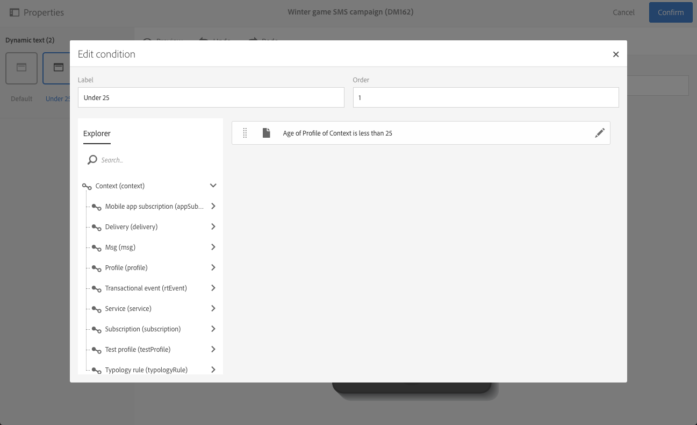

# 定義動態文字{#defining-dynamic-text}

動態文字的定義方式與動態內容相同。 請參閱[定義動態內容](../../designing/using/personalization.md#defining-dynamic-content-in-an-email)區段。

>[!NOTE]
>
>對於SMS和推播，您只能定義動態文字。 您可以在登錄頁面中定義動態內容和文字。 如果您想使用[電子郵件設計工具](../../designing/using/designing-content-in-adobe-campaign.md)定義動態文字，請參閱[定義電子郵件](../../designing/using/personalization.md#defining-dynamic-content-in-an-email)中的動態內容。

請注意，替代配對（Unicode字元集的基本多語言平面中未包含的字元）無法儲存為2個位元組（16位），且需要編碼為2個UTF-16字元。 這些字元包括一些中日韓表意字、大多數表情符號和一些語言。
 這些字元可能會在動態文字中造成一些不相容的問題。傳送訊息之前，您需要先執行強式測試。

以下範例說明如何在SMS訊息中定義動態文字。

1. 在訊息內文或登錄頁面中選取文字。
1. 按一下&#x200B;**[!UICONTROL Enable dynamic text]**。

   

   **[!UICONTROL Dynamic text]**&#x200B;選項會顯示在浮動視窗中。 其設定方式與動態內容相同。

1. 選取變體。

   

1. 定義此變體的條件。

   

為至少一個變體定義條件後，會在動態文字周圍顯示紫色框架。

