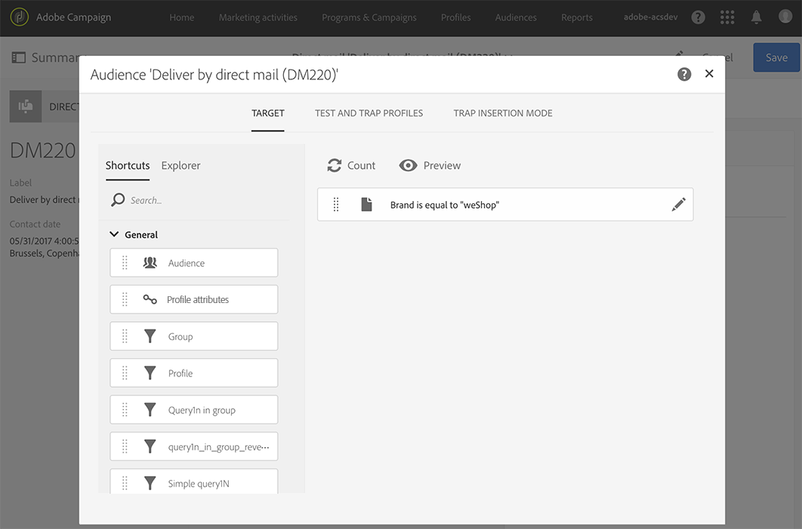

# 定義直接郵件閱聽眾{#defining-the-direct-mail-audience}

您可以在建立精靈中定義對象，或按一下傳送控制面板的「 **對象** 」區段來定義對象。

## 定義主目標 {#defining-the-main-target}

對於直接郵件，目標配置檔案是將包含在提取檔案中的配置檔案，您將將其發送給直接郵件提供者。

對於每個目標配置檔案，抽取檔案中將添加一行新行。 每個收件者將包含的描述檔資訊量，在「定義提取」 [畫面中定義](../../channels/using/defining-the-direct-mail-content.md#defining-the-extraction) 。

>[!CAUTION]
>
>請確定您的個人檔案包含郵寄地址，因為這項資訊對於直效郵件提供者至關重要。 另請確定您已勾選設定 **[!UICONTROL Address specified]** 檔資訊中的方塊。 請參 [閱Recommendations](../../channels/using/about-direct-mail.md#recommendations)。

## 添加測試和陷印配置檔案 {#adding-test-and-trap-profiles}

新增測試設定檔，以便使用少量設定檔來測試您的檔案。 它可讓您在準備實際檔案之前，快速建立檔案範例以測試和驗證結構。 請參閱 [管理測試設定檔](../../audiences/using/managing-test-profiles.md)。

使用陷阱對於直接郵寄至關重要。 它們允許您驗證您的直接郵件提供商是否確實在發送通信，以及他們是否沒有將您的客戶端清單發送給其他提供商。 請參 [閱使用陷阱](../../sending/using/using-traps.md)。

對於直接郵件傳送，在提取期間會新增陷印，並混合在輸出檔案中。 預設情況下，它們會按輸出檔案的排序順序插入，但您可以選擇在檔案的結尾或開頭插入它們。 定義對象時，請從標籤中選取所要的 **[!UICONTROL Trap insertion mode]** 選項。

