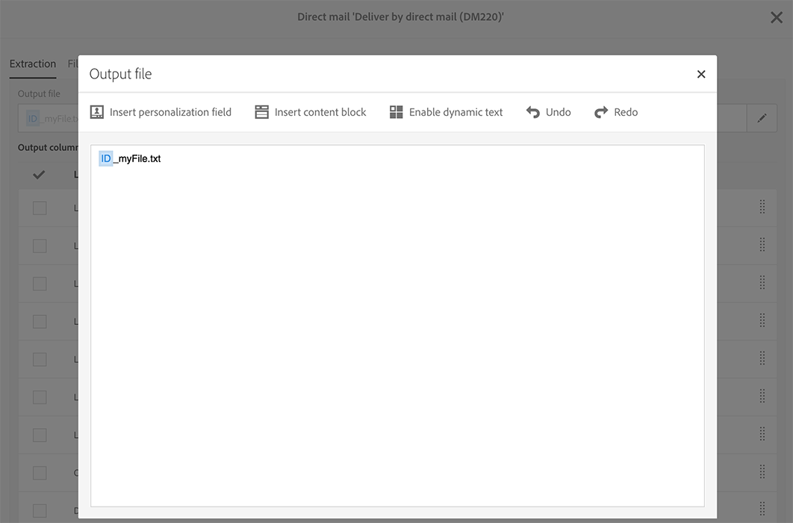

# 定義直接郵件內容{#defining-the-direct-mail-content}

您可以在建立精靈的最後一個畫面中定義內容，或按一下傳遞控制面板的 **Content** 區段來定義對象。

**[!UICONTROL Content]** 定義畫面是直接郵件通道專屬的。它分為四個索引標籤：**[!UICONTROL Extraction]**、**[!UICONTROL File structure]**、**[!UICONTROL Header]** 及 **[!UICONTROL Footer]**。

## 定義解壓縮 {#defining-the-extraction}

1. 首先，定義解壓縮檔案的名稱。按一下 **[!UICONTROL Output file]** 欄位右側的按鈕，然後輸入需要的標籤。您可以使用個人化欄位、內容區塊和動態文字（請參閱[定義內容](../../designing/using/personalization.md#example-email-personalization)）。例如，您可以使用傳送識別碼或解壓縮日期來完成標籤。

   

1. 按一下 **[!UICONTROL +]** 或 **[!UICONTROL Add an element]** 按鈕以新增至輸出欄。**[!UICONTROL Output columns]** 可讓您定義要匯出至輸出檔案的設定檔資訊（欄）。

   >[!CAUTION]
   >
   >請確定您的設定檔包含郵寄地址，因為此資訊對於直接郵件提供者至關重要。另請確保您已核取設定檔資訊中的 **[!UICONTROL Address specified]**&#x200B;方塊。請參閱[建議](../../channels/using/about-direct-mail.md#recommendations)。

   

1. 建立您所需的欄數。您可以按一下欄的運算式及標籤來進行編輯。

>[!NOTE]
>
>如需輸出欄定義的詳細資訊，請參閱[解壓縮檔案](../../automating/using/extract-file.md)工作流程活動區段。

## 定義檔案結構 {#defining-the-file-structure}

**File structure**　索引標籤可讓您針對要匯出的檔案，設定輸出、日期及數字格式。

>[!NOTE]
>
>[解壓縮檔案](../../automating/using/extract-file.md)工作流程活動區段中會詳細說明可用選項。

## 定義頁首和頁尾 {#defining-the-header-and-footer}

有時候，您可能需要在解壓縮檔案的開頭或結尾新增資訊。對此，請使用 **[!UICONTROL Content]** 設定畫面的　**[!UICONTROL Header]** 及 **[!UICONTROL Footer]**　索引標籤。

例如，對於直接郵件提供者，您可能希望在檔案的標題中包含寄件者資訊。您可以使用傳送內容中的可用資訊來個人化頁尾和頁首。請參閱[定義內容](../../designing/using/personalization.md#example-email-personalization)。

會在直接郵件屬性的 **[!UICONTROL Send]** 區段或範本層級中定義寄件者地址。

