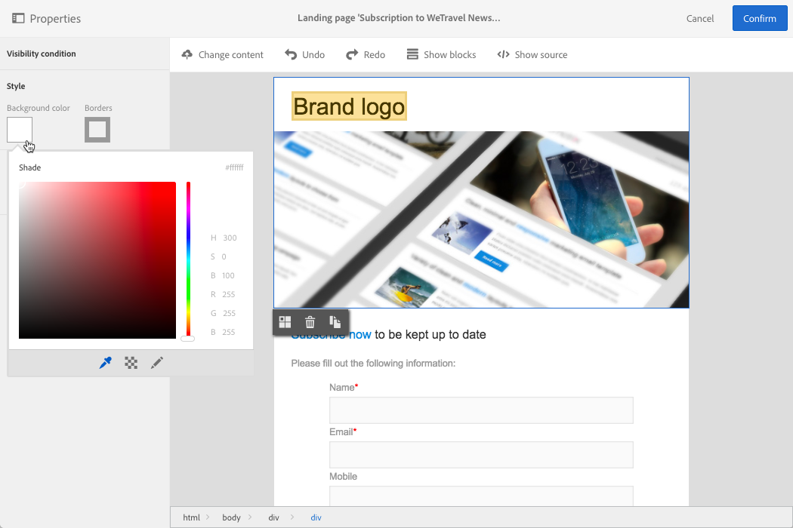
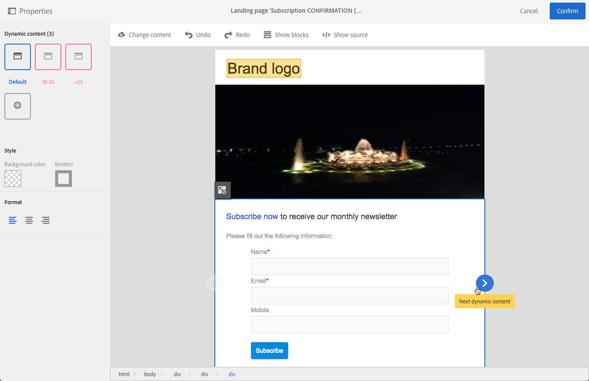

# 設計登錄頁面{#designing-a-landing-page}

## 關於著陸頁面內容設計內容設計 {#about-content-design}

著陸頁面會建立為任何 [行銷活動](../../start/using/marketing-activities.md#about-marketing-activities)。

設計著陸頁面時，您需要定義頁面本身、確認頁面和錯誤頁面的內容。 使用動作列下方的切換器來顯示和設定這些頁面。

著陸頁面的內容是透過促銷活動內容編輯器設計。

>[!NOTE]
>
>如果您的例項是在Adobe Campaign Standard 19.0發行之前安裝，您仍可存取舊版電子郵件內容編輯器。 著陸頁面的介面、使用原則和設定大致與下文所述相同。 但是，舊版電子郵件內容編輯器中可能無法使用或維護所有功能，此編輯器自19.0版起即不再提供。 若要透過具有擴充功能的拖放介面快速編輯您的電子郵件內容，請使用電子郵 [件設計器](../../designing/using/designing-content-in-adobe-campaign.md)。

此頁面說明著陸頁面內容編輯器的特定性。 有關一個或多個行銷活動常見動作的詳細資訊，請參閱「設計電子郵件內容指南」中 **的下列章節** :

* [插入個人化欄位](../../designing/using/personalization.md#inserting-a-personalization-field)
* [新增內容區塊](../../designing/using/personalization.md#adding-a-content-block)。
* [插入連結](../../designing/using/links.md#inserting-a-link)。
* [插入影像](../../designing/using/images.md)。
* [內容設計的一般最佳實務](../../designing/using/designing-content-in-adobe-campaign.md#content-design-best-practices)。

>[!NOTE]
>如果您有已預先定義為HTML格式的著陸頁面，則可使用按鈕直接匯入 **[!UICONTROL Change content]** 頁面。
>
>在Adobe Campaign中匯入HTML頁面之前，請確定它會在各種瀏覽器中開啟並正確顯示。 如果HTML頁面包含JavaScript指令碼，則必須在編輯器外執行這些指令碼，而不會出現錯誤。 一般而言，請避免在訊息內容中使用指令碼，以確保電子郵件用戶端正確處理。

## 著陸頁面內容編輯器介面{#landing-page-content-editor-interface}

著陸頁面內容編輯器可讓您輕鬆定義、修改及個人化Adobe Campaign中的內容。 若要存取它，請按一 **[!UICONTROL Content]** 下著陸頁面控制面板中的區塊。

內容編輯器會組織成三個不同的區段。 這些區段可讓您檢視和編輯內容。

1. 畫面 **左側的** 「浮動視窗」可讓您修改連結至選取區塊的一般選項。 可修改的選項包括：背景顏色、邊框、文字對齊、可見性條件等。 請參 [閱插入個人化欄位](../../designing/using/personalization.md#inserting-a-personalization-field)。
1. 動 **作列** ，包含頁面的一般選項。 您可以選取範本並變更顯示模式。
1. 主編 **輯區** ，可讓您使用內容相關工具列直接與內容互動：將連結插入影像、變更字型、刪除欄位等。

動作 **列包含** 不同的按鈕，可讓您與正在建立的內容互動。

<table> 
 <thead> 
  <tr> 
   <th> 表徵圖  </th> 
   <th> 按鈕名稱  </th> 
   <th> 頻道  </th> 
   <th> 說明  </th> 
  </tr> 
 </thead> 
 <tbody> 
  <tr> 
   <td>    </td> 
   <td> 變更內容  </td> 
   <td> 登陸頁面和電子郵件  </td> 
   <td> 可讓您選擇現成可用的內容或匯入您自己的HTML內容。 請參閱 <a href="../../designing/using/using-existing-content.md">載入現有內容</a>。  </td> 
  </tr> 
  <tr> 
   <td>    </td> 
   <td> 還原  </td> 
   <td> 全部  </td> 
   <td> 取消執行的最後一個操作。  </td> 
  </tr> 
  <tr> 
   <td>    </td> 
   <td> 重做  </td> 
   <td> 全部  </td> 
   <td> 重新執行您取消的最後一個動作。  </td> 
  </tr> 
  <tr> 
   <td>    </td> 
   <td> 顯示塊  </td> 
   <td> 登陸頁面和電子郵件  </td> 
   <td> 可讓您顯示內容區塊周圍的方塊(與 <strong>&lt;div&gt;</strong> HTML標籤對應)。  </td> 
  </tr> 
  <tr> 
   <td>    </td> 
   <td> 顯示源  </td> 
   <td> 登陸頁面和電子郵件  </td> 
   <td> 可讓您顯示頁面的HTML原始碼。  </td> 
  </tr> 
 </tbody> 
</table>

工具 **列是編輯器介面的上下文元素** ，根據選取的區域提供各種功能。 它包含可讓您變更文字樣式的動作按鈕和按鈕。 所執行的修改一律適用於選取的區域。 選擇塊後，可以刪除或複製它。 在選取區塊內的文字後，您可以將它轉換為連結或加粗。

>[!CAUTION]
>
>某些工具列功能可讓您設定HTML內容的格式。 不過，如果頁面包含CSS樣式表，則樣 **式表中的說明** ，可能會優先於透過工具列 **指定的指示** 。

<table> 
 <thead> 
  <tr> 
   <th> 表徵圖  </th> 
   <th> 按鈕名稱  </th> 
   <th> 內容  </th> 
   <th> 說明  </th> 
  </tr> 
 </thead> 
 <tbody> 
  <tr> 
   <td>    </td> 
   <td> 連結至外部URL  </td> 
   <td> 任何元素  </td> 
   <td> 可讓您新增URL的連結。 如何設定連結的詳細資訊會顯示在「插入 <a href="../../designing/using/links.md#inserting-a-link">連結」區段中</a> 。  </td> 
  </tr> 
  <tr> 
   <td>    </td> 
   <td> 連結至著陸頁面  </td> 
   <td> 任何元素  </td> 
   <td> 允許存取Adobe Campaign登陸頁面。 如何設定連結的詳細資訊會顯示在「插入 <a href="../../designing/using/links.md#inserting-a-link">連結」區段中</a> 。  </td> 
  </tr> 
  <tr> 
   <td>    </td> 
   <td> 訂閱連結  </td> 
   <td> 任何元素  </td> 
   <td> 允許您插入服務訂閱連結。 如何設定連結的詳細資訊會顯示在「插入 <a href="../../designing/using/links.md#inserting-a-link">連結」區段中</a> 。  </td> 
  </tr> 
  <tr> 
   <td>    </td> 
   <td> 取消訂閱連結  </td> 
   <td> 任何元素  </td> 
   <td> 允許您插入服務取消訂閱連結。 如何設定連結的詳細資訊會顯示在「插入 <a href="../../designing/using/links.md#inserting-a-link">連結」區段中</a> 。  </td> 
  </tr> 
  <tr> 
   <td>    </td> 
   <td> 移除連結  </td> 
   <td> 連結  </td> 
   <td> 允許您在確認後刪除連結以及連結到該連結的所有配置。  </td> 
  </tr> 
  <tr> 
   <td>    </td> 
   <td> 插入個人化欄位  </td> 
   <td> 文字元素  </td> 
   <td> 允許您從資料庫向內容中添加欄位。 請參閱 <a href="../../designing/using/personalization.md#inserting-a-personalization-field">插入個人化欄位</a>。  </td> 
  </tr> 
  <tr> 
   <td>    </td> 
   <td> 插入內容區塊  </td> 
   <td> 文字元素  </td> 
   <td> 可讓您新增個人化區塊至內容。 請參閱 <a href="../../designing/using/personalization.md#adding-a-content-block">新增內容區塊</a>。  </td> 
  </tr> 
  <tr> 
   <td>    </td> 
   <td> 啟用動態內容  </td> 
   <td> 文字元素  </td> 
   <td> 可讓您在內容中插入動態內容。 請參閱定 <a href="../../channels/using/designing-a-landing-page.md#defining-dynamic-content-in-a-landing-page">義動態內容</a>。  </td> 
  </tr> 
  <tr> 
   <td>    </td> 
   <td> 停用動態內容  </td> 
   <td> 文字元素  </td> 
   <td> 可讓您刪除動態內容。  </td> 
  </tr> 
  <tr> 
   <td>    </td> 
   <td> 放大字型  </td> 
   <td> 文字元素  </td> 
   <td> 增加選取文字的大小(新增 <strong>&lt;span style="font-size:"&gt;</strong>)。  </td> 
  </tr> 
  <tr> 
   <td>    </td> 
   <td> 減少字型  </td> 
   <td> 文字元素  </td> 
   <td> 縮小選取文字的大小(新增 <strong>&lt;span style="font-size:"&gt;</strong>)。  </td> 
  </tr> 
  <tr> 
   <td>    </td> 
   <td> 粗體  </td> 
   <td> 文字元素  </td> 
   <td> 將粗體樣式新增至選取的文字(以 <strong>&lt;strong&gt;</strong><strong>&lt;/strong&gt;標籤包住文字</strong> )。  </td> 
  </tr> 
  <tr> 
   <td>    </td> 
   <td> 斜體  </td> 
   <td> 文字元素  </td> 
   <td> 將斜體樣式新增至選取的文字(以 <strong>&lt;em&gt;</strong><strong>&lt;/em&gt;標籤包住文字</strong> )。  </td> 
  </tr> 
  <tr> 
   <td>    </td> 
   <td> 下划線  </td> 
   <td> 文字元素  </td> 
   <td> 將選取的文字加底線(以 <strong>&lt;span style="text-decoriting:下划線；"&gt;</strong> tag)。  </td> 
  </tr> 
  <tr> 
   <td>    </td> 
   <td> 變更背景顏色  </td> 
   <td> 文字元素  </td> 
   <td> 允許您更改所選塊的背景顏色(添加style="background-color:rgba(170、86、255、0.87)。  </td> 
  </tr> 
  <tr> 
   <td>    </td> 
   <td> 變更字型顏色  </td> 
   <td> 文字元素  </td> 
   <td> 可讓您變更區塊中所有文字的色彩，或僅變更區塊中選取的文字(<strong>&lt;span style="color:#56ff56;"&gt;</strong>)。  </td> 
  </tr> 
  <tr> 
   <td>    </td> 
   <td> 影像  </td> 
   <td> 包含影像的塊  </td> 
   <td> 允許您從本地保存的檔案插入影像。  </td> 
  </tr> 
  <tr> 
   <td>    </td> 
   <td> 刪除  </td> 
   <td> 任何區塊  </td> 
   <td> 刪除塊及其內容。  </td> 
  </tr> 
  <tr> 
   <td>    </td> 
   <td> 複製  </td> 
   <td> 任何區塊  </td> 
   <td> 複製區塊，包括任何連結至區塊的樣式。  </td> 
  </tr> 
 </tbody> 
</table>

## 管理著陸頁面結構和樣式{#managing-landing-page-structure-and-style}

### 在內容編輯器中管理區塊 {#managing-blocks-in-the-content-editor}

不同的HTML內容元素在登陸頁面中顯示為區塊，與 **&lt;div&gt;****&lt;/div&gt;標籤相對應** 。 選取要與其互動的區塊。 然後就會被藍色的盒子包圍。

如果選取區塊，則對應HTML元素的上層物件會顯示在編輯區域底部的階層連結中。

當滑鼠暫留在其中一個階層連結元素上時，會反白顯示相關元素。 因此，您可以輕鬆地在不同區塊之間導覽，並精確選取您要修改的HTML元素。

使用浮動視窗和內容相關工具列中的選項來修改、刪除或複製區塊。

對於包含文本的塊，請在塊中再次按一下以啟用文本編輯模式。 塊周圍的框架變綠。 然後，您可以選取或輸入文字。 使用浮動視窗和內容相關工具列中的選項來新增連結或修改文字格式。

為區塊中的元素（連結、個人化欄位、內容區塊等）定義的參數可隨時從浮動視窗修改。

### 在內容編輯器中新增邊框和背景 {#adding-a-border-and-a-background-in-the-content-editor}

您也可以從圖表 **選取顏色** ，以定義背景顏色。 此顏色會套用至選取的區塊。

您可以將邊框 **新增** 至選取的區塊。

### 在內容編輯器中更改文本樣式 {#changing-the-text-style-in-the-content-editor}

若要變更文字的樣式，您必須在文字區塊內按一下。

若要變更文字對齊方式，請在左側浮動視窗中選取下列三個圖示之一：

* **左對齊**:將文字對齊選定塊的左側(添加style="text-align:左；」)。
* **中心**:將選取的區塊中的文字置中(新增style="text-align:中；」)。
* **右對齊**:將文字對齊選定塊的右側(添加style="text-align:對；」)。

您也可以使用工具列來變更字型屬性：調整字型大小、使文字變為粗體或斜體、加底線或變更文字的顏色。 Refer to [this section](../../channels/using/designing-a-landing-page.md#landing-page-content-editor-interface).

### 在著陸頁面中插入影像 {#inserting-images-in-a-landing-page}

1. 在著陸頁面內容中，選取包含影像的區塊。
1. 選擇按 **[!UICONTROL Insert]** 鈕。

   

1. 從內容 **[!UICONTROL Local image]** 相關工具列中選擇。

   

1. 選取檔案。

   

1. 視需要調整影像屬性。

   

## 在著陸頁面中定義動態內容{#defining-dynamic-content-in-a-landing-page}

若要定義著陸頁面中的動態內容，請使用階層連結或直接按一下元素來選取區塊。

某些區塊（例如影像）無法直接選取。 在這種情況下，請使用階層連結來選取父區塊。 然後，您可以修改此父元素中包含的所有元素，包括影像。 該條件將應用於父塊內的所有子元素。

導覽路徑標示會顯示在「管理 [區塊](../../channels/using/designing-a-landing-page.md#managing-landing-page-structure-and-style) 」區段。

在登陸頁面中定義動態內容的後續步驟類似於電子郵件的後續步驟。 請參 [閱本節](../../designing/using/personalization.md#defining-dynamic-content-in-an-email)。

>[!NOTE]
>
>如果變型元素以紅色描述，表示尚未定義運算式。

您可以在區塊的不同動態內容之間導覽。 操作步驟：

1. 選擇塊。

   箭頭會出現在影像的右側和左側。

1. 按一下右箭頭，瀏覽可用的動態內容。

   

   每側的箭頭會根據您到達最後一個或第一個可用的動態內容而變暗。

   

1. 要刪除應用於某個塊的所有條件，請選擇該塊並按一下該 **[!UICONTROL Disable dynamic content]** 表徵圖。
1. 選取您要保留的動態內容。

   

在浮動視窗中：

* 輸入了表達式的內容不再以紅色括起來，而是以灰色顯示。
* 目前選取的內容會以藍色顯示。

