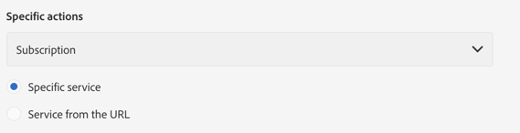

# 設計著陸頁面{#designing-a-landing-page}

## 關於內容設計 {#about-content-design}

著陸頁面會建立為任何 [行銷活動](../../start/using/marketing-activities.md#about-marketing-activities)。

設計著陸頁面時，您需要定義下列內容：

* 頁面本身，
* 確認頁面，
* 錯誤頁面。

使用動作列下方的切換器來顯示和設定這些頁面。

這些頁面的內容是透過促銷活動內容編輯器設計。 請參閱 [設計內容](../../channels/using/about-landing-page-content-design.md)。

## 對應表單欄位 {#mapping-form-fields}

輸入欄位可用來儲存或更新促銷活動資料庫中的資料。 為此，您需要將資料庫欄位與輸入區域、單選按鈕或複選框類型塊連結起來。 要執行此操作：

1. 在著陸頁面中選取區塊。
1. 在浮動視 **[!UICONTROL Form data]** 窗中完成部件。

   

1. 選擇資料庫欄位以與選擇區域中的表單欄位 **[!UICONTROL Field]** 連結。

   勾選選 **[!UICONTROL Mandatory]** 選項時，只有在使用者完成此欄位時，才能提交頁面。 如果未完成必填欄位，當使用者驗證頁面時，將會顯示錯誤訊息。

   >[!NOTE]
   >
   >著陸頁面只能與描述檔 **對應**。

1. 定義欄位類型，方法是選擇(例如 **[!UICONTROL Text]**, **[!UICONTROL Number]**&#x200B;或 **[!UICONTROL Date]** 在選擇區 **[!UICONTROL HTML type of the field]** 域中)。

>[!NOTE]
>
>內建著陸頁面的預設欄位已預先設定。 您可以視需要修改它們。

## 提交表格 {#submitting-the-form}

您可以選取訪客點按提交按鈕時要執行的動作。 要執行此操作：

1. 選取著陸頁面的送出按鈕。
1. 在左面板的下拉式清單中選取動作。 可能的動作包括： **[!UICONTROL Refresh]** （要重新整理頁面） **[!UICONTROL Next page]** 和（要顯示確認頁面）。

   

此外，您還可以變更按鈕的標籤或設定特定連結。 要執行此操作：

1. 選擇提交按鈕。
1. 按一下左  側面板中的按鈕。
1. 輸入按鈕的標籤，選擇連結類型、其屬性和目標。

   

## 將表單連結至服務 {#linking-a-form-to-a-service}

您可以將表單連結至服務，如此在驗證著陸頁面時，描述檔就可以訂閱特定服務。

連結著陸頁面的參數可讓您指定執行的動作類型，以及著陸頁面是否特別連結至單一服務或是否為一般服務。

要選擇要連結的服務，您需要：

1. 編輯透過著陸頁面控制面板中  的圖示存取的著陸頁面屬性，並顯示 **[!UICONTROL Job]** 參數。

   

1. 從下 **[!UICONTROL Subscription]** 拉式清 **[!UICONTROL Specific actions]** 單中選擇。

   

1. 選擇 **[!UICONTROL Specific service]** 將登陸頁面連結至單一服務。 如果您想要在登陸頁面上使用數個服務，請勿選取此選項。

   使用 **[!UICONTROL Specified service in the URL]** 選項可允許將登陸頁面用於數個服務。 因此，在配置服務時，您必須參考著陸頁面。

### 確認著陸頁面提交 {#confirm-a-landing-page-submission}

當訪客提交著陸頁面時，您可以設定觸發的動作。 要執行此操作：

1. 編輯透過著陸頁面控制面板中  的圖示存取的著陸頁面屬性，並顯示 **[!UICONTROL Job]** 參數。

   

1. 在該節 **[!UICONTROL Specific actions]** 下，選 **[!UICONTROL Start sending message]** 擇確定自動消息的發送，例如確認服務的訂閱。 然後您需要選取電子郵件傳送範本。

   請注意，如果服務級別已配置確認消息，則不應在此螢幕中選擇一個消息以避免發送多個確認消息。 請參 [閱Configure a service](../../audiences/using/creating-a-service.md)。

1. 建立 **[!UICONTROL Additional data]** 以啟用在提交著陸頁面時儲存其他資料。 此資料對瀏覽頁面的使用者不可見。 只考慮常數值。

   

## 設定權限和預先載入資料 {#setting-permissions-and-pre-loading-data}

登陸頁面的存取權可限制為已識別的訪客，例如來自促銷活動所傳送訊息中的連結。 在此情況下，您可以在著陸頁面中預先載入其資料。 要執行此操作：

1. 編輯透過著陸頁面控制面板中  的圖示存取的著陸頁面屬性，並顯示 **[!UICONTROL Access & loading]** 參數。

   

1. 選擇 **[!UICONTROL Preload visitor data]**。

   如果頁面的訪客與資料庫中的描述檔相對應，則其資料會顯示在與資料庫資料對應的表單欄位中，而著陸頁面的個人化元素也會納入考量。

   

您也可以：

* 使用URL參數來識別訪客，使用下列 **[!UICONTROL Authorize visitor identification via URL parameters]** 選項：然後，您必須選擇載入索引鍵，並將篩選參數對應至對應URL的參數。
* 使用選項授權任何訪客存取著陸 **[!UICONTROL Authorize unidentified visitors]** 頁面。

## 設定Google reCAPTCHA {#setting-google-recaptcha}

您可以使用登陸頁面設定Google reCAPTCHA V3，以保護其免受Bot造成的垃圾訊息和濫用。 若要將它用於著陸頁面，您必須先建立外部帳戶。 有關如何配置的詳細資訊，請參閱本 [節](../../administration/using/external-accounts.md#google-recaptcha-external-account)。

一旦您的Google reCAPTCHA V3外部帳戶設定完成後，您就可以將它新增至您的登陸頁面：

1. 發佈著陸頁面之前，請先存取透過您著陸頁面控制面板  圖示存取的頁面屬性。

   

1. 展開功 **[!UICONTROL Access & loading]** 能表。
1. 勾選 **[!UICONTROL Use reCAPTCHA to protect your site from spam and abuse]** 選項。
1. 選取您先前建立的Google reCAPTCHA外部帳戶。

   

1. Click **[!UICONTROL Confirm]**.

您的登陸頁面現在已設定Google reCAPTCHA，可在頁面底部檢視。

然後，Google reCAPTCHA會根據使用者與您頁面的互動，傳回分數。 若要檢查您的分數，請連線至您的 [Google管理控制台](https://g.co/recaptcha/admin)。
