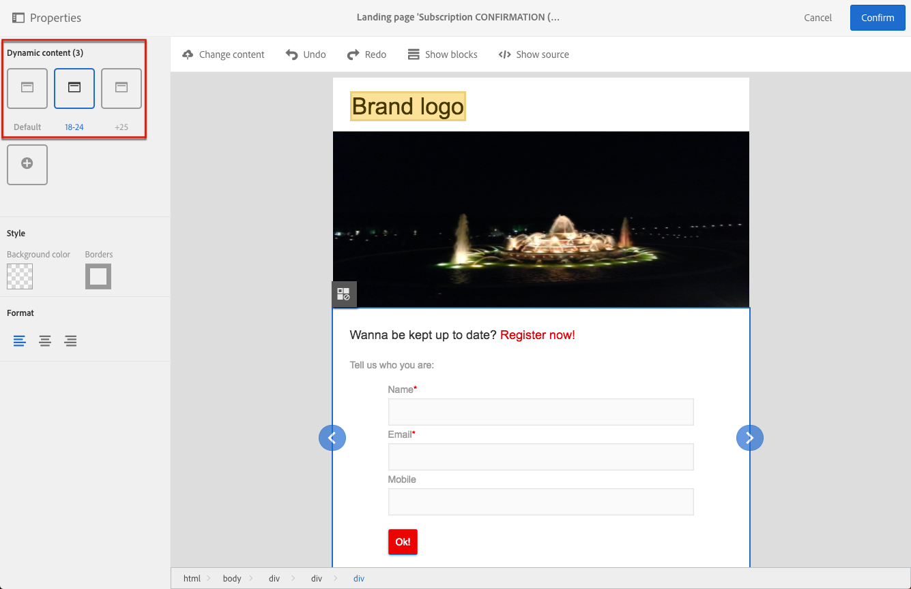

# 設計登錄頁面{#designing-a-landing-page}

## 關於登錄頁面內容設計內容設計{#about-content-design}

會將登錄頁面建立為任何[行銷活動](../../start/using/marketing-activities.md#about-marketing-activities)的形式。

設計登錄頁面時，您需要定義頁面本身、確認頁面及錯誤頁面的內容。使用動作列下方的切換器，以顯示和設定其中的每個頁面。

登錄頁面的內容是透過 Campaign 內容編輯器設計而成。

>[!NOTE]
>
>如果您的執行個體是在 Adobe Campaign Standard 19.0 發行之前安裝，則仍可存取舊版電子郵件內容編輯器。登錄頁面的介面、使用原則和設定大致與下述相同。但是，舊版電子郵件內容編輯器中可能無法使用或維護所有功能，因為此編輯器自 19.0 版起即已淘汰。若要透過具有擴充功能的拖放介面快速來編輯電子郵件內容，請使用[電子郵件設計工具](../../designing/using/designing-content-in-adobe-campaign.md)。

此頁面說明登錄頁面內容編輯器的特異性。如需一或多個行銷活動常見動作的詳細資訊，請參閱&#x200B;**設計電子郵件內容**&#x200B;指南中的下列區段：

* [插入個人化欄位](../../designing/using/personalization.md#inserting-a-personalization-field)
* [新增內容區塊](../../designing/using/personalization.md#adding-a-content-block)。
* [插入連結](../../designing/using/links.md#inserting-a-link)。
* [插入影像](../../designing/using/images.md)。
* [內容設計的一般最佳實務](../../designing/using/designing-content-in-adobe-campaign.md#content-design-best-practices)。

>[!NOTE]
>如果您有以 HTML 格式預先定義的登錄頁面，則可使用 **[!UICONTROL Change content]** 按鈕直接匯入頁面。
>
>在 Adobe Campaign 中匯入 HTML 頁面之前，請確定它會在各種瀏覽器中開啟並正確顯示。如果 HTML 頁面包含 JavaScript 指令碼，則必須在編輯器外部執行這些指令碼，而不會出現錯誤。一般而言，請避免在郵件內容中使用指令碼，以確保電子郵件用戶端可正確地處理郵件。

## 登錄頁面內容編輯器介面{#landing-page-content-editor-interface}

登錄頁面內容編輯器可讓您輕鬆定義、修改及個人化 Adobe Campaign 中的內容。若要存取，請按一下登錄頁面控制面板中的 **[!UICONTROL Content]** 區塊。

內容編輯器會分為三個不同的區段。這些區段可讓您檢視和編輯內容。

1. 螢幕左側的&#x200B;**浮動視窗**&#x200B;可讓您修改連結至所選取區塊的一般選項。可修改的選項是：背景顏色、邊框、文字對齊、可見度條件等。請參閱[插入個人化欄位](../../designing/using/personalization.md#inserting-a-personalization-field)。
1. **動作列**&#x200B;包含頁面的一般選項。您可以選取範本並變更顯示模式。
1. 主要的&#x200B;**編輯區**&#x200B;可讓您使用內容工具列，直接與內容互動：將連結插入影像中、變更字型、刪除欄位等。

**動作列包含**&#x200B;不同的按鈕，可讓您與正在建立的內容互動。

<table> 
 <thead> 
  <tr> 
   <th> 圖示  </th> 
   <th> 按鈕名稱  </th> 
   <th> 通道  </th> 
   <th> 說明  </th> 
  </tr> 
 </thead> 
 <tbody> 
  <tr> 
   <td>    </td> 
   <td> 變更內容   </td> 
   <td> 登錄頁面及電子郵件  </td> 
   <td> 可讓您選取現成的內容或匯入自己的 HTML 內容。請參閱<a href="../../designing/using/using-existing-content.md">載入現有內容</a>。  </td> 
  </tr> 
  <tr> 
   <td>    </td> 
   <td> 還原   </td> 
   <td> 全部  </td> 
   <td> 取消最後執行的動作。  </td> 
  </tr> 
  <tr> 
   <td>    </td> 
   <td> 取消復原   </td> 
   <td> 全部  </td> 
   <td> 取消復原您取消的最後一個動作。  </td> 
  </tr> 
  <tr> 
   <td>    </td> 
   <td> 顯示區塊   </td> 
   <td> 登錄頁面及電子郵件  </td> 
   <td> 可讓您顯示內容區塊周圍的方塊 (與 <strong>&lt;div&gt;</strong> HTML 標記相對應)。  </td> 
  </tr> 
  <tr> 
   <td>    </td> 
   <td> 顯示來源   </td> 
   <td> 登錄頁面及電子郵件  </td> 
   <td> 可讓您顯示頁面的 HTML 原始碼。  </td> 
  </tr> 
 </tbody> 
</table>

**工具列**&#x200B;是編輯器介面的內容元素，該介面會根據選取的區域提供各種功能。其包含可讓您變更文字樣式的動作按鈕和按鈕。所進行的修改始終適用於選取的區域。舉例來說，選取區塊之後，您可以刪除或複製該區塊。選取區塊內部的文字之後，您可以將之轉換為連結或設為粗體。

>[!CAUTION]
>
>特定工具列功能可讓您設定 HTML 內容的格式。但是，如果頁面包含 CSS 樣式表，則樣式表中的&#x200B;**指示**&#x200B;可能會證明其&#x200B;**優先順序**&#x200B;高於透過工具列指定的指示。

<table> 
 <thead> 
  <tr> 
   <th> 圖示  </th> 
   <th> 按鈕名稱  </th> 
   <th> 內容  </th> 
   <th> 說明  </th> 
  </tr> 
 </thead> 
 <tbody> 
  <tr> 
   <td>    </td> 
   <td> 連結至外部 URL   </td> 
   <td> 任何元素  </td> 
   <td> 可讓您將連結新增至 URL。說明如何在<a href="../../designing/using/links.md#inserting-a-link">插入連結</a>區段中設定連結顯示方式的詳細資料。  </td> 
  </tr> 
  <tr> 
   <td>    </td> 
   <td> 連結至登錄頁面   </td> 
   <td> 任何元素  </td> 
   <td> 可存取 Adobe Campaign 登錄頁面。說明如何在<a href="../../designing/using/links.md#inserting-a-link">插入連結</a>區段中設定連結顯示方式的詳細資料。  </td> 
  </tr> 
  <tr> 
   <td>    </td> 
   <td> 訂閱連結   </td> 
   <td> 任何元素  </td> 
   <td> 可讓您插入服務訂閱連結。說明如何在<a href="../../designing/using/links.md#inserting-a-link">插入連結</a>區段中設定連結顯示方式的詳細資料。  </td> 
  </tr> 
  <tr> 
   <td>    </td> 
   <td> 取消訂閱連結   </td> 
   <td> 任何元素  </td> 
   <td> 可讓您插入服務取消訂閱連結。說明如何在<a href="../../designing/using/links.md#inserting-a-link">插入連結</a>區段中設定連結顯示方式的詳細資料。  </td> 
  </tr> 
  <tr> 
   <td>    </td> 
   <td> 移除連結   </td> 
   <td> 連結  </td> 
   <td> 可讓您在確認後刪除連結，以及刪除連結至該連結的所有設定。  </td> 
  </tr> 
  <tr> 
   <td>    </td> 
   <td> 插入個人化欄位   </td> 
   <td> 文字元素  </td> 
   <td> 可讓您將欄位從資料庫新增至內容。請參閱<a href="../../designing/using/personalization.md#inserting-a-personalization-field">插入個人化欄位</a>。  </td> 
  </tr> 
  <tr> 
   <td>    </td> 
   <td> 插入內容區塊   </td> 
   <td> 文字元素  </td> 
   <td> 可讓您新增個人化區塊至內容。請參閱<a href="../../designing/using/personalization.md#adding-a-content-block">新增內容區塊</a>。  </td> 
  </tr> 
  <tr> 
   <td>    </td> 
   <td> 啟用動態內容   </td> 
   <td> 文字元素  </td> 
   <td> 可讓您在內容中插入動態內容。請參閱<a href="../../channels/using/designing-a-landing-page.md#defining-dynamic-content-in-a-landing-page">定義動態內容</a>。  </td> 
  </tr> 
  <tr> 
   <td>    </td> 
   <td> 停用動態內容   </td> 
   <td> 文字元素  </td> 
   <td> 可讓您刪除動態內容。  </td> 
  </tr> 
  <tr> 
   <td>    </td> 
   <td> 放大字型   </td> 
   <td> 文字元素  </td> 
   <td> 增加所選取文字的大小 (新增 <strong>&lt;span style="font-size:"&gt;</strong>)。  </td> 
  </tr> 
  <tr> 
   <td>    </td> 
   <td> 縮小字型   </td> 
   <td> 文字元素  </td> 
   <td> 縮小所選取文字的大小 (新增 <strong>&lt;span style="font-size:"&gt;</strong>)。  </td> 
  </tr> 
  <tr> 
   <td>    </td> 
   <td> 粗體   </td> 
   <td> 文字元素  </td> 
   <td> 將粗體樣式新增至所選取的文字 (以 <strong>&lt;strong&gt;</strong><strong>&lt;/strong&gt;</strong> 標記括住文字)。  </td> 
  </tr> 
  <tr> 
   <td>    </td> 
   <td> 斜體   </td> 
   <td> 文字元素  </td> 
   <td> 將斜體樣式新增至所選取的文字 (以 <strong>&lt;em&gt;</strong><strong>&lt;/em&gt;</strong> 標記括住文字)。  </td> 
  </tr> 
  <tr> 
   <td>    </td> 
   <td> 畫底線   </td> 
   <td> 文字元素  </td> 
   <td> 對所選取的文字畫底線 (以 <strong>&lt;span style="text-decoration: underline;"&gt;</strong> 標記括住所選取的文字)。  </td> 
  </tr> 
  <tr> 
   <td>    </td> 
   <td> 變更背景顏色   </td> 
   <td> 文字元素  </td> 
   <td> 可讓您變更所選取區塊的背景顏色 (新增 style="background-color: rgba(170, 86, 255, 0.87))。  </td> 
  </tr> 
  <tr> 
   <td>    </td> 
   <td> 變更字型顏色   </td> 
   <td> 文字元素  </td> 
   <td> 可讓您變更區塊中所有文字的色彩，或是僅變更區塊中選取的文字 (<strong>&lt;span style="color: #56ff56;"&gt;</strong>)。  </td> 
  </tr> 
  <tr> 
   <td>    </td> 
   <td> 影像   </td> 
   <td> 包含影像的區塊  </td> 
   <td> 可讓您從本機儲存的檔案插入影像。  </td> 
  </tr> 
  <tr> 
   <td>    </td> 
   <td> 刪除   </td> 
   <td> 任何區塊  </td> 
   <td> 刪除區塊及其內容。  </td> 
  </tr> 
  <tr> 
   <td>    </td> 
   <td> 複製   </td> 
   <td> 任何區塊  </td> 
   <td> 複製區塊，包含連結至該區塊的任何樣式。  </td> 
  </tr> 
 </tbody> 
</table>

## 管理登錄頁面結構和樣式{#managing-landing-page-structure-and-style}

### 在內容編輯器中管理區塊 {#managing-blocks-in-the-content-editor}

不同的 HTML 內容元素會在登錄頁面中顯示為區塊，且會與 **&lt;div>** **&lt;/div>** 標記相對應。選取要與其互動的區塊。然後就會由藍色方塊包圍。

如果選取區塊，則相對應 HTML 元素的上層物件會顯示在編輯區域底部的階層連結中。

讓滑鼠停留在其中一個階層連結元素上方時，會反白顯示相關元素。因此，您可以輕鬆地在不同區塊之間導覽，並準確地選取您要修改的 HTML 元素。

使用浮動視窗和內容工具列中的選項來修改、刪除或複製區塊。

對於包含文字的區塊，請在區塊中再次按一下以啟用文字編輯模式。區塊周圍的外框會變成綠色。之後，您可以選取或輸入文字。使用浮動視窗和內容工具列中的選項來新增連結或修改文字格式。

可隨時從浮動視窗修改專為區塊中的元素（連結、個人化欄位、內容區塊等）定義的參數。

### 在內容編輯器中新增邊框和背景 {#adding-a-border-and-a-background-in-the-content-editor}

您也可以從圖表選取一個顏色，以定義&#x200B;**背景顏色**。此顏色會套用至所選取的區塊。

您可以將&#x200B;**邊框**&#x200B;新增至所選取的區塊。

### 在內容編輯器中變更文字樣式 {#changing-the-text-style-in-the-content-editor}

若要變更文字的樣式，必須在文字區塊內部按一下。

若要變更文字對齊方式，請在左側的浮動視窗中選取下列三個圖示之一：

* **靠左對齊**：將文字對齊所選取區塊的左側（新增　style=&quot;text-align: left;&quot;）。
* **置中**：將所選取區塊中的文字置中對齊（新增　style=&quot;text-align: center;&quot;）。
* **靠右對齊**：將文字對齊所選取區塊的右側（新增　style=&quot;text-align: right;&quot;）。

您也可以使用工具列來變更字型屬性：調整字型大小、使文字變為粗體或斜體、畫底線或變更文字的顏色。請參閱[本區段](../../channels/using/designing-a-landing-page.md#landing-page-content-editor-interface)。

### 在登錄頁面中插入影像{#inserting-images-in-a-landing-page}

1. 在登錄頁面內容中，選取包含影像的區塊。
1. 選取 **[!UICONTROL Insert]** 按鈕。

   

1. 從內容工具列選取　**[!UICONTROL Local image]**。

   

1. 選取檔案。

   

1. 視需要調整影像屬性。

   

## 在登錄頁面中定義動態內容{#defining-dynamic-content-in-a-landing-page}

若要定義登錄頁面中的動態內容，請使用階層連結或直接按一下元素來選取區塊。

無法直接選取特定區塊（例如影像）。在此情況下，請使用階層連結來選取上層區塊。之後，您可以修改此上層元素中包含的所有元素，包括影像。此條件將套用至上層區塊內的所有下層元素。

階層連結會顯示在[管理區塊](../../channels/using/designing-a-landing-page.md#managing-landing-page-structure-and-style)區段中。

在登錄頁面中定義動態內容的後續步驟類似於電子郵件的後續步驟。請參閱[本區段](../../designing/using/personalization.md#defining-dynamic-content-in-an-email)。

>[!NOTE]
>
>如果變型元素的外框為紅色，這表示尚未定義運算式。

您可以在區塊的不同動態內容之間導覽。操作步驟：

1. 選取區塊。

   箭頭會出現在影像的右側和左側。

1. 按一下右箭頭，瀏覽可用的動態內容。

   

   每側的箭頭會根據您到達最後一個或第一個可用的動態內容而變暗。

   

1. 若要刪除套用至區塊的所有條件，請選取該區塊並按一下 **[!UICONTROL Disable dynamic content]** 圖示。
1. 選取您要保留的動態內容。

   

在浮動視窗中：

* 已輸入運算式的內容將不會再有紅色外框，而會以灰色顯示。
* 目前選取的內容會以藍色顯示。

