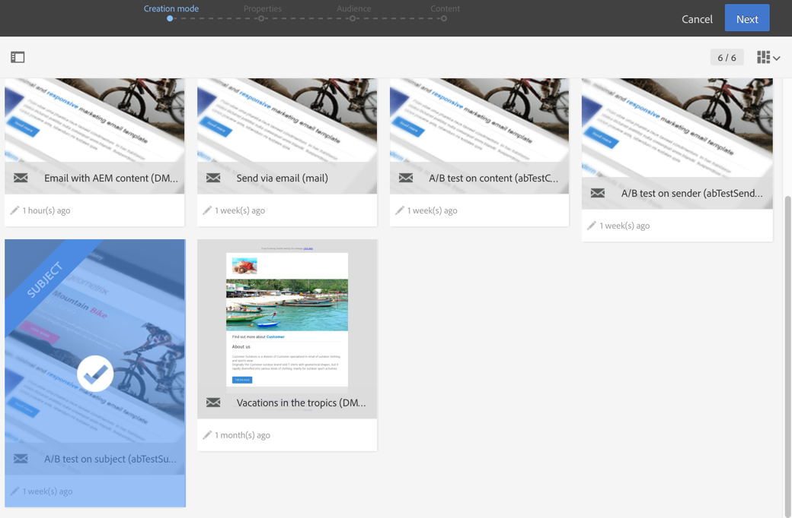

# Designing an A/B test email{#designing-an-a-b-test-email}

Adobe Campaign中的A/B測試功能可讓您定義二到三個電子郵件變數。每個變數都會傳送至人口樣本，以判斷哪個變數有最佳結果。決定後，成功變體便會傳送給剩餘的人口族群。

您可以選擇變更電子郵件的內容、主旨或寄件者。

>[!NOTE]
>
>不可能對在Adobe Experience Manager建立的電子郵件進行A/B測試。

## Creating an A/B test email {#creating-an-a-b-test-email}

A/B測試可使用標準電子郵件建立精靈建立，並新增A/B測試設定步驟。Creating a standard email is detailed in the [Creating an email](../../channels/using/creating-an-email.md) section.

在A/B測試的特定內容中：

1. 根據您要變更的元素，從這三個A/B測試專用範本中建立新的電子郵件：

   * 傳送者上的A/B測試
   * A/B測試內容
   * A/B測試主題
   

   >[!NOTE]
   >
   >依預設會隱藏後續和A/B測試範本。Check the A/B test box on the left side ( **[!UICONTROL Filter]** lateral panel) to display them.

1. 定義一般屬性和電子郵件的目標對象，就像標準電子郵件一樣。Refer to the [Creating audiences](../../audiences/using/creating-audiences.md) section.
1. 在建立精靈的第四個步驟中，定義A/B測試參數：

   * **[!UICONTROL Number of variants]**：您可以選擇使用兩個或三個變體。如果您選擇三個變體，在精靈中確認此步驟後，無法修改此選項。
   * **[!UICONTROL Winning strategy]**：選取要用來決定成功變體的標準。
   * **[!UICONTROL Target breakdown]**：選擇哪個百分比的目標會接收每個變體。剩餘百分比將在決定成功變體後取得。系統會隨機選取目標設定檔。
   * **[!UICONTROL Winner sending method]**：選擇您要在決定成功變體後自動傳送成功變體，還是要手動確認傳送給剩餘的人口。
   * **[!UICONTROL Test duration]**：指定測試的持續時間。成功變體會在此期間自動決定。您可以在電子郵件控制面板結束之前，手動選擇成功變體。

      測試必須至少一小時，以便收集所有追蹤資料並正確將其納入考量，以選取獲勝變體。
   

1. 在定義A/B測試參數後，請傳遞到精靈中的下一個步驟，然後定義電子郵件內容。視您選擇的範本而定，您可以定義數個主題、數個傳送者名稱或數個不同的內容。使用轉盤來導覽元素不同的變體。For more information, consult the [content editor](../../designing/using/about-email-content-design.md) section.

   

1. 確認建立電子郵件。接著會顯示電子郵件控制面板。
1. 排程傳送。定義的日期表示A/B測試開始。
1. Check the A/B test parameters displayed in the **[!UICONTROL A/B test parameters]** block. 您可以修改它們，直到您確認要透過選取區塊來傳送測試(步驟9)為止。

   

1. 準備電子郵件以分析目標及傳送訊息的數目。Consult the [Preparing the send](../../sending/using/preparing-the-send.md) section.
1. 傳送A/B測試之前，請傳送校樣以檢查您的電子郵件。
1. 準備完成後，確認傳送測試。在確認後，A/B測試參數即無法修改。

   The A/B test starts on the date defined in the **[!UICONTROL Schedule]**.You can track its progress using the **[!UICONTROL A/B test]** and **[!UICONTROL Deployment]** blocks.

   如果您想要縮短測試時間長度，可以隨時手動選取成功變體。

   Once testing has finished, a summary table is displayed in the **[!UICONTROL A/B Test]** block and this allows you to view the various indicators for the different variants that were tested.

1. If you have selected **[!UICONTROL Send after confirmation]** as the sending method, you have to manually select the winning variant to start sending it to the remaining population. If you have selected **[!UICONTROL Automatic]**, the winning variant is automatically sent to the remaining population as soon as it has been determined by the system.

   >[!NOTE]
   >
   >如果有關聯，必須手動選取獲勝變體。您可以通知電子郵件製作程式和修飾詞已選擇或需要選取變體。See [Adobe Campaign notifications](../../administration/using/sending-internal-notifications.md).

現在已定義並傳送您的電子郵件。您可以存取其記錄檔和報告以測量促銷活動的成功。

**相關主題**：

[建立電子郵件](https://helpx.adobe.com/campaign/kt/acs/using/acs-create-email-from-homepage-feature-video-use.html) 視訊

## About A/B test indicators {#about-a-b-test-indicators}

在電子郵件控制面板中，有幾個指標可協助您測量A/B測試：點按次數、開啓次數、彈回數等。

Note that the **[!UICONTROL Estimated recipient reactivity]** indicator is a rate comparing the number of recipients who clicked against the number of recipients who opened the email. 例如，如果10位收件者開啓電子郵件，收件者按一下該電子郵件。重新活動率為50%。
