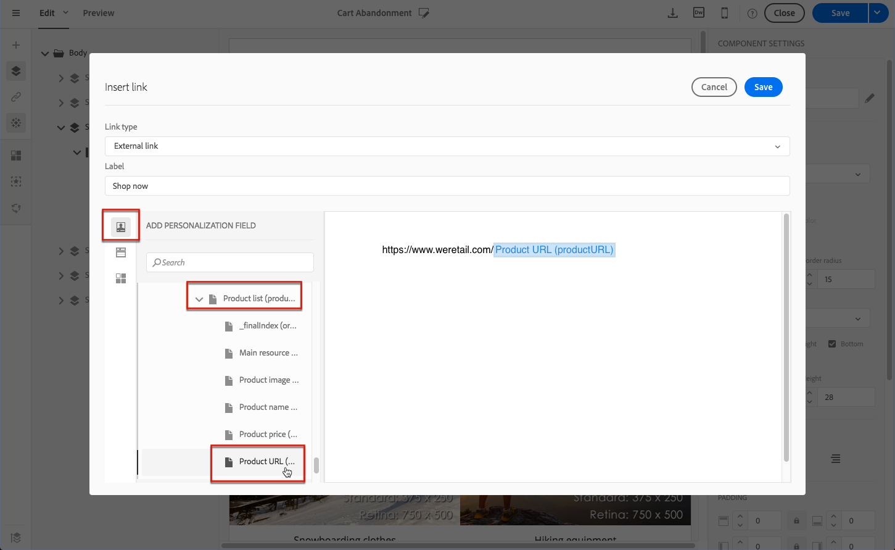

# 事件交易式訊息{#event-transactional-messages}

您可以傳送目標定位事件的事件交易式訊息。此類交易式訊息不包含設定檔資訊：傳遞目標是由事件本身包含的資料所定義。

一旦您建立並發佈事件（[如本節所述的購物車放棄率](../../channels/using/getting-started-with-transactional-msg.md#transactional-messaging-operating-principle)）後，就會自動建立對應的交易式訊息。

設定步驟顯示在「[設定事件以發送交易式訊息](../../administration/using/configuring-transactional-messaging.md#use-case--configuring-an-event-to-send-a-transactional-message)」一節。

>[!NOTE]
>
>事件交易式訊息不包含設定檔資訊，因此它們與疲勞規則不相容（即使在設定檔擴充的情況下亦然）。請參閱[疲勞規則](../../sending/using/fatigue-rules.md#choosing-the-channel)。

為了讓事件觸發傳送交易式訊息，您必須個人化訊息，然後再測試之後發佈訊息。

## 訪問事務性消息 {#accessing-transactional-messages}

要訪問您建立的事務性消息，請執行以下操作：

1. Click the **[!UICONTROL Adobe Campaign]** logo, in the top left corner.
1. Select **[!UICONTROL Marketing plans]** > **[!UICONTROL Transactional messages]** > **[!UICONTROL Transactional messages]**.

   

1. 按一下您選擇的訊息以進行編輯。

>[!IMPORTANT]
>
>您必須是 **[!UICONTROL Administrators (all units)]** 安全群組的成員，才能存取交易式訊息。

## 個人化交易式訊息 {#personalizing-a-transactional-message}

在此示例中，您將通過添加在建立事件時定義的三個欄位來瞭解如何個性化 [事務性消息](../../administration/using/configuring-transactional-messaging.md#use-case--configuring-an-event-to-send-a-transactional-message):名字、最後咨詢的產品、購物車總量。

To do this, you will [insert a personalization field](../../designing/using/personalization.md#inserting-a-personalization-field) in the message content.

1. 按一下 **[!UICONTROL Content]** 區塊以修改訊息的主旨與內容。在此範例中，選取包含影像與文字的任何範本。如需電子郵件內容範本的詳細資訊，請參閱「[使用範本進行設計](../../designing/using/using-reusable-content.md#designing-templates)」。

   

1. 新增主旨並編輯訊息內容以符合您的需求。

   >[!NOTE]
   >
   >連至「放棄的購物車」連結是外部 URL 的連結，這會將使用者重新導向至其購物車。Adobe Campaign 並未管理此參數。

1. 瀏覽> **[!UICONTROL Context]****[!UICONTROL Real-time event]** >以取 **[!UICONTROL Event context]** 得個人化欄位：名字、最後咨詢的產品、購物車總量。

   

1. 若要擴充訊息的內容，請從您連結事件的表格中選取欄位，以新增欄位。在我們的範例中，透過「**[!UICONTROL Context]** > **[!UICONTROL Real-time event]** > **[!UICONTROL Event context]**」選取 **[!UICONTROL Title (salutation)]** 表格中的 **[!UICONTROL Profile]** 欄位。

   

1. 插入需要的所有欄位。

   

1. 選取您為此事件定義的設定檔，以預覽訊息。

   在「[預覽訊息](../../sending/using/previewing-messages.md)」區段中會詳細說明預覽訊息的步驟。

   

   您可以檢查個人化欄位是否符合在測試設定檔中輸入的資訊。如需詳細資訊，請參閱[在交易式訊息中定義測試設定檔](../../channels/using/event-transactional-messages.md#defining-specific-test-profile)。

## 在交易式訊息中使用產品清單 {#using-product-listings-in-a-transactional-message}

您可以建立產品清單，以參考交易式電子郵件內容中的一或多個資料集合。例如，在購物車放棄率電子郵件中，您可以包含使用者離開網站時購物車中的所有產品清單，其中會包含每個產品的影像、價格及其連結。

透過此影片進 [一步瞭解](https://docs.adobe.com/content/help/zh-Hant/campaign-standard-learn/tutorials/designing-content/product-listings-in-transactional-email.translate.html)。

>[!IMPORTANT]
>
>只有在透過「[電子郵件設計工具](../../designing/using/designing-content-in-adobe-campaign.md#email-designer-interface)」介面編輯交易式電子郵件訊息時，才能使用產品清單。
>
>Adobe Campaign 不支援巢狀產品清單，這表示您無法將產品清單加入另一個產品清單中。

在以下範例中，您將學習在交易訊息中新增放棄產品清單的步驟。

### 步驟1:定義產品清單 {#defining-a-product-listing}

您必須先在事件層級中定義產品清單以及您想要顯示清單中各產品的欄位，才能在交易式訊息中使用產品清單。如需詳細資訊，請參閱「[定義資料集合](../../administration/using/configuring-transactional-messaging.md#defining-data-collections)」。

1. 在交易式訊息中，按一下 **[!UICONTROL Content]** 區塊以修改電子郵件內容。
1. 將結構元件拖放至工作區。如需詳細資訊，請參閱「[編輯電子郵件結構](../../designing/using/designing-from-scratch.md#defining-the-email-structure)」。

   例如，選取單欄結構元件並新增文字元件、影像元件及按鈕元件。如需詳細資訊，請參閱「[新增片段及元件](../../designing/using/designing-from-scratch.md#defining-the-email-structure)」。

1. 選取您剛剛建立的結構元件，然後按一下內容工具列中的 **[!UICONTROL Enable product listing]** 圖示。

   

   結構元件會以橘色外框突出顯示，而 **[!UICONTROL Product listing]** 設定會顯示在左側色盤中。

   

1. 選取集合元素的顯示方式：

   * **[!UICONTROL Row]**：水平顯示，表示每列上的每個元素會位在彼此下方。
   * **[!UICONTROL Column]**：垂直顯示，表示每個元素會位在相同列上彼此旁邊。

   >[!NOTE]
   >
   >只有使用多欄結構元件時，才可使用　**[!UICONTROL Column]**　選項（**[!UICONTROL 2:2 column]**、**[!UICONTROL 3:3 column]** 及 **[!UICONTROL 4:4 column]**）。編輯產品清單時，僅填入第一欄：不會將其他欄納入考量。如需選取結構元件的詳細資訊，請參閱「[編輯電子郵件結構](../../designing/using/designing-from-scratch.md#defining-the-email-structure)」。

1. 選取您在設定與交易式訊息相關之事件時建立的資料集合。您可以在 **[!UICONTROL Context]** > **[!UICONTROL Real-time event]** > **[!UICONTROL Event context]** 節點下方找到該集合。

   

   如需設定事件的詳細資訊，請參閱「[定義資料集合](../../administration/using/configuring-transactional-messaging.md#defining-data-collections)」。

1. 使用 **[!UICONTROL First item]** 下拉式清單，以選取會啟動電子郵件中所顯示清單的元素。

   例如，如果您選取 2，集合的第一個項目將不會顯示在電子郵件中。產品清單將從第二個項目開始。

1. 選取清單中要顯示的項目數量上限。

   >[!NOTE]
   >
   >如果您希望清單的元素垂直顯示　(**[!UICONTROL Column]**)，則會根據已選取的結構元件（2、3 或 4 欄）來限制項目數目上限。如需選取結構元件的詳細資訊，請參閱「[編輯電子郵件結構](../../designing/using/designing-from-scratch.md#defining-the-email-structure)」。

### 步驟2:填入產品清單 {#populating-the-product-listing}

若要顯示從連結至交易式電子郵件之事件的產品清單，請遵循下列步驟。

如需在設定事件時建立集合及相關欄位的詳細資訊，請參閱「[定義資料集合](../../administration/using/configuring-transactional-messaging.md#defining-data-collections)」。

1. 選取您已插入的影像元件、選取 **[!UICONTROL Enable personalization]** 並按一下「設定」窗格中的鉛筆。

   

1. 在開啟的 **[!UICONTROL Image source URL]** 視窗中選取　**[!UICONTROL Add personalization field]**。

   從　**[!UICONTROL Context]** > **[!UICONTROL Real-time event]** > **[!UICONTROL Event context]**　節點中，開啟與您建立之集合（此處 **[!UICONTROL Product list]**）相對應的節點，然後選取您定義的影像欄位（此處 **[!UICONTROL Product image]**）。按一下 **[!UICONTROL Save]**。

   

   您選取的個人化欄位現在會顯示在「設定」窗格中。

1. 在需要的位置中，從內容工具列選取 **[!UICONTROL Insert personalization field]**。

   

1. 從　**[!UICONTROL Context]** > **[!UICONTROL Real-time event]** > **[!UICONTROL Event context]**　節點中，開啟與您建立之集合（此處 **[!UICONTROL Product list]**）相對應的節點，然後選取您建立的欄位（此處 **[!UICONTROL Product name]**）。按一下 **[!UICONTROL Confirm]**。

   

   您選取的個人化欄位現在會顯示在電子郵件內容的需要位置。

1. 以類似方式繼續插入價格。
1. 選取一些文字，然後從內容工具列選取 **[!UICONTROL Insert link]**。

   

1. 在開啟的 **[!UICONTROL Insert link]** 視窗中選取　**[!UICONTROL Add personalization field]**。

   從　**[!UICONTROL Context]** > **[!UICONTROL Real-time event]** > **[!UICONTROL Event context]**　節點中，開啟與您建立之集合（此處 **[!UICONTROL Product list]**）相對應的節點，然後選取您建立的　URL　欄位（此處 **[!UICONTROL Product URL]**）。按一下 **[!UICONTROL Save]**。

   >[!IMPORTANT]
   >
   >基於安全考量，請確定您將個人化欄位插入在連結（以適當靜態網域名稱開頭）內部。

   

   您選取的個人化欄位現在會顯示在「設定」窗格中。

1. 選取要對產品清單套用的結構元件，並選取 **[!UICONTROL Show fallback]** 以定義預設內容。

   

1. 拖曳一或多個內容元件，並視需要加以編輯。

   

   如果集合在觸發事件（例如客戶購物車中沒有任何項目）時為空白，則會顯示後備內容。

1. 在「設定」窗格中，編輯產品清單的樣式。如需詳細資訊，請參閱[編輯電子郵件樣式](../../designing/using/styles.md)。
1. 使用連結至相關交易式事件且您為其定義集合資料的測試設定檔，以預覽電子郵件。例如，在您要使用之測試設定檔的 **[!UICONTROL Event data]** 區段中新增下列資訊：

   

   如需在交易式訊息中定義測試設定檔的詳細資訊，請參閱[本區段](../../channels/using/event-transactional-messages.md#defining-specific-test-profile)。

## 測試交易式訊息 {#testing-a-transactional-message}

您首先需要建立特定的測試設定檔，以便正確檢查交易訊息。

### 定義特定測試設定檔 {#defining-specific-test-profile}

定義將連結至您事件的測試設定檔，讓您預覽訊息並傳送相關證明。

1. From the transactional message dashboard, click the **[!UICONTROL Create test profile]** button.

   

1. 在 **[!UICONTROL Event data used for personalization]** 區段中指定要以 JSON 格式傳送的資訊。這是預覽訊息與測試設定檔收到校樣時，將會使用的內容。

   

   >[!NOTE]
   >
   >您也可以輸入與設定檔表格相關的資訊。請參閱 [豐富交易式訊息內容](../../administration/using/configuring-transactional-messaging.md#enriching-the-transactional-message-content)。

1. 建立後，測試描述檔將預先指定在交易訊息中。 按一下訊息的 **[!UICONTROL Test profiles]** 區塊以檢查您的校樣目標。

   

您也可以建立新的測試設定檔，或是使用 **[!UICONTROL Test profiles]** 功能表中已存在的測試設定檔。操作步驟：

1. 按一下左上方的標誌 **[!UICONTROL Adobe Campaign]**，然後選取 **[!UICONTROL Profiles & audiences]** > **[!UICONTROL Test profiles]**。
1. 在區段 **[!UICONTROL Event]** 中，選取您剛建立的事件。 在此範例中，選取「購物車放棄率 (EVTcartAbandonment)」。
1. 在 **[!UICONTROL Event data]** 文字方塊中指定要以 JSON 格式傳送的資訊。

   

1. 儲存您的變更。
1. 存取您建立的訊息，並選取更新的測試設定檔。

**相關主題：**

* [管理測試設定檔](../../audiences/using/managing-test-profiles.md)
* [定義對象](../../audiences/using/creating-audiences.md)

### 傳送證明 {#sending-proof}

建立一或多個特定測試設定檔並儲存交易訊息後，您就可以傳送測試證明。

在「[傳送校樣](../../sending/using/sending-proofs.md)」區段中會詳細說明傳送校樣的步驟。

## 發佈交易式訊息 {#publishing-a-transactional-message}

檢查交易式訊息之後，即可發佈。

現在，觸發「購物車放棄率」事件之後，則會自動提示訊息，其中包含收件者的職務及姓氏、購物車 URL、上次諮詢的產品或產品清單（如果您已定義產品清單），以及要傳送的購物車總金額。

若要存取關於交易式訊息的報告，請使用 **[!UICONTROL Reports]** 按鈕。請參閱「[報告](../../reporting/using/about-dynamic-reports.md)」。

### 暫停交易式訊息發佈 {#suspending-a-transactional-message-publication}

您可以使用　**[!UICONTROL Pause]**　按鈕以暫停發佈交易式訊息，例如，修改訊息中所包含的資料。因此，系統將不會再處理這些事件，而會將之保留在 Adobe Campaign 資料庫的佇列中。

在 REST API 中定義的時段期間，會保留佇列的事件（請參閱 [REST API 文件](../../api/using/get-started-apis.md)），或是保留在觸發事件中　- 如果您使用的是　Triggers　核心服務（請參閱[搭配使用 Campaign 及 Experience Cloud Triggers](../../integrating/using/about-adobe-experience-cloud-triggers.md)）。

按一下　**[!UICONTROL Resume]**　時，則會處理所有佇列的事件（前提是這些事件並未過期）。它們現在會包含暫停範本發佈時進行的所有修改。

### 取消發佈交易式訊息 {#unpublishing-a-transactional-message}

按一下 **[!UICONTROL Unpublish]** 可讓您取消交易式訊息發佈，同時也可取消相對應事件的發佈，這會從與　REST API（與您先前建立之事件相對應的資源）刪除。

現在，即使事件是透過網站觸發，也不會再傳送相對應的訊息，也不會將之儲存在資料庫中。

>[!NOTE]
>
>若要再次發佈訊息，您必須返回相對應的事件設定並將其發佈，然後再發佈訊息。如需詳細資訊，請參閱「[發佈交易式訊息](#publishing-a-transactional-message)」。

如果您解除發佈已暫停的交易式訊息，則可能必須等候長達 24 小時，才能再次發佈。這是為了讓 **[!UICONTROL Database cleanup]** 工作流程清除已傳送至佇列的所有事件。

在「[暫停交易式訊息發佈](#suspending-a-transactional-message-publication)」一節中會詳細說明暫停訊息的步驟。

可透過 **[!UICONTROL Administration]** > **[!UICONTROL Application settings]** > **[!UICONTROL Workflows]** 存取每天凌晨 4:00 執行的工作流程 **[!UICONTROL Database cleanup]**。

### 刪除交易式訊息 {#deleting-a-transactional-message}

在取消發佈交易式訊息之後，或尚未發佈交易式訊息時，您可以從交易式訊息清單中刪除該訊息。操作步驟：

1. 按一下左上方的標誌 **[!UICONTROL Adobe Campaign]**，然後選取 **[!UICONTROL Marketing plans]** > **[!UICONTROL Transactional messages]** > **[!UICONTROL Transactional messages]**。
1. 將滑鼠游標移到您選取的訊息上。
1. 按一下 **[!UICONTROL Delete element]** 按鈕。

但是，只能在特定條件下刪除交易式訊息：

* 請確定交易式訊息的狀態為 **[!UICONTROL Draft]** 狀態，否則您無法將之刪除。**[!UICONTROL Draft]** 狀態適用於尚未發佈或已[取消發佈](#unpublishing-a-transactional-message)（而且並未[暫停](#suspending-a-transactional-message-publication)）的訊息。

* **交易式訊息**：除非將另一個交易式訊息連結到相對應的事件，否則如果已取消發佈交易式訊息，也需要取消發佈事件設定，才能成功刪除交易式訊息。如需詳細資訊，請參閱「[取消發佈事件](../../administration/using/configuring-transactional-messaging.md#unpublishing-an-event)」。

   >[!IMPORTANT]
   >
   >刪除已傳送通知的交易式訊息也會刪除其發送與追蹤日誌。

* **來自現成事件範本的交易式訊息（內部交易式訊息）**：如果內部交易式訊息是唯一與相對應內部事件關聯的訊息，則無法刪除該訊息。您必須先建立另一個交易式訊息，方法是複製該訊息或透過 **[!UICONTROL Resources]** > **[!UICONTROL Templates]** > **[!UICONTROL Transactional message templates]** 功能表進行。

## 交易式訊息重試過程 {#transactional-message-retry-process}

暫時未傳送的交易式訊息可能會執行自動重試，直到傳送到期為止。如需傳遞期間的詳細資訊，請參閱「[有效期間參數](../../administration/using/configuring-email-channel.md#validity-period-parameters)」。

如果無法傳送交易式訊息，有兩種重試系統：

* 在交易式訊息傳遞層級，在將該事件指派給執行傳送之前（代表介於事件接收及傳送準備之間），交易式訊息可能會失敗。請參閱「[事件處理重試過程](#event-processing-retry-process)」。
* 在傳送過程層級，一旦將事件指派給執行傳送，交易式訊息就會因暫時錯誤而失敗。請參閱「[訊息傳送重試過程](#message-sending-retry-process)」。

### 事件處理重試過程 {#event-processing-retry-process}

如果無法將事件指派給執行傳送，則會延遲事件處理。然後會執行重試，直到將其指派給新的執行傳送為止。

>[!NOTE]
>
>交易式訊息傳送日誌中不會顯示延遲的事件，因為尚未將之指派給執行傳送。

例如，由於事件內容不正確、存取權限或品牌推廣有問題、套用類型規則時偵測到錯誤，因此無法將事件指派給執行傳送。在此情況下，您可以暫停訊息、編輯訊息以修正問題，然後再次發佈。之後，重試系統會將其指派給新的執行傳送。

### 訊息傳送重試過程 {#message-sending-retry-process}

一旦將事件指派給執行傳送，交易式訊息可能會因為暫時錯誤（例如，如果收件人的信箱已滿）而失敗。如需詳細資訊，請參閱[傳送暫時失敗後重試](../../sending/using/understanding-delivery-failures.md#retries-after-a-delivery-temporary-failure)。

>[!NOTE]
>
>將事件指派給執行傳送時，其會顯示在此執行傳遞的傳送日誌中，而且只有在這個時候才會顯示。The failed deliveries are displayed in the **[!UICONTROL Execution list]** tab of the transactional message sending logs.

### 重試流程限制 {#limitations}

**傳送日誌更新**

在重試過程中，不會對新執行傳送的傳送日誌進行立即更新（更新會透過排程的工作流程執行）。這表示即使交易式事件已經由新的執行傳送處理，該訊息仍可能處於 **[!UICONTROL Pending]** 狀態。

**執行傳送失敗**

您無法停止執行傳送。但是，如果目前的執行傳送失敗，只要在收到新事件時，就會建立新事件，而且所有新事件都會由這個新的執行傳遞進行處理。失敗的執行傳送不會處理任何新事件。

如果已經將一些事件指派給已延遲的執行傳送且該執行傳送失敗，重試系統不會將延遲的事件指派給新的執行傳送，這代表這些事件都會遺失。
