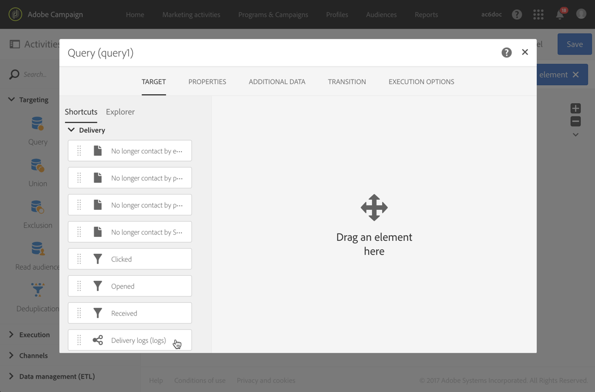

# 後續訊息{#follow-up-messages}

您可以傳送後續訊息給收到特定交易訊息的客戶。 若要這麼做，您必須設定針對對應事件的工作流程。

讓我們重複使用「事務性消息傳遞」操作原 [則部分中介紹的示例](../../channels/using/getting-started-with-transactional-msg.md#transactional-messaging-operating-principle) :購物車放棄電子郵件會傳送給將產品新增至購物車的網站使用者，但是離開網站卻未進行購買。

您想要傳送友好提醒給所有收到購物車放棄通知但三天後未開啟通知的客戶。

然後，每位相關客戶都會根據第一次傳送電子郵件中使用的相同資料收到後續訊息。

## 訪問後續消息 {#accessing-the-follow-up-messages}

Once you have created and published an event (the cart abandonment as per the [example](../../channels/using/getting-started-with-transactional-msg.md#transactional-messaging-operating-principle) above), the corresponding transactional message and follow-up message are created automatically.

The configuration steps are presented in the [Configuring an event to send a follow-up message](../../administration/using/configuring-transactional-messaging.md#configuring-an-event-to-send-a-follow-up-message) section.

若要處理工作流程中的事件，需要傳送範本。 但是，發佈事件時，所 [建立的交易訊息](../../channels/using/event-transactional-messages.md) ，無法當做範本使用。 因此，您需要建立特定的後續傳送範本，以支援此事件類型，並用作工作流程中的範本。

若要存取此範本：

1. Click the **[!UICONTROL Adobe Campaign]** logo, in the top left corner.
1. Select **[!UICONTROL Resources]** > **[!UICONTROL Templates]** > **[!UICONTROL Delivery templates]**.
1. 選中左 **[!UICONTROL Follow-up messages]** 窗格中的框。

   

僅顯示後續消息。

>[!NOTE]
>
>您必須是 **[!UICONTROL Administrators (all units)]** 安全群組的成員，才能存取交易式訊息。

## 傳送後續訊息 {#sending-a-follow-up-message}

建立後續傳送範本後，您就可以在工作流程中使用它來傳送後續訊息。

1. 存取行銷活動清單並建立新的工作流程。

   See [Creating a workflow](../../automating/using/building-a-workflow.md#creating-a-workflow).

1. Drag and drop a **[!UICONTROL Scheduler]** activity into your workflow and open it. 將執行頻率設為一天一次。

   「調度程式」(Scheduler)部分顯示「 [調度程式](../../automating/using/scheduler.md) 」活動。

1. Drag and drop a **[!UICONTROL Query]** activity into your workflow and open it.

   「查詢」活動顯示在「查 [詢](../../automating/using/query.md) 」部分。

1. 要對配置檔案資源以外的資源運行查詢，請轉至活動的頁籤， **[!UICONTROL Properties]** 然後按一下 **[!UICONTROL Resource]** 下拉清單。

   

   >[!NOTE]
   >
   >依預設，活動會預先設定為搜尋設定檔。

1. 選擇您要定位的事件，以便您僅能存取此事件的資料。

   

1. 移至活動的標籤， **[!UICONTROL Target]** 並將元素從浮動視窗拖 **[!UICONTROL Delivery logs (logs)]** 放至工作區中。

   

   選 **[!UICONTROL Exists]** 擇以鎖定收到電子郵件的所有客戶。

   

1. 將元素 **[!UICONTROL Tracking logs (tracking)]** 從浮動視窗移至工作區，然後選 **[!UICONTROL Does not exist]** 取以定位所有未開啟電子郵件的客戶。

   

1. 從浮動視窗拖放您要定位的事件(**此範例中為放棄購物車** )至工作區。 然後定義規則，以定位三天前傳送的所有訊息。

   

   這表示所有在工作流執行三天前收到交易性消息但尚未開啟該消息的接收者都將定位。

   Click **[!UICONTROL Confirm]** to save the query.

1. Drag and drop an **Email delivery** activity into your workflow.

   「電子郵件傳送」活動會顯示在「電子 [郵件傳送](../../automating/using/email-delivery.md) 」區段。

   

   您也可以使用 [SMS傳送](../../automating/using/sms-delivery.md) ，或 [Mobile應用程式傳送活動](../../automating/using/push-notification-delivery.md) 。 在這種情況下，請務必在建立事件設 **[!UICONTROL Mobile (SMS)]** 定時 **[!UICONTROL Mobile application]** 選取或渠道。 請參閱[建立事件](../../administration/using/configuring-transactional-messaging.md#creating-an-event)。

1. 開啟「電子 **郵件傳送** 」活動。 在建立精靈中，核取方 **[!UICONTROL Follow-up messages]** 塊並選取發佈事件後建立的後續傳送範本。

   

1. 在後續的訊息內容中，您可以新增個人化欄位，以運用活動的內容。

   

1. 選取> **[!UICONTROL Context]** >以尋找建立事件時定義的欄 **[!UICONTROL Real-time event]****[!UICONTROL Event context]**&#x200B;位。 See [Personalizing a transactional message](../../channels/using/event-transactional-messages.md#personalizing-a-transactional-message).

   

   這表示您可以運用第一次傳送活動時使用的相同內容（包括豐富資料）來建立個人化的友好提醒。

1. 儲存活動並啟動工作流程。

工作流程啟動後，每位在三天前收到購物車放棄通知但未開啟該通知的客戶，都會收到以相同資料為基礎的後續訊息。

>[!NOTE]
>
>如果您在建立事 **[!UICONTROL Profile]** 件設定時選取定位維度，後續訊息也會運用Adobe Campaign行銷資料庫。 請參閱[設定檔交易式訊息](../../channels/using/profile-transactional-messages.md)。

