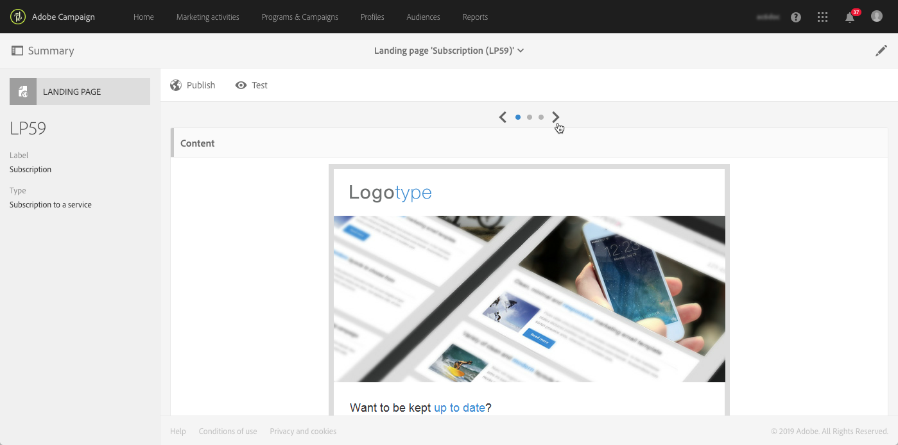

# 登錄頁面快速入門 {#getting-started-with-landing-pages}

設定登錄頁面的主要步驟如下：

在本頁面中，您將會找到這些步驟的相關資訊及專用檔案的參考，以取得更多詳細資訊。

**相關主題：**

* [建立著陸頁面教學課程影片](https://docs.adobe.com/content/help/zh-Hant/campaign-standard-learn/tutorials/communication-channels/landing-pages/landing-page-create-and-edit.translate.html)
* [建立服務](../../audiences/using/creating-a-service.md)
* [設定雙重加入程序](setting-up-a-double-opt-in-process.md)

## 登錄頁面限制{#landing-page-limitations}

下節列出您在開始設定登錄頁面之前應注意的限制。

**寫入和更新資料**

* 登錄頁面僅限於 **[!UICONTROL Profile]** 和 **[!UICONTROL Subscription]** 資源。可從 **[!UICONTROL Profile]** 儲存及更新記錄，以及訂閱/取消訂閱 **[!UICONTROL Service]**。
有關資源設定的詳細資訊，請參閱[設定資源的資料結構](../../developing/using/configuring-the-resource-s-data-structure.md)。

>[!CAUTION]
>
>登錄頁面無法顯示或更新來自 **[!UICONTROL Profile]** 及 **[!UICONTROL Subscription]** 以外之任何資源的資料。

**預先載入**

* 登錄頁面無法自動顯示記錄清單，也無法列出已訂閱設定檔的服務。如需服務的詳細資訊，請參閱本[頁面](../../audiences/using/creating-a-service.md)。

* 具有預先填入表單的登錄頁面（已使用資料預先載入頁面）只能從 Adobe Campaign 電子郵件存取。無法從網站頁面存取此類表格。

**調解**

* 調解行為如下：找到相符項目之後，調解進度就會停止。這表示調解只能在一個設定檔記錄上進行，如果有重複項目，則無法在多個記錄上進行。

例如，您想要將下列贏取登錄頁面傳送至設定檔，以使用設定檔的行動號碼更新 Campaign 資料庫。

如果您的其中一個設定檔填入登錄頁面，但已有重複的設定檔，則會更新具有最早建立日期的相符設定檔，因為設定檔會根據其建立日期來排定優先順序。

此處僅更新第一個設定檔，因為它是最舊的項目。

**測試登錄頁面**

* 登錄頁面僅適用於設定檔，而非測試設定檔，這表示登錄頁面無法作為電子郵件證明的一部分進行測試。

## 步驟 1 –設定登錄頁面範本 {#configure-the-landing-page-template}

設定登錄頁面之前，第一步是設定符合您需求的登錄頁面範本。範本準備就緒後，會使用所需的參數來預先設定所有以該範本為基礎的登錄頁面。

1. 從進階功能表，透過 Adobe Campaign 標誌，選取 **[!UICONTROL Resources]** / **[!UICONTROL Templates]** / **[!UICONTROL Landing page templates]**，然後複製您要使用的範本。
1. 在範本屬性中，指定登錄頁面必須具有的所有共同參數。例如：目標維度、已識別或未識別訪客的頁面存取參數、訪客進行表單驗證的特定動作、內容中使用的品牌/標誌等。如需登錄頁面屬性的詳細資訊，請參閱[本區段](../../channels/using/configuring-landing-page.md)。
1. 儲存您的修改。

如需登錄頁面範本，請參閱[本區段](../../channels/using/getting-started-with-landing-pages.md)。

## 步驟 2 –建立和設定登錄頁面 {#create-and-configure-the-landing-page}

從上一步驟中定義的範本，在方案或行銷活動中建立新的登錄頁面。

1. 依據需要的範本建立登錄頁面。
1. 輸入登錄頁面的一般參數（標籤、說明等）。
1. 之後，您將會存取登錄頁面控制面板。如有需要，可以編輯登錄頁面屬性（請參閱[設定登錄頁面](../../channels/using/configuring-landing-page.md)）。依預設，屬性是在登錄頁面範本中設定的屬性。
基於安全性原因和平台效能，強烈建議您在登錄頁面屬性中設定到期日。完成後，登錄頁面將在選取的日期自動取消發佈。如需有效性參數的詳細資訊，請參閱[本區段](../../channels/using/testing-publishing-landing-page.md#setting-up-validity-parameters)。

   

>[!NOTE]
>
>您的修改僅對正在編輯的登錄頁面有效。如果您想要將這些修改套用至其他登錄頁面，您可以在專用的範本中執行這些修改，然後從該範本建立其他登錄頁面。

## 步驟　3 –設計登錄頁面 {#design-the-landing-page}

您現在可以定義登錄頁面的內容。依預設，登錄頁面包含三個可透過捲動箭頭存取的頁面：主要內容頁面、確認頁面和錯誤頁面。

每個頁面預設會設定數個欄位。如有必要，您可以編輯其屬性和對應。

您也可以設定在設定檔按一下確認按鈕後，其行為方式，並根據您的需求（影像、個人化欄位等）個人化內容。例如，您可以在登錄頁面的確認頁面上插入設定檔的名字，以感謝他們註冊。

如需登錄頁面設計的詳細資訊，請參閱[本區段](../../channels/using/designing-a-landing-page.md)。

## 步驟　4 –測試登錄頁面 {#test-the-landing-page}

一旦定義登錄頁面後，您就可以模擬其執行方式，並在登錄頁面可線上使用時採取動作。

>[!CAUTION]
>
>登錄頁面測試只能使用設定檔進行，而不能使用測試設定檔。提交表單時，選取的設定檔資料將會實際更新。若要避免修改真正的設定檔，請使用假造的客戶設定檔。

如果您對登錄頁面的運作方式感到滿意，則可以發佈它，以供線上使用。

如需如何測試登錄頁面的詳細資訊，請參閱[本區段](../../channels/using/testing-publishing-landing-page.md#testing-the-landing-page-)。

## 步驟　5 –發佈登錄頁面 {#publish-the-landing-page}

測試成功後，您就可以使用控制面板中動作列的 **[!UICONTROL Publish]** 按鈕以發佈登錄頁面。監控區塊會顯示發佈的進展和狀態。

發佈登錄頁面可讓其透過線上存取。發佈後，您隨時都可以更新：若要執行此操作，您必須在每次修改後重新發佈。您也可以隨時解除發佈登錄頁面，使其不再可用。

發佈後，您的登錄頁面就可供使用。然後，您可以設定不同的機制來存取該機制，以便在資料庫中獲取新設定檔案或獲取有關現有設定檔案的其他資訊。

如需這些差異的詳細資訊，請參閱[本區段](../../channels/using/testing-publishing-landing-page.md#publishing-a-landing-page)。
