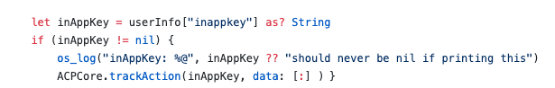

# 應用程式內常見問題集 {#in-app-faq}

## 在Adobe Campaign Standard中深入瞭解應用程式內頻道時，有哪些實用的資源建議？ {#resources-inapp}

檢視下列資源：

* [影片教學課程](https://experienceleague.adobe.com/docs/campaign-standard-learn/tutorials/communication-channels/mobile/in-app/in-app-message-overview.html)
* [部落格貼文](https://theblog.adobe.com/get-more-out-of-the-new-in-app-message-channel-from-adobe-campaign/)
* [社群頁面](https://experienceleaguecommunities.adobe.com/t5/adobe-campaign-standard/ct-p/adobe-campaign-standard-community)

## Campaign擴充功能API setLinkageField和resetLinkageField的用途為何？ {#extensions-apis}

由於SDK會從Campaign提取應用程式內訊息，因此我們想要提供安全的機制，以確保包含PII資料的應用程式內訊息不會落入惡意人士之手。 因此，我們備有以下機制來確保將訊息安全傳送至裝置：

* 如果客戶想要確保安全地傳遞此特定資訊，請將行動設定檔欄位（appSubscriberRcp表格）標示為「個人」和「敏感」。
* 標示為此類的欄位只能用於具有額外內建安全性機制的設定檔範本（不在appSubscriber範本或廣播範本中）。
* 只有當使用者已登入應用程式時，才能提供使用設定檔範本建立的訊息。
* 為了促進此安全交握，行動應用程式開發人員應使用setLinkageField API傳遞其他驗證詳細資訊。 請注意，連結欄位是在擴充appSubscriberRcp表格時，識別為行動設定檔與CRM設定檔之間的連結。
* 當使用者使用resetLinkageField登出應用程式時，他們應該清除儲存在裝置上的應用程式內訊息和resetLinkagefields 。 這樣可確保當不同的使用者登入應用程式時，不會看到傳遞給前一個使用者的訊息。
* 請參閱 [行動SDK API](https://developer.adobe.com/client-sdks/documentation/adobe-campaign-standard/api-reference/) 在使用者端實作此安全性機制。

## 在Campaign中啟用應用程式內報表需要做什麼？ {#enable-inapp-reporting}

您需要設定應用程式內追蹤回傳。 您可以找到指示 [此處](../../administration/using/configuring-rules-launch.md#inapp-tracking-postback).

若要實作本機通知追蹤，請參閱此 [頁面](../../administration/using/local-tracking.md).

## 哪些報表適用於應用程式內頻道？ {#report-inapp}

Adobe Campaign中針對應用程式內頻道提供了現成可用的報表。 請參閱此 [檔案](../../reporting/using/in-app-report.md).

檢視此 [頁面](../../reporting/using/indicator-calculation.md#in-app-delivery) 以瞭解每個應用程式內量度的計算方式。

## 是否針對類似推播的應用程式內支援多語言內容變體？ {#multilingual-inapp}

目前沒有可用於應用程式內傳訊的多語言範本。

不過，如果目標是要以英文以外的語言傳送應用程式內訊息，內容可以直接貼到可用的文字方塊中。

## Campaign個人化欄位可以新增到自訂HTML嗎？ {#custom-html-inapp}

否，目前尚不支援此功能。

## 我已設定警示訊息，但警示訊息未顯示在裝置上。 {#alert-message}

警示訊息至少需要一個解除按鈕（主要或次要應該有動作解除）。 否則，可以儲存訊息，但無法接收。

## 如果本機通知iOS自訂聲音未播放；是否會改為播放預設聲音？ {#local-notification-sound}

針對iOS上的自訂聲音，在建立本機通知時（例如sound.caf），您需要提供副檔名為的檔案名稱。 如果未提供此擴充功能，則會使用預設聲音。

## 應用程式內訊息是否支援深層連結？ {#inapp-deeplinks}

是，應用程式內訊息支援深層連結。 深層連結應包括：

* 語言指出必須停用傳遞追蹤，深層連結才能運作。
* 將Branch作為可執行深層連結追蹤之合作夥伴的應用程式傳單。 如需Branch和Adobe Campaign Standard整合的詳細資訊，請參閱此 [頁面](https://help.branch.io/using-branch/docs/adobe-campaign-standard-1).

## 當使用者從推播通知啟動應用程式時，可以觸發應用程式內訊息嗎？ {#inapp-push-trigger}

是的，這些訊息也稱為菊花鏈訊息。 請依照下列程式進行：

1. 建立應用程式內訊息。

1. 定義自訂事件，並選取它作為此IAM的事件觸發器，例如「從秋季預覽推送觸發」。

1. 在製作推送訊息時，請定義自訂變數，其值可設為用來觸發IAM的事件，例如Key = &quot;inappkey&quot;且value = &quot;Trigger from fall preview Push&quot;。

1. 在行動應用程式程式碼中，實作事件觸發器，如下所示：

   
