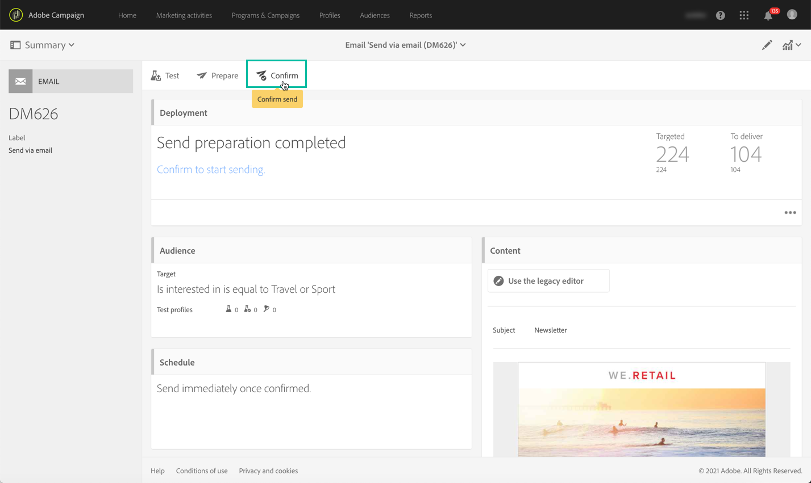
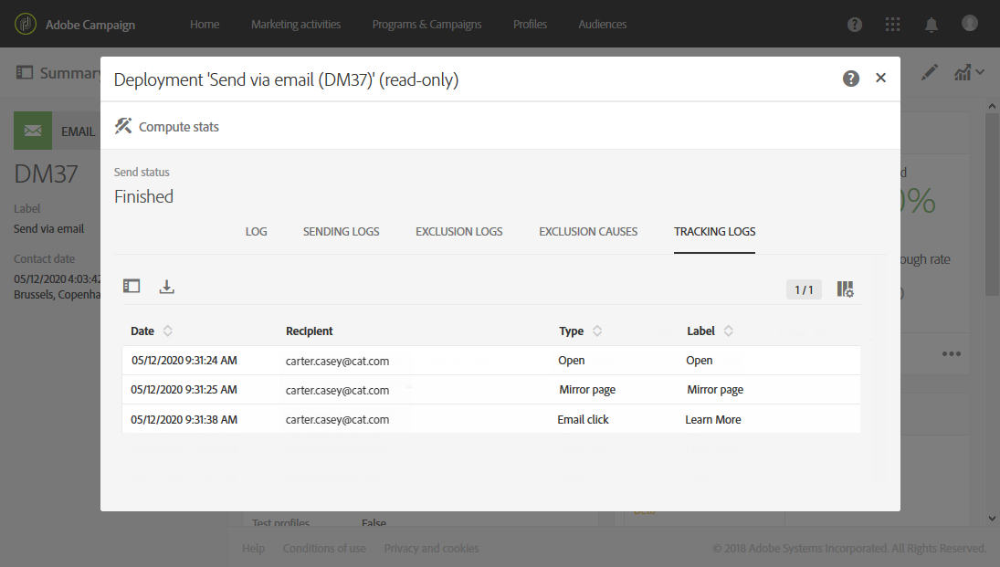

# 傳送訊息的重要步驟{#key-steps-to-send-a-message}

在本節中，您將瞭解如何使用Adobe Campaign Standard建立個人化訊息並傳送給目標對象。

以下章節提供如何建立及設定每個通訊通道的特定資訊：

* [建立電子郵件](../../channels/using/creating-an-email.md)
* [建立簡訊](../../channels/using/creating-an-sms-message.md)
* [建立直接郵件傳送](../../channels/using/creating-the-direct-mail.md)
* [正在建立推播通知](../../channels/using/preparing-and-sending-a-push-notification.md)。
* [準備和傳送應用程式內訊息](../../channels/using/preparing-and-sending-an-in-app-message.md)

若要瞭解傳遞最佳實務，請參閱[傳遞最佳實務](../../sending/using/delivery-best-practices.md)區段。

## 建立您的訊息

利用Campaign Standard [行銷活動](../../start/using/marketing-activities.md)建立電子郵件、簡訊、直接郵件、推播通知或應用程式內訊息。

可從行銷活動清單或使用[專用活動](../../automating/using/about-channel-activities.md)的工作流程建立訊息。

## 定義客群

定義訊息的收件者。 若要這麼做，請使用左側窗格中的[查詢編輯器](../../automating/using/editing-queries.md)來篩選資料庫中包含的資料，並建立規則以鎖定您的對象。

有數種對象可供使用：

* **[!UICONTROL Target]**&#x200B;是您電子郵件的主要目標，
* **[!UICONTROL Test profiles]**&#x200B;是用於測試和驗證您的電子郵件的設定檔（請參閱[管理測試設定檔](../../audiences/using/managing-test-profiles.md)）。

## 設計並將內容個人化

在&#x200B;**[!UICONTROL Content]**&#x200B;區塊中，使用資料庫中的欄位來設計和個人化您的訊息內容。 如需如何為特定頻道設計內容的詳細資訊，請參閱本頁頂端所列的區段。

## 準備和測試

[準備](../../sending/using/preparing-the-send.md)訊息。 此程式會計算目標母體並準備個人化訊息。

**使用Campaign Standard功能傳送訊息之前，請先檢查並測試您的訊息**：預覽、電子郵件呈現、校樣等。如需詳細資訊，請參閱[此章節](../../sending/using/previewing-messages.md)。

使用&#x200B;**[!UICONTROL Schedule]**&#x200B;區塊來定義訊息的傳送時間（請參閱[排程訊息](../../sending/using/about-scheduling-messages.md)）。

## 傳送及追蹤

訊息就緒後，即可確認傳送。 **[!UICONTROL Deployment]**&#x200B;區塊會顯示傳送進度和結果。

有數個記錄檔可協助您監視訊息的傳遞（請參閱[監視傳遞](../../sending/using/monitoring-a-delivery.md)）。 有了Campaign Standard的[追蹤功能](../../sending/using/tracking-messages.md)，您也可以追蹤傳遞收件者的行為。

透過各種指標和圖表（請參閱[存取報告](../../reporting/using/about-dynamic-reports.md)），測量訊息的成效以及傳送和行銷活動的演化。

