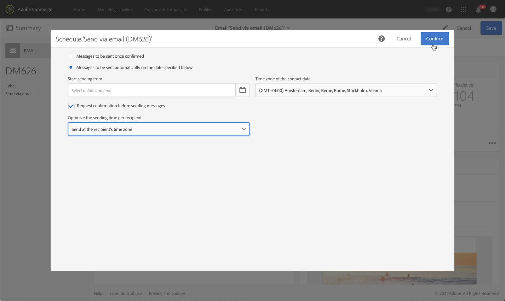

# 傳送訊息的重要步驟{#key-steps-to-send-a-message}

在本節中，您將學習如何使用Adobe Campaign Standard建立個性化消息並將其發送到目標受眾。

有關如何建立和配置每個通信通道的具體資訊，請參閱以下各節：

* [建立電子郵件](../../channels/using/creating-an-email.md)
* [建立SMS](../../channels/using/creating-an-sms-message.md)
* [建立直接郵件傳遞](../../channels/using/creating-the-direct-mail.md)
* [建立推送通知](../../channels/using/preparing-and-sending-a-push-notification.md)。
* [準備和傳送應用程式內訊息](../../channels/using/preparing-and-sending-an-in-app-message.md)

要瞭解交付最佳實踐，請咨詢 [提供最佳做法](../../sending/using/delivery-best-practices.md) 的子菜單。

## 建立郵件

利用Campaign Standard [營銷活動](../../start/using/marketing-activities.md) 建立電子郵件、SMS、直接郵件、推送通知或In-App消息。

可以通過市場營銷活動清單或工作流使用 [專門活動](../../automating/using/about-channel-activities.md)。

## 定義對象

定義郵件的收件人。 要執行此操作，請使用 [查詢編輯器](../../automating/using/editing-queries.md) 從左窗格篩選資料庫中包含的資料並生成規則以針對您的受眾。

可用的受眾類型有幾種：

* **[!UICONTROL Target]** 是你電子郵件的主要目標，
* **[!UICONTROL Test profiles]** 是用於test和驗證電子郵件的配置檔案(請參閱 [管理test配置檔案](../../audiences/using/managing-test-profiles.md))。

## 設計並個人化內容

在 **[!UICONTROL Content]** 使用資料庫中的欄位阻止、設計和個性化消息內容。 有關如何為特定頻道設計內容的詳細資訊，請參閱本頁頂部列出的部分。

## 準備和test

[準備](../../sending/using/preparing-the-send.md) 消息。 此過程計算目標總量並準備個性化消息。

**檢查並test您的郵件** 在使用Campaign Standard功能發送之前：預覽、電子郵件呈現、校對等。 如需詳細資訊，請參閱[本章節](../../sending/using/previewing-messages.md)。

使用 **[!UICONTROL Schedule]** 阻止以定義何時發送消息(請參閱 [計畫消息](../../sending/using/about-scheduling-messages.md))。

## 發送和跟蹤

消息準備好後，您可以確認發送。 的 **[!UICONTROL Deployment]** 塊顯示發送進度和結果。

有幾個日誌可幫助您監視郵件的傳遞(請參見 [監控交貨](../../sending/using/monitoring-a-delivery.md))。 您還可以跟蹤遞送收件人的行為，這要歸功於Campaign Standard [跟蹤功能](../../sending/using/tracking-messages.md)。

通過各種指標和圖表衡量郵件的有效性以及發送和促銷活動的演變情況(請參閱 [訪問報告](../../reporting/using/about-dynamic-reports.md))。

