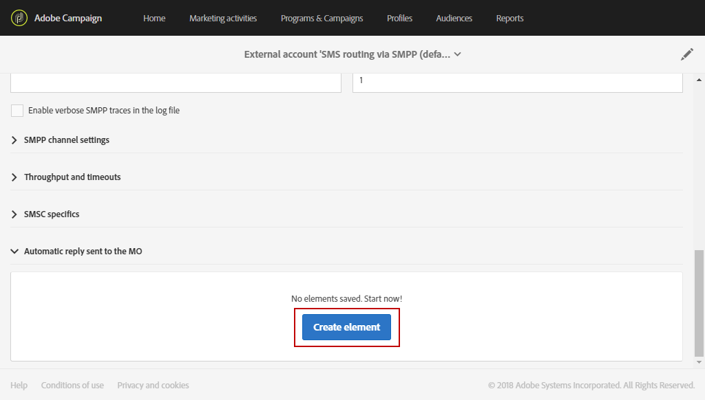
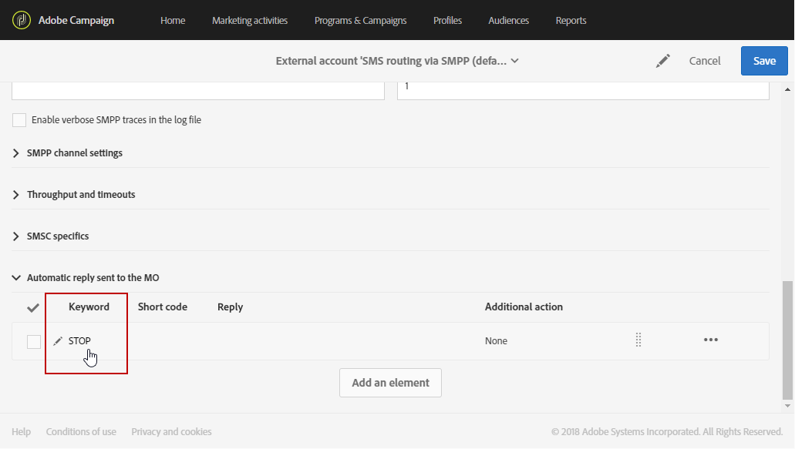
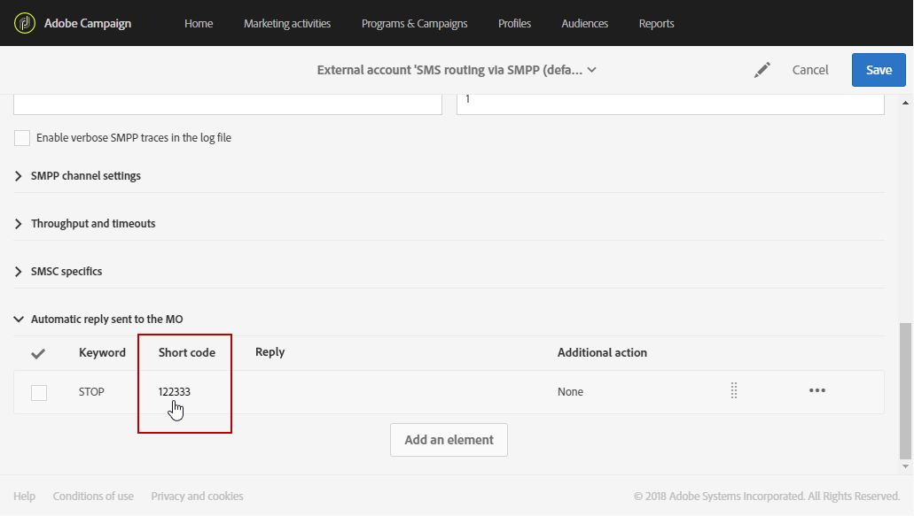

# 管理傳入的 SMS{#managing-incoming-sms}

## 管理停止SMS {#managing-stop-sms}

當描述檔回覆透過「促銷活動」傳送的SMS訊息時，您可以設定自動傳回給他的訊息，以及要執行的動作。

此配置在SMS路由外 **[!UICONTROL Automatic reply sent to the MO]** 部帳戶的 [部分中定義](../../administration/using/configuring-sms-channel.md#defining-an-sms-routing)。 MO代表「Mobile Surced」，這表示您可以設定自動回覆給傳送SMS的行動裝置。

若要這麼做：

1. 從進階功能表，透過Adobe Campaign標誌，選擇 **[!UICONTROL Administration > Application settings > External accounts]** 外部 **[!UICONTROL SMS routing via SMPP]** 帳戶。
1. 在類別 **[!UICONTROL Automatic reply sent to the MO]** 下，按一 **[!UICONTROL Create element]** 下以開始設定自動回覆。

   

1. 選擇將觸發此自動回覆的關鍵字。 關鍵字不區分大小寫。 例如，在這裡，如果收件者傳送關鍵字「STOP」，就會收到自動回覆。

   如果您想要傳送相同的回覆（無論關鍵字為何），請將此欄留空。

   

1. 在欄位 **[!UICONTROL Short code]** 中，指定一個通常用來傳送傳送的編號，並作為傳送者名稱。 您也可以決定將欄留空， **[!UICONTROL Short code]** 以便不論使用什麼簡短的程式碼，都傳送相同的回覆。

   

1. 在欄位中輸入您要傳送給收件者的答案 **[!UICONTROL Reply]**。

   若要執行動作而不傳送回覆，請將欄留 **[!UICONTROL Reply]** 空。 例如，這可讓您從隔離中移除回覆「STOP」以外訊息之使用者的電話號碼。

   

1. 在欄位 **[!UICONTROL Additional action]** 中，將動作連結至您的自動回覆：

   * 該操 **[!UICONTROL Send to quarantine]** 作會自動隔離配置檔案電話號碼。
   * 該操 **[!UICONTROL Remove from quarantine]** 作會從隔離中刪除配置檔案電話號碼。
   * 此動 **[!UICONTROL None]** 作可讓您只傳送訊息給收件者，而不需執行動作。
   例如，在下列設定中，如果收件者傳送關鍵字"STOP"，他們會自動收到取消訂閱的確認，而且其電話號碼將會以狀態傳送至隔離 **[!UICONTROL Blacklisted]** 區。 此狀態僅指電話號碼，設定檔未列入黑名單，因此使用者會繼續收到電子郵件訊息。

   

您的收件者現在可以自動取消訂閱您的訊息，並透過此自動回覆傳送至隔離。 隔離的收件者列在可透過「 &gt; **[!UICONTROL Addresses]** &gt; **[!UICONTROL Administration]** 」功能表取得的 **[!UICONTROL Channels]****[!UICONTROL Quarantines]** 表格中。 For more information on quarantines, refer to this [section](../../sending/using/understanding-quarantine-management.md).

如有需要，可儲存這些傳入的SMS。 For more information on this, refer to this [section](#storing-incoming-sms).

## 儲存傳入的簡訊 {#storing-incoming-sms}

在外部 **[!UICONTROL SMS routing via SMPP]** 帳戶中，您可以選擇儲存傳入訊息，例如當訂閱者回覆「STOP」SMS訊息，以便從收件者清單中移除時。

在類 **[!UICONTROL Store incoming MO in the database]** 別中檢 **[!UICONTROL SMPP channel settings]** 查，所有SMS都會儲存在inSMS表格中，並可透過工作流程中的查詢活動來擷取。

若要這麼做：

1. 在欄位 **[!UICONTROL SMPP channel settings]** 中，選中 **[!UICONTROL Store incoming MO in the database]**。

   

1. 在標籤 **[!UICONTROL Marketing activities]** 中，按一下， **[!UICONTROL Create]** 然後選取 **[!UICONTROL Workflow]**。

   

1. 選擇您的工作流類型。
1. 編輯工作流程的屬性，然後按一下 **[!UICONTROL Create]**。 For more on workflows creation, refer to this [section](../../automating/using/building-a-workflow.md).
1. 拖放活動 **[!UICONTROL Query]** 並按兩下活動。
1. 在查詢 **[!UICONTROL Properties]** 的標籤中，在欄 **[!UICONTROL Incoming SMS (inSMS)]** 位中選 **[!UICONTROL Resource]** 擇。

   

1. 然後，在標 **[!UICONTROL Target]** 簽中拖放規 **[!UICONTROL Incoming SMS attributes]** 則。

   

1. 在此，我們希望定位從前一天開始的每個傳入消息。 在類別 **[!UICONTROL Field]** 中，選擇 **[!UICONTROL Creation date (created)]**。
1. 在中 **[!UICONTROL Filter type]**，選擇 **[!UICONTROL Relative]** ，然後 **[!UICONTROL Level of precision]**&#x200B;在中選擇 **[!UICONTROL Day]**。

   

1. 然後，您可以選擇從今天、前一天或前幾天擷取資料。 配置 **[!UICONTROL Confirm]** 查詢時按一下。

此查詢將根據所選時間範圍檢索收到的每條STOP消息。

例如，此活動可讓您建立人口，並更個人化您的遞送。
