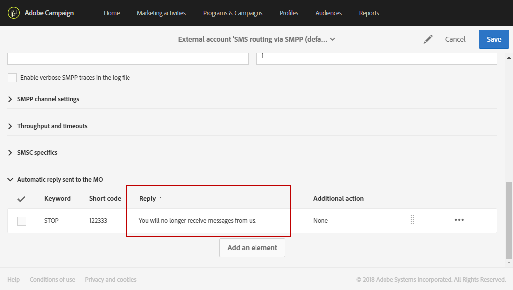
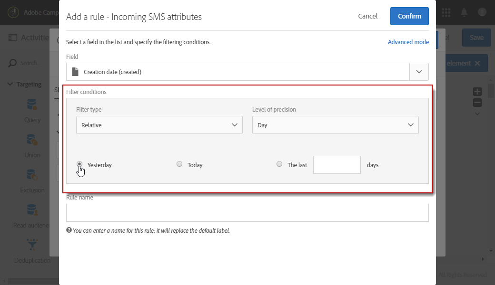

# 管理傳入的 SMS{#managing-incoming-sms}

## 管理停止SMS {#managing-stop-sms}

當描述檔回覆透過 Campaign 傳送的 SMS 訊息時，您可以設定自動傳回給他的訊息，以及要執行的動作。

此配置在[SMS路由外部帳戶](../../administration/using/configuring-sms-channel.md#defining-an-sms-routing)的&#x200B;**[!UICONTROL Automatic reply sent to the MO]**&#x200B;部分中定義。 MO代表「Mobile Surced」，這表示您可以設定自動回覆給傳送SMS的行動裝置。

若要這麼做：

1. 從進階功能表，透過Adobe Campaign標誌，選擇&#x200B;**[!UICONTROL Administration > Application settings > External accounts]**，然後選擇&#x200B;**[!UICONTROL SMS routing via SMPP]**&#x200B;外部帳戶。
1. 在&#x200B;**[!UICONTROL Automatic reply sent to the MO]**&#x200B;類別下，按一下&#x200B;**[!UICONTROL Create element]**&#x200B;開始設定自動回覆。

   

1. 選擇將觸發此自動回覆的關鍵字。 關鍵字不區分大小寫。 例如，在這裡，如果收件者傳送關鍵字「STOP」，就會收到自動回覆。

   如果您想要傳送相同的回覆（無論關鍵字為何），請將此欄留空。

   

1. 在&#x200B;**[!UICONTROL Short code]**&#x200B;欄位中，指定通常用於傳送傳送的數字，並做為傳送者名稱。 您也可以決定將&#x200B;**[!UICONTROL Short code]**&#x200B;欄留空，以傳送相同的回覆，不論程式碼為何。

   

1. 在&#x200B;**[!UICONTROL Reply]**&#x200B;欄位中輸入您要傳送給收件者的答案。

   要執行不發送回復的操作，請保留&#x200B;**[!UICONTROL Reply]**&#x200B;列為空。 例如，這可讓您從隔離中移除回覆「STOP」以外訊息之使用者的電話號碼。

   

1. 在&#x200B;**[!UICONTROL Additional action]**&#x200B;欄位中，將動作連結至您的自動回覆：

   * **[!UICONTROL Send to quarantine]**&#x200B;動作會自動隔離設定檔電話號碼。
   * **[!UICONTROL Remove from quarantine]**&#x200B;動作會移除描述檔電話號碼的隔離。
   * **[!UICONTROL None]**&#x200B;動作可讓您只傳送訊息給收件者，而不執行動作。

   例如，在下列設定中，如果收件者傳送關鍵字&quot;STOP&quot;，他們會自動收到取消訂閱的確認，而且其電話號碼會傳送至具有&#x200B;**[!UICONTROL On denylist]**&#x200B;狀態的隔離區。 此狀態僅指電話號碼，設定檔會讓使用者繼續收到電子郵件訊息。

   

您的收件者現在可以自動取消訂閱您的訊息，並透過此自動回覆傳送至隔離。 隔離的收件者列在&#x200B;**[!UICONTROL Addresses]**&#x200B;表格中，可透過&#x200B;**[!UICONTROL Administration]** > **[!UICONTROL Channels]** > **[!UICONTROL Quarantines]**&#x200B;功能表取得。 有關隔離的詳細資訊，請參閱[部分](../../sending/using/understanding-quarantine-management.md)。

如有需要，可儲存這些傳入的SMS。 有關此問題的詳細資訊，請參閱此[部分](#storing-incoming-sms)。

## 儲存傳入的SMS {#storing-incoming-sms}

在&#x200B;**[!UICONTROL SMS routing via SMPP]**&#x200B;外部帳戶中，您可以選擇儲存傳入消息，例如當訂閱者回覆SMS消息時，以便從收件人清單中刪除。

在&#x200B;**[!UICONTROL SMPP channel settings]**&#x200B;類別中勾選&#x200B;**[!UICONTROL Store incoming MO in the database]**，所有SMS都會儲存在inSMS表格中，並可透過工作流程中的查詢活動來擷取。

若要這麼做：

1. 在&#x200B;**[!UICONTROL SMPP channel settings]**&#x200B;欄位中，選中&#x200B;**[!UICONTROL Store incoming MO in the database]**。

   

1. 在&#x200B;**[!UICONTROL Marketing activities]**&#x200B;標籤中，按一下&#x200B;**[!UICONTROL Create]**，然後選取&#x200B;**[!UICONTROL Workflow]**。

   

1. 選擇您的工作流類型。
1. 編輯工作流的屬性，然後按一下&#x200B;**[!UICONTROL Create]**。 有關建立工作流的詳細資訊，請參閱此[部分](../../automating/using/building-a-workflow.md)。
1. 拖放&#x200B;**[!UICONTROL Query]**&#x200B;活動，然後按兩下活動。
1. 在查詢的&#x200B;**[!UICONTROL Properties]**&#x200B;頁籤中，在&#x200B;**[!UICONTROL Resource]**&#x200B;欄位中選擇&#x200B;**[!UICONTROL Incoming SMS (inSMS)]**。

   

1. 然後，在&#x200B;**[!UICONTROL Target]**&#x200B;標籤中，拖放&#x200B;**[!UICONTROL Incoming SMS attributes]**&#x200B;規則。

   

1. 在此，我們希望定位從前一天開始的每個傳入消息。 在&#x200B;**[!UICONTROL Field]**&#x200B;類別中，選擇&#x200B;**[!UICONTROL Creation date (created)]**。
1. 在&#x200B;**[!UICONTROL Filter type]**&#x200B;中，選擇&#x200B;**[!UICONTROL Relative]**，然後在&#x200B;**[!UICONTROL Level of precision]**&#x200B;中選擇&#x200B;**[!UICONTROL Day]**。

   

1. 然後，您可以選擇從今天、前一天或前幾天擷取資料。 配置查詢時，按一下&#x200B;**[!UICONTROL Confirm]**。

此查詢將根據所選時間範圍檢索收到的每條STOP消息。

例如，此活動可讓您建立人口，並更個人化您的遞送。
