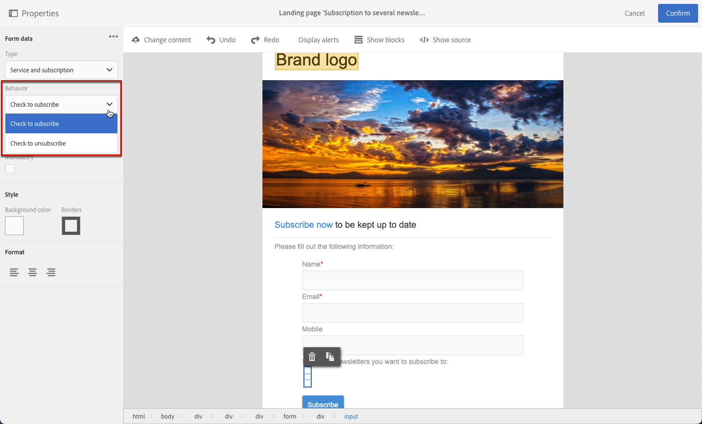

# 管理登陸頁面表單資料{#managing-landing-page-form-data}

在登錄頁內容中，輸入欄位用於儲存或更新市場活動資料庫中的資料。

要執行此操作，必須將這些欄位映射到資料庫欄位。

您可以通過 **[!UICONTROL Form data]** 的上界。

## 對應表單欄位 {#mapping-form-fields}

要根據需要更新市場活動資料庫，請將相關資料庫欄位連結到登錄頁的輸入區域、單選按鈕或複選框類型塊。

要執行此操作，請遵循下列步驟：

1. 在登錄頁內容中選擇一個塊。

   >[!NOTE]
   >
   >內建登錄頁面的預設欄位已預先設定。您可以視需要修改它們。

1. 訪問 **[!UICONTROL Form data]** 的上界。

1. 要更改欄位類型，請從 **[!UICONTROL HTML type of the field]** 的子菜單。

   

   >[!NOTE]
   >
   >有關在登錄頁中使用複選框類型的詳細資訊，請參閱 [更新多個服務訂閱](#multiple-subscriptions) 和 [協定複選框](#agreement-checkbox) 的下界。

1. 如果選擇的欄位類型與當前在 **[!UICONTROL Field]** 區域，將顯示警告消息。 要獲得最佳映射，請選擇適當的值。

   

1. 使用 **[!UICONTROL Field]** 區域，以選擇將連結到表單域的資料庫欄位。

   

   >[!NOTE]
   >
   >登錄頁只能與 **[!UICONTROL Profiles]** 或 **[!UICONTROL Service]** 資源。

   在此示例中，映射 **名稱** 登錄頁的 **[!UICONTROL Last name]** 的 **[!UICONTROL Profiles]** 資源。

   

1. 視需要核取 **[!UICONTROL Mandatory]** 選項。在這種情況下，只有在用戶已填入此欄位時，才能提交登錄頁。

   

   如果未填寫必填欄位，則用戶提交頁面時將顯示錯誤消息。

1. 按一下 **[!UICONTROL Confirm]** 的子菜單。

<!--If you choose a mandatory **[!UICONTROL Checkbox]**, make sure that it is of **[!UICONTROL Field]** type.-->

## 資料儲存與調解{#data-storage-and-reconciliation}

資料調解參數可讓您定義在使用者提交登錄頁面中輸入的資料後，如何加以管理。

操作步驟：

1. 編輯透過登錄頁面控制面板中  圖示存取的登錄頁面屬性，並顯示 **[!UICONTROL Job]** 參數。

   

1. 選擇 **[!UICONTROL Reconciliation key]**:此資料庫欄位用於確定訪問者是否具有Adobe Campaign資料庫中已知的配置檔案。 可以是電子郵件，名字，姓氏。 協調鍵允許您根據 **[!UICONTROL Update strategy]** 參數。

1. 定義 **[!UICONTROL Form parameter mapping]**：此部分允許您對應登錄頁面欄位參數以及調解金鑰中使用的參數。

1. 選擇 **[!UICONTROL Update strategy]**:如果協調密鑰恢復了現有的資料庫配置檔案，則可以選擇使用在表單中輸入的資料更新此配置檔案，或者改為阻止此更新。

   

## 多個服務訂閱 {#multiple-subscriptions}

您可以在單個登錄頁上使用多個複選框，以允許用戶訂閱或取消訂閱多個服務。

要執行此操作，請遵循下列步驟：

1. 設計登錄頁時：

   * 選擇塊，並從 **[!UICONTROL Form data]** 的 **[!UICONTROL Checkbox]** 的子菜單。

      

   * 如果您熟悉HTML，還可以使用 **[!UICONTROL Show source]** 按鈕

      

      這允許您在頁面上方便的位置插入複選框。

      

1. 確保在內容中選中該複選框。 的 **[!UICONTROL Type]** 下拉清單顯示在 **[!UICONTROL Form data]** 的下界。 選擇 **[!UICONTROL Service and subscription]** 清單中。

   

1. 從 **[!UICONTROL Behavior]** 的子菜單。

   

1. 選擇 [服務](../../audiences/using/creating-a-service.md) 的下界。

   

1. 確保 **[!UICONTROL Mandatory]** 複選框。 否則，您的用戶將別無選擇。

   

1. 要添加更多複選框，以便訂閱其他服務，請根據需要重複上述步驟多次。

   

登錄頁發佈後，用戶可以選擇多個複選框以從同一頁訂閱多個新聞稿。

## 協定複選框 {#agreement-checkbox}

您可以添加一個複選框，在提交登錄頁之前，配置檔案需要選中該複選框。

例如，這允許您在用戶提交表單之前請求用戶對隱私策略的同意，或讓他們接受您的條款和條件。

>[!IMPORTANT]
>
>選擇此複選框對您的用戶是必需的。 如果未選擇，則無法提交登錄頁。

要插入和配置此複選框，請執行以下操作：

1. 設計登錄頁時：

   * 選擇塊，並從 **[!UICONTROL Form data]** 的 **[!UICONTROL Checkbox]** 的子菜單。

      

   * 如果您熟悉HTML，還可以使用 **[!UICONTROL Show source]** 按鈕

      

      <!--Manually insert a checkbox, such as in the example below:

      <!--Click **[!UICONTROL Hide source]**.-->

1. 確保選中該複選框。

   

1. 的 **[!UICONTROL Type]** 下拉清單顯示在 **[!UICONTROL Form data]** 的下界。 選擇 **[!UICONTROL Agreement]** 清單中。

   

   >[!NOTE]
   >
   >的 **[!UICONTROL Agreement]** 元素未映射到市場活動資料庫的欄位。

1. 按一下  表徵圖 **[!UICONTROL Form data]** 複選框的高級屬性。

1. 如果需要，可編輯郵件。

   

   如果用戶在提交表單之前未選中複選框，則此文本將顯示為警告。

   >[!NOTE]
   >
   >預設情況下，此操作是必需的，無法更改。

1. 按一下&#x200B;**[!UICONTROL Confirm]**。

現在，每次顯示登錄頁時，用戶都必須在提交表單之前選中此複選框。 否則，將顯示警告，用戶將無法提交表單，直到激活複選框。