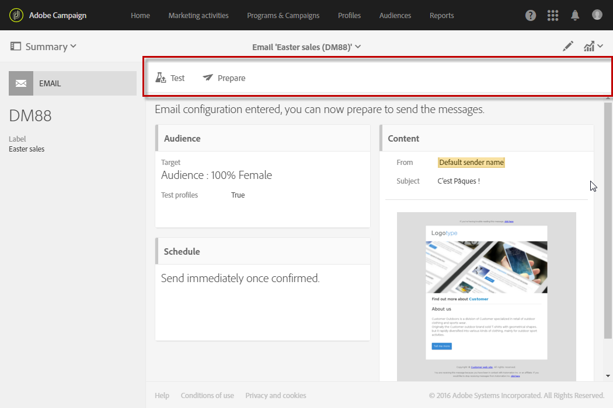
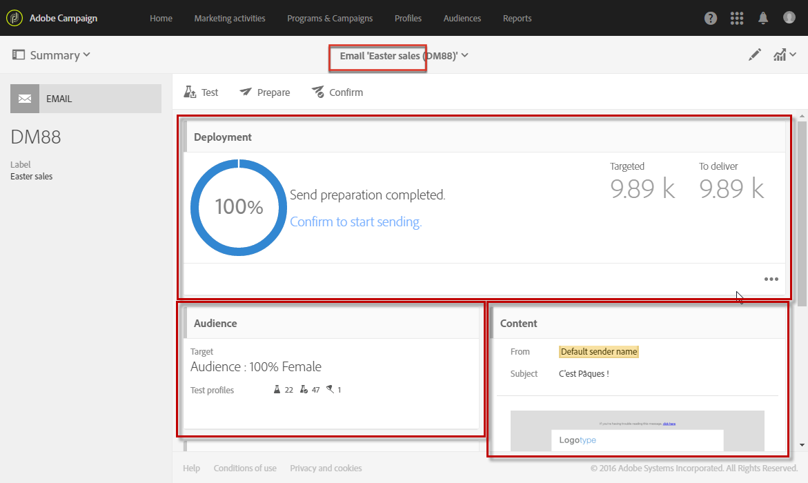
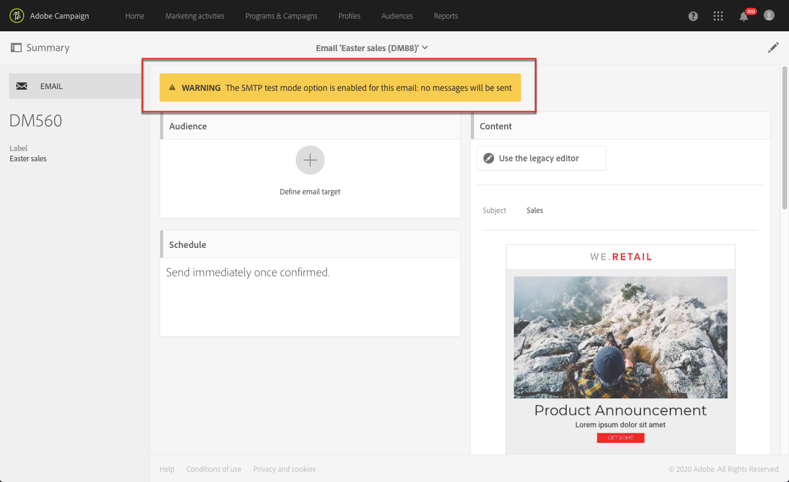

# 訊息儀表板{#message-dashboard}

訊息控制面板是由不同圖示（重新分組為動作列）和各種功能區塊組成的工作區，可讓您建立訊息的參數並加以傳送。 以下將介紹這些要素。

## 灰色列 {#gray-bar}

灰色列會重新分組連結至訊息的各種圖示。

* **[!UICONTROL Summary]**:顯示／隱藏與消息相關的主要資訊。
* **[!UICONTROL Edit properties]**:可讓您編輯訊息的進 [階參數](../../administration/using/configuring-email-channel.md#list-of-email-properties)。
* **[!UICONTROL Reports]**:可讓您存取與訊息相關的報表。

**相關主題：**

* [設定通道](../../administration/using/about-channel-configuration.md)
* [存取報表](../../reporting/using/about-dynamic-reports.md)

## 動作列 {#action-bar}

動作列有不同的圖示，可讓您與訊息互動。

視已設定的參數和進度而定，某些圖示可能無法使用。

* **[!UICONTROL Show proofs]**:顯示／隱藏已傳送的校樣清單（如果有的話）。 只有在您傳送校樣後，才會啟用此按鈕。

   如需校樣的詳細資訊，請參 [閱傳送校樣](../../sending/using/sending-proofs.md)。

* **[!UICONTROL Send a test]**:可讓您選取要使用的核准模式： **[!UICONTROL Email rendering]**、 **[!UICONTROL Proof]** 或兩者皆適用。 如需測試設定檔的詳細資訊，請參 [閱傳送校樣](../../sending/using/sending-proofs.md)。

   只有在您建立測試設定檔後，才會啟用此按鈕。

   >[!NOTE]
   >
   >對於SMS訊息，沒有別的選擇：它自動變成 **[!UICONTROL Proof]**。

* **[!UICONTROL Prepare send]**:開始準備傳送。 此 **[!UICONTROL Deployment]** 塊將出現並顯示準備結果。 只有在輸入目標後，此按鈕才會顯示。 您可以隨時使用對應的按鈕停止準備。

   有關消息準備的詳細信 [息，請準備發送](../../sending/using/preparing-the-send.md)。

* **[!UICONTROL Confirm send]**:確認傳送訊息。 傳送統計資料會出現在區塊 **[!UICONTROL Deployment]** 中。 此按鈕只會在傳送準備完成後顯示。 您可以隨時使用「停止傳送」和按鈕來停止 **或暫停****[!UICONTROL Pause]** 傳送。

   有關確認發送的詳細資訊，請參 [閱發送消息](../../sending/using/confirming-the-send.md)。

## 塊 {#blocks}

主螢幕由不同的塊組成。 按一下區塊內部以存取對應的參數畫面：

* **[!UICONTROL Deployment]**:可讓您追蹤訊息準備或傳送的進度。 按一下此區塊右下方區段中的按鈕，以存取傳送和分析記錄檔。 只有在準備好傳送後，才會顯示此區塊。 有關此事的更多資訊。 See [Confirming send](../../sending/using/confirming-the-send.md).
* **[!UICONTROL Audience]**:可讓您建立訊息的主要目標以及測試設定檔。 請參閱[建立對象](../../audiences/using/creating-audiences.md)。
* **[!UICONTROL Schedule]**:可讓您指定訊息傳送的日期。 請參閱 [排程](../../sending/using/about-scheduling-messages.md)。
* **[!UICONTROL Content]**:可讓您定義訊息的內容並加以預覽。 See [Key steps to send a message](../../channels/using/key-steps-to-send-a-message.md).

## 警告 {#warnings}

在某些情況下，訊息控制面板頂端的黃色橫幅中可能會出現警告。

以下是可顯示的訊息清單：

* *&quot;SMTP測試模式選項已為此電子郵件啟用：不會傳送任何訊息。」*

   如需詳細資訊，請參閱[本區段](../../administration/using/configuring-email-channel.md#smtp-test-mode)。

* *&quot;路由外部帳戶已禁用。&quot;*

   如需詳細資訊，請參閱「 [外部帳戶」](../../administration/using/external-accounts.md)。

* *&quot;無法發送消息，因為當前IP相關性不由任何發送進程處理。&quot;*

   如果您看到此訊息，在IP相似性定義層級或傳送程式層級會發生問題。 請聯絡您的Adobe管理員。

* *「這是現成可用的交易訊息範本。 如果要修改它，您必須複製它並處理副本。」*

   其中一些現成可用的交易訊息範本是內建的登陸頁面範本。 如需詳細資訊，請參閱[本區段](../../channels/using/landing-page-templates.md)。

* *「此訊息是技術交易訊息範本。 您無法修改或發佈它。」*

   此警告會顯示在不可編輯的空事務性消息模板中。 For more on transactional messages, see [this section](../../channels/using/getting-started-with-transactional-msg.md).
