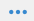
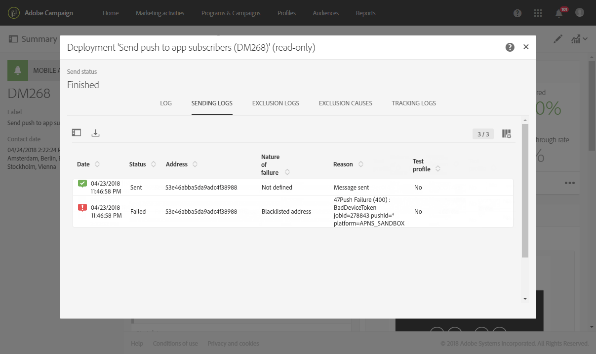

# 準備和傳送推播通知{#preparing-and-sending-a-push-notification}

## 準備通知 {#preparing-the-notification}

使用Adobe Campaign建立推播通知的步驟如下：

1. 從視窗 **[!UICONTROL Marketing activities]** 中建 [立新的行銷活動](../../start/using/marketing-activities.md#creating-a-marketing-activity)。

   請注意，您也可以從促銷活動或Adobe Campaign首頁 [建立](../../start/using/marketing-activities.md#creating-a-marketing-activity) 單一推 [播通知](../../start/using/interface-description.md#home-page)。

   您也可以在工作流程中使用推播通知傳送活動。 此活動會顯示在「推 [播通知傳送」區段](../../automating/using/push-notification-delivery.md) 。

1. 選取 **[!UICONTROL Push notification]**。
1. 選取範本。

   

   依預設，您可以選取下列兩個範本之一：

   * **[!UICONTROL Send push to Campaign profiles]**:使用此範本來定位已訂閱您行動應用程式並選擇接收推播通知的Adobe Campaign CRM設定檔。 您可以將個 [人化欄位](../../designing/using/personalization.md#inserting-a-personalization-field) ，插入您的推播通知中，例如收件者的名字。
   * **[!UICONTROL Send push to app subscribers]**:使用此範本，將推播通知傳送給所有已知和匿名行動應用程式使用者，這些使用者已選擇從您的應用程式接收通知。 您可以透過從行動應用程式收集的資料個人化這些訊息。

   您也可以選擇多語言範本。 如需詳細資訊，請參閱「 [建立多語言推播通知」](../../channels/using/creating-a-multilingual-push-notification.md)。

   For more on templates, refer to the [Managing templates](../../start/using/marketing-activity-templates.md) section.

1. Enter your push notification properties and select your mobile app in the **[!UICONTROL Associate a Mobile App to a delivery]** field.

   請注意，下拉式清單將同時顯示SDK V4和Experience Platform SDK應用程式。

   

   您可以將推播通知連結至促銷活動。 若要這麼做，請從已建立的促銷活動中選取它。

1. 在下列畫面中，您可以指定對象，例如所有訂閱特定行動應用程式的VIP客戶。 如需詳細資訊，請參閱「建 [立觀眾](../../audiences/using/creating-audiences.md)」。

   系統會根據上一步驟中選取的行動應用程式，自動篩選您的觀眾。

   

1. 您現在可以自訂推播通知。 首先，選擇消息樣式： **[!UICONTROL Alert/Message/Badge]** 或 **[!UICONTROL Silent push]**&#x200B;者。 推播通知類型在「關於推播通知」 [區段中有說明](../../channels/using/about-push-notifications.md) 。

   編輯推播通知的內容並定義進階選項。 See [Customizing a push notification](../../channels/using/customizing-a-push-notification.md).

   

   此處設定的推播通知內容和選項會以裝載的形式傳遞至您的行動應用程式。 Understanding ACS push notification payload structure technote中說明了有效負載的 [詳細結構](https://helpx.adobe.com/tw/campaign/kb/understanding-campaign-standard-push-notifications-payload-struc.html) 。

1. 按一下 **[!UICONTROL Create]**。

   

1. 在傳送通知之前，您可以使用測試設定檔來測試通知，然後在傳送傳送之前，先查看收件者將看到的內容。 從您 **[!UICONTROL Audiences]** 的傳送摘要中選取，然後按一下 **[!UICONTROL Test profiles]** 標籤。

   如需傳送測試的詳細資訊，請參閱測 [試描述檔](../../sending/using/sending-proofs.md)。

1. 選取您的測試設定檔，然後按一 **[!UICONTROL Preview]** 下以顯示通知：內容會與測試描述檔資料個人化。
1. 檢查不同裝置上的推播通知配置：選取iPhone、Android手機、iPad或Android平板電腦以預覽演算。

   

1. 此 **[!UICONTROL Estimated Payload Size]** 為根據測試描述檔資料的估計值。 實際負載大小可能有所不同。 訊息的限制為4KB。

   >[!CAUTION]
   >
   >如果裝載大小超過4KB限制，則不會傳送訊息。 個人化資料會影響訊息的大小。

## 傳送通知 {#sending-the-notification}

推播通知可透過定義對象條件，傳送至Adobe Campaign中的選定對象。 在下列範例中，我們選取的對象包括4個目標行動應用程式訂閱者。

1. Click **[!UICONTROL Prepare]** to compute the target and generate the notifications.

   

1. Once the preparation has finished successfully, the **[!UICONTROL Deployment]** window presents the following KPIs: **[!UICONTROL Target]** and **[!UICONTROL To deliver]**. Note that the **[!UICONTROL To deliver]** count is lower than the **[!UICONTROL Targeted]** one due to exclusions which can be viewed by clicking  button at the bottom of the **[!UICONTROL Deployment]** window.

   

1. 在標籤 **[!UICONTROL Exclusion logs]** 中，您可以找到從傳送的目標中排除的所有訊息清單，以及此排除的原因。

   在這裡，我們可以看到我們的行動應用程式訂閱者被排除，因為該位址在登入清單上，而其他訂閱者則因為描述檔是重複的。

   

1. 按一下該 **[!UICONTROL Exclusion causes]** 頁籤可顯示已排除消息的卷。

   

1. 您現在可以按一 **[!UICONTROL Confirm]** 下以開始傳送推播通知。
1. 透過訊息儀表板和記錄檔檢查您的傳送狀態。如需詳細資訊，請參 [閱傳送訊息](../../sending/using/confirming-the-send.md)[和傳送記錄](../../sending/using/monitoring-a-delivery.md#delivery-logs)。

   在此範例中，訊息控制面板會顯示Adobe Campaign嘗試傳送兩個推播通知：一個設備已成功傳送到設備，另一個設備失敗。 若要瞭解傳送錯誤的原因，請按一  下視窗底部的按 **[!UICONTROL Deployment]** 鈕。

   

1. 在視窗 **[!UICONTROL Deployment]** 中，按一下標 **[!UICONTROL Sending logs]** 簽以存取已傳送的推播通知清單及其狀態。 對於此傳送，一個推播通知已成功傳送，而另一個則因裝置Token錯誤而失敗。 然後，此訂閱者會從進一步的傳送新增至denylist。

   >[!NOTE]
   >
   >原因可能是Adobe Campaign下游的任何失敗。 如果apns和fcm等提供者出現故障，原因也將反映出這一點。 如需有關提供者失敗的詳細資訊，請參閱 [Apple](https://developer.apple.com/library/content/documentation/NetworkingInternet/Conceptual/RemoteNotificationsPG/CommunicatingwithAPNs.html) 和 [Android](https://firebase.google.com/docs/cloud-messaging/http-server-ref) 檔案。

   

您現在可以使用動態報表測量推播通知傳送的影響。

**相關主題：**

* [推播通知報告](../../reporting/using/push-notification-report.md)
* [在工作流程中傳送推播通知](../../automating/using/push-notification-delivery.md)

