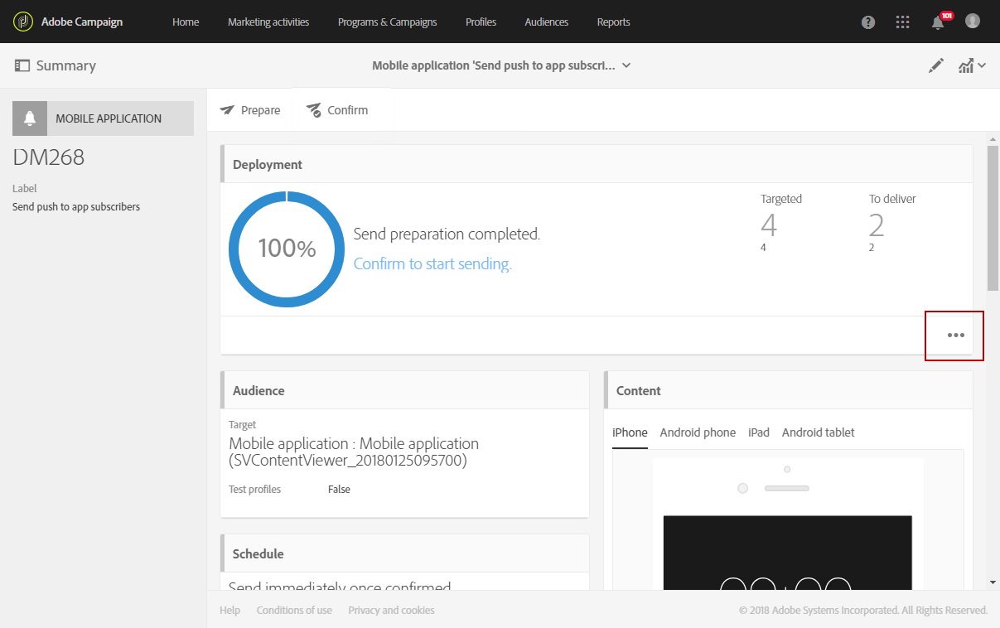

# 準備和傳送推送通知{#preparing-and-sending-a-push-notification}

## 準備通知 {#preparing-the-notification}

使用Adobe Campaign建立推播通知的步驟如下：

1. 從 **[!UICONTROL Marketing activities]** 窗口， [建立新的行銷活動](../../start/using/marketing-activities.md#creating-a-marketing-activity).

   請注意，您也可以從 [行銷活動](../../start/using/marketing-activities.md#creating-a-marketing-activity) 或從Adobe Campaign [首頁](../../start/using/interface-description.md#home-page).

   您也可以在工作流程中使用推播通知傳送活動。 此活動會顯示在 [推播通知傳送](../../automating/using/push-notification-delivery.md) 區段。

1. 選取 **[!UICONTROL Push notification]**。
1. 選取範本。

   

   依預設，您可以選取下列兩個範本之一：

   * **[!UICONTROL Send push to Campaign profiles]**:使用此範本，將目標定位為已訂閱您行動應用程式且已選擇接收推播通知的Adobe Campaign CRM設定檔。 您可以插入 [個人化](../../designing/using/personalization.md#inserting-a-personalization-field) 欄位放入推播通知中，例如收件者的名字。
   * **[!UICONTROL Send push to app subscribers]**:使用此範本，向所有已知和匿名行動應用程式使用者傳送推播通知，這些使用者已選擇從您的應用程式接收通知。 您可以使用從行動應用程式收集的資料來個人化這些訊息。

   您也可以選取多語言範本。 如需詳細資訊，請參閱 [建立多語言推播通知](../../channels/using/creating-a-multilingual-push-notification.md).

   如需範本的詳細資訊，請參閱 [管理範本](../../start/using/marketing-activity-templates.md) 區段。

1. 輸入推播通知屬性，並在 **[!UICONTROL Associate a Mobile App to a delivery]** 欄位。

   請注意，下拉式清單將同時顯示SDK V4和Experience PlatformSDK應用程式。

   

   您可以將推播通知連結至促銷活動。 若要這麼做，請從已建立的促銷活動中選取它。

1. 在下列畫面中，您可以指定對象，例如訂閱特定行動應用程式的所有VIP客戶。 有關詳細資訊，請參閱 [建立對象](../../audiences/using/creating-audiences.md).

   系統會根據上一步驟中選取的行動應用程式自動篩選您的對象。

   

1. 您現在可以自訂推播通知。 首先，選擇消息樣式： **[!UICONTROL Alert/Message/Badge]** 或 **[!UICONTROL Silent push]**. 推播通知類型在 [關於推播通知](../../channels/using/about-push-notifications.md) 區段。

   編輯推播通知的內容並定義進階選項。 請參閱 [自訂推播通知](../../channels/using/customizing-a-push-notification.md).

   

   此處設定的推播通知內容和選項會以裝載的形式傳遞至您的行動應用程式。 有效負載的詳細結構如 [了解Campaign Standard推播通知裝載結構](../../administration/using/push-payload.md) 技術檔案。

1. 按一下&#x200B;**[!UICONTROL Create]**。

   

1. 在傳送通知之前，您可以使用測試設定檔測試通知，然後在傳送傳遞前，先清楚看到收件者將看到的內容。 選擇 **[!UICONTROL Audiences]** 從您的傳送摘要中，按一下 **[!UICONTROL Test profiles]** 標籤。

   有關傳送測試的詳細資訊，請參閱 [測試設定檔](../../sending/using/sending-proofs.md).

1. 選取您的測試設定檔，然後按一下 **[!UICONTROL Preview]** 若要顯示通知：內容會與測試設定檔資料個人化。
1. 檢查不同裝置上的推播通知配置：選取iPhone、Android手機、iPad或Android平板電腦以預覽呈現。

   

1. 此 **[!UICONTROL Estimated Payload Size]** 是根據測試設定檔資料的預估值。 實際有效負載大小可能不同。 訊息的限制為4KB。

   >[!CAUTION]
   >
   >如果裝載大小超過4KB限制，則不會傳送訊息。

請注意，個人化資料會影響訊息的大小。

## 傳送通知 {#sending-the-notification}

定義對象條件，即可將推播通知傳送至Adobe Campaign中的選取對象。 在以下範例中，我們選取的對象包含4個目標行動應用程式訂閱者。

1. 按一下 **[!UICONTROL Prepare]** 計算目標並產生通知。

   

1. 準備完成後， **[!UICONTROL Deployment]** 視窗會顯示下列KPI: **[!UICONTROL Target]** 和 **[!UICONTROL To deliver]**. 請注意， **[!UICONTROL To deliver]** 計數小於 **[!UICONTROL Targeted]** 會因為排除而造成，您可以按一下  按鈕 **[!UICONTROL Deployment]** 窗口。

   

1. 在 **[!UICONTROL Exclusion logs]** 索引標籤，您可以找到從已傳送目標中排除的所有訊息清單及此排除的原因。

   在此，我們會看到其中一個行動應用程式訂閱者因為位址位於封鎖清單上而遭到排除，而其他訂閱者則因為設定檔重複。

   

1. 按一下 **[!UICONTROL Exclusion causes]** 頁簽來顯示排除的訊息數量。

   

1. 您現在可以按一下 **[!UICONTROL Confirm]** 開始傳送推播通知。
1. 透過訊息儀表板和記錄檔檢查您的傳送狀態。有關詳細資訊，請參閱 [傳送訊息](../../sending/using/confirming-the-send.md) 和 [傳送記錄檔](../../sending/using/monitoring-a-delivery.md#delivery-logs).

   在此範例中，訊息控制面板顯示Adobe Campaign嘗試傳送兩個推播通知：一個已成功傳送到設備，另一個失敗。 若要了解傳送為何發生錯誤，請按一下  按鈕 **[!UICONTROL Deployment]** 窗口。

   

1. 從 **[!UICONTROL Deployment]** ，按一下 **[!UICONTROL Sending logs]** 標籤來存取已傳送推播通知的清單及其狀態。 對於此傳送，一個推播通知已成功傳送，而另一個則因裝置代號錯誤而失敗。 接著，此訂閱者會從後續傳送新增至封鎖清單。

   >[!NOTE]
   >
   >原因可能是下游的任何失敗，皆可能是Adobe Campaign。 如果apns和fcm等提供者發生故障，原因也會反映。 有關提供程式故障的詳細資訊，請參閱 [Apple](https://developer.apple.com/library/content/documentation/NetworkingInternet/Conceptual/RemoteNotificationsPG/CommunicatingwithAPNs.html) 和 [Android](https://firebase.google.com/docs/cloud-messaging/http-server-ref) 檔案。

   

您現在可以使用動態報告來測量推播通知傳送的影響。

**相關主題：**

* [推播通知報告](../../reporting/using/push-notification-report.md)
* [在工作流程中傳送推播通知](../../automating/using/push-notification-delivery.md)
