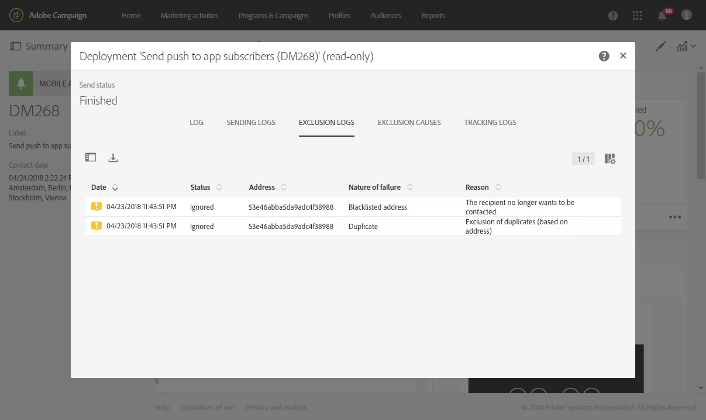

# Preparing and sending a push notification{#preparing-and-sending-a-push-notification}

## Preparing the notification {#preparing-the-notification}

使用Adobe Campaign建立推播通知的步驟包括：

1. From the **[!UICONTROL Marketing activities]** window, [create a new marketing activity](../../start/using/marketing-activities.md#creating-a-marketing-activity).

   Note that a single push notification can also be created from a [campaign](../../start/using/marketing-activities.md#creating-a-marketing-activity) or from the Adobe Campaign [home page](../../start/using/interface-description.md#home-page).

   您也可以在工作流程中使用推播通知傳送活動。This activity is presented in the [Push notification delivery](../../automating/using/push-notification-delivery.md) section.

1. Select **[!UICONTROL Push notification]**.
1. 選取範本。

   

   依預設，您可以選取下列其中一個範本：

   * **[!UICONTROL Send push to Campaign profiles]**：使用此範本定位已訂閱您行動應用程式且選擇接收推播通知的Adobe Campaign CRM描述檔。You can insert [personalization](../../designing/using/inserting-a-personalization-field.md) fields into your push notification, such as the recipient's first name.
   * **[!UICONTROL Send push to app subscribers]**：使用此範本，將推播通知傳送給選擇接收您應用程式通知的所有已知行動應用程式使用者。您可以使用行動應用程式收集到的資料個人化這些訊息。
   您也可以選擇多語言範本。For more information, refer to [Creating a multilingual push notification](../../channels/using/creating-a-multilingual-push-notification.md).

   For more on templates, refer to the [Managing templates](../../start/using/about-templates.md) section.

1. Enter your push notification properties and select your mobile app in the **[!UICONTROL Associate a Mobile App to a delivery]** field.

   請注意，下拉式清單將同時顯示SDK V和Experience Platform SDK應用程式。

   

   您可以將推播通知連結至促銷活動。若要這麼做，請從已建立的促銷活動中選取它。

1. 在下列畫面中，您可以指定對象，例如訂閱特定行動應用程式的所有VIP客戶。For more on this, see [Creating audiences](../../audiences/using/creating-audiences.md).

   您的觀眾將會根據在上一步驟選取的行動應用程式自動篩選。

   

1. 您現在可以自訂推播通知。First, choose the message style: **[!UICONTROL Alert/Message/Badge]** or **[!UICONTROL Silent push]**. The push notification types are described in the [About push notifications](../../channels/using/about-push-notifications.md) section.

   編輯推播通知的內容並定義進階選項。See [Customizing a push notification](../../channels/using/customizing-a-push-notification.md).

   

   此處設定的推播通知內容和選項會以裝載形式傳遞至您的行動應用程式。[「瞭解ACS推播通知」裝載結構](https://helpx.adobe.com/campaign/kb/understanding-campaign-standard-push-notifications-payload-struc.html) 注意事項中說明裝載的詳細結構。

1. Click **[!UICONTROL Create]**.

   

1. 傳送通知之前，您可以使用測試設定檔來測試它，然後查看收件者在傳送傳送前實際看到的內容。Select **[!UICONTROL Audiences]** from your delivery summary and click the **[!UICONTROL Test profiles]** tab.

   For more on sending tests, refer to [Test profiles](../../sending/using/managing-test-profiles-and-sending-proofs.md).

1. Select your test profiles and click **[!UICONTROL Preview]** to display the notification: content is personalized with the test profile data.
1. 檢查不同裝置上的推播通知版面：選取iPhone、Android手機、iPad或Android平板電腦，以預覽演算。

   

1. The **[!UICONTROL Estimated Payload Size]** is an estimate based on test profile data. 實際的裝載大小可能會有所不同。訊息的限制為4KB。

   >[!CAUTION]
   >
   >如果裝載大小超過4KB限制，則不會傳送訊息。個人化資料會影響訊息大小。

## Sending the notification {#sending-the-notification}

您可以定義對象條件，將推播通知傳送給Adobe Campaign中的選定對象。在下列範例中，我們選取的對象包含個目標行動應用程式訂閱者。

1. Click **[!UICONTROL Prepare]** to compute the target and generate the notifications.

   

1. Once the preparation has finished successfully, the **[!UICONTROL Deployment]** window presents the following KPIs: **[!UICONTROL Target]** and **[!UICONTROL To deliver]**. Note that the **[!UICONTROL To deliver]** count is lower than the **[!UICONTROL Targeted]** one due to exclusions which can be viewed by clicking  button at the bottom of the **[!UICONTROL Deployment]** window.

   

1. **[!UICONTROL Exclusion logs]** 在標籤中，您可以找到從目標傳送的所有訊息清單，以及此排除的原因。

   在這裡，我們可以看到我們的其中一個行動應用程式訂閱者被排除在外，因為該位址已列入黑名單，而其他訂閱者則是因為該描述檔重復。

   

1. Click the **[!UICONTROL Exclusion causes]** tab to display the volume of excluded messages.

   

1. You can now click **[!UICONTROL Confirm]** to start sending push notifications.
1. 透過訊息控制面板和記錄檔檢查傳送狀態。For more on this, see [Sending messages](../../sending/using/confirming-the-send.md) and [Delivery logs](../../sending/using/monitoring-a-delivery.md#delivery-logs).

   在此範例中，訊息控制面板會顯示Adobe Campaign嘗試傳送兩個推播通知：其中一個成功傳遞至裝置，另一個失敗。To know why the delivery has errors, click the  button at the bottom of the **[!UICONTROL Deployment]** window.

   

1. From the **[!UICONTROL Deployment]** window, click the **[!UICONTROL Sending logs]** tab to access the list of sent push notifications and their statuses. 在此發佈中，一個推播通知成功傳送，而另一個推播通知由於裝置Token而失敗。然後，此訂閱者將會從進一步傳送中列入黑名單。

   >[!NOTE]
   >
   >Adobe Campaign下游可能發生任何失敗。如果供應商如Apns和fcm等供應商失敗，原因也會反映這點。For more information on provider failures, you can refer to the [Apple](https://developer.apple.com/library/content/documentation/NetworkingInternet/Conceptual/RemoteNotificationsPG/CommunicatingwithAPNs.html) and [Android](https://firebase.google.com/docs/cloud-messaging/http-server-ref) documentation.

   

您現在可以測量推播通知傳送對動態報表的影響。

**相關主題：**

* [推播通知報表](../../reporting/using/push-notification-report.md)
* [在工作流程中傳送推播通知](../../automating/using/push-notification-delivery.md)

