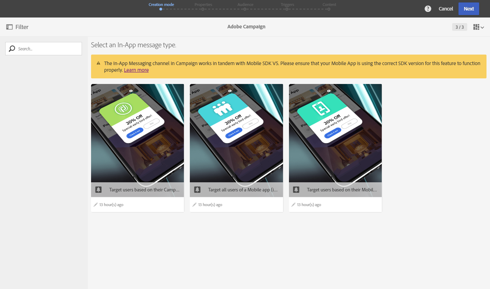
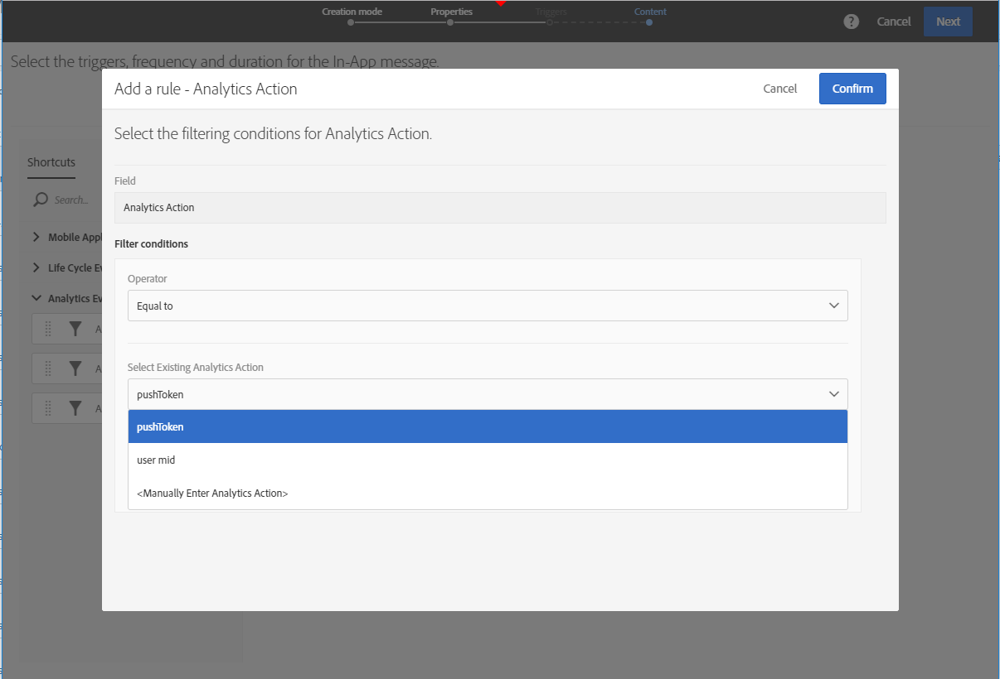

# 準備和傳送應用程式內訊息{#preparing-and-sending-an-in-app-message}

>[!NOTE]
>
>應用程式內個人化需仰賴連結欄位，連結欄位通常是CRM ID和／或行動應用程式登入ID。 當您與Adobe Campaign搭配使用時，應自行負責保護此連結欄位。 如果您無法確保連結欄位的安全，您的個人化訊息可能會很脆弱。 如果您未遵守安全的連結欄位構成、管理和保護實務，Adobe將不負責因未經授權存取或使用任何描述檔資料而造成的損害。

Adobe Campaign提供三種類型的應用程式內訊息：

* **[!UICONTROL Target users based on their Campaign profile (inAppProfile)]**:此訊息類型可讓您定位已訂閱您行動應用程式的Adobe Campaign設定檔（CRM設定檔）。 此訊息類型可與Adobe Campaign中所有可用的描述檔屬性個人化，但需要Mobile SDK與Campaign應用程式內訊息服務之間的安全握手，以確保只有授權使用者才會使用包含個人和敏感資訊的訊息。

   若要在使用者的裝置上下載此訊息類型，Mobile SDK必須傳送連結欄位，用以將行動設定檔連結至Adobe Campaign中的CRM設定檔。 如需支援應用程式內部所需SDK API的詳細資訊，請參閱本 [頁](https://aep-sdks.gitbook.io/docs/using-mobile-extensions/adobe-campaign-standard/adobe-campaign-standard-api-reference)。

* **[!UICONTROL Target all users of a Mobile app (inAppBroadcast)]**:此訊息類型可讓您傳送訊息給行動應用程式的所有使用者（目前或未來），即使他們在Adobe Campaign中沒有現有的設定檔亦然。 因此，當自訂訊息時，無法個人化，因為Adobe Campaign中可能甚至不存在使用者設定檔。
* **[!UICONTROL Target users based on their Mobile profile (inApp)]**:此訊息類型可讓您鎖定在Adobe Campaign中具有行動設定檔的行動應用程式的所有已知或匿名使用者。 此訊息類型僅能使用非個人和非敏感屬性進行個人化，而且不需要Mobile SDK與Adobe Campaign的應用程式內訊息服務之間的安全握手。

   有關如何處理個人和敏感資料的詳細資訊，請參閱使用個 [人和敏感資料處理行動設定檔欄位](#handling-mobile-profile-fields-with-personal-and-sensitive-data)。

## 使用個人和敏感資料處理行動設定檔欄位 {#handling-mobile-profile-fields-with-personal-and-sensitive-data}

In Adobe Campaign, mobile profile attributes data sent from mobile device are stored in **[!UICONTROL Subscriptions to an application (appSubscriptionRcp)]** resource which allows you to define the data that you want to collect from your applications' subscribers.

需要擴充此資源，以收集您要從行動裝置傳送至Adobe Campaign的資料。 若要這麼做，請參閱本 [頁](../../developing/using/extending-the-subscriptions-to-an-application-resource.md) ，以取得詳細步驟。

為了提供更安全的應用程式內訊息個人化功能，您需要據此設定這項資源的行動設定檔欄位。在您的 **[!UICONTROL Subscriptions to an application (appSubscriptionRcp)]**&#x200B;建立新行動設定檔欄位時，請勾選以 **[!UICONTROL Personal and Sensitive]** 在應用程式內訊息個人化期間使用這些設定檔。

>[!NOTE]
>
>如果此表格上已有具有自訂資源擴充功能的現有實作，我們建議您在將欄位用於個人化應用程式內訊息之前，先適當地標籤欄位。

在設定 **[!UICONTROL Subscriptions to an application]** 並發佈自訂資源後，您就可以開始使用範本準備應用程式內傳送 **[!UICONTROL Target users based on their Mobile profile (inApp)]** 內容。 個人化資源將僅提供非個人和非敏感 **[!UICONTROL Subscriptions to an application (appSubscriptionRcp)]** 欄位。

If you require personalization with **Personal and Sensitive** fields, we recommend using the **[!UICONTROL Target users based on their Campaign profile (inAppProfile)]** template which has additional security mechanism to ensure that your users' PII data remains secure.

## 準備應用程式內訊息 {#preparing-your-in-app-message}

使用Adobe Campaign建立獨立應用程式內訊息的步驟如下：

1. 從Adobe Campaign首頁，按一下 **[!UICONTROL In-App messaging]** 資訊卡。

   您也可以按一下按鈕，從「行銷活動」標 **簽建立** 「應用程式內 **[!UICONTROL Create]** 」。

   請注意，您也可以從促銷活動或Adobe Campaign首頁或工作流程建立應用程式內訊息。

1. 選取 **應用程式內訊息**。

   

1. 根據受眾定位需求選擇適當的範本。

   

   依預設，您可以選取下列三個立即可用的範本之一：

   * **[!UICONTROL Target users based on their Campaign CRM profile (inAppProfile)]**
   * **[!UICONTROL Target all users of a Mobile app (inAppBroadcast)]**
   * **[!UICONTROL Target users based on their Mobile profile (inApp)]**

1. 輸入應用程式內訊息屬性，並在欄位中選取您的行動應用 **[!UICONTROL Associate a Mobile App to a delivery]** 程式。 請注意，如果您未使用Adobe Campaign Standard設定行動應用程式，該應用程式將不會出現在清單中。 如需行動應用程式設定的詳細資訊，請參閱本 [頁](https://helpx.adobe.com/campaign/kb/configuring-app-sdk.html#ChannelspecificapplicationconfigurationinAdobeCampaign)。

   

1. 選取您要針對應用程式內訊息鎖定的對象。 您的觀眾會根據與此傳送相關聯的行動應用程式預先篩選。

   請注意，此步驟不是行動應用程 **[!UICONTROL Broadcast an In-App message (inAppBroadcast)]** 式的必要步驟，因為其目標是行動應用程式的所有使用者。

   

1. 在標籤 **[!UICONTROL Triggers]** 中，拖放將觸發訊息的事件。 選擇觸發器後，您就會選擇使用者執行的動作，以顯示應用程式內訊息。

   有四類事件可供使用：

   * **[!UICONTROL Mobile Application events]**:在行動應用程式中實作的自訂事件。

      如需建立事件的詳細資訊，請參閱此 [頁面](https://helpx.adobe.com/campaign/kb/configuring-app-sdk.html)。

   * **[!UICONTROL Life Cycle events]**:Adobe Mobile SDK支援的現成可用生命週期事件。

      有關生命週期事件的詳細資訊，請參閱本 [頁](https://marketing.adobe.com/resources/help/en_US/mobile/android/metrics.html)。

   * **[!UICONTROL Analytics Events]**:根據您的行動應用程式中所創作的內容，支援下列三個類別：Adobe Analytics、上下文資料或檢視狀態。

      請注意，這些事件僅在您擁有Adobe Analytics授權時才可用。

   * **[!UICONTROL Places]**:以下三個類別運用即時位置資料來提供情境相關的行動體驗：放置上下文資料、放置自訂中繼資料或放置事件類型。

      如需Adobe Places的詳細資訊，請參閱 [Places檔案](https://placesdocs.com/)。
   

1. 如果您使用 **[!UICONTROL Analytics Events]**,Adobe Analytics和檢視狀態事件將會根據Adobe Experience Platform Launch中Analytics擴充功能中設定的報表套裝自動填入，而上下文資料事件則必須手動新增。

   請注意，這些事件僅在您擁有Adobe Analytics授權時才可用。

   

1. 如果您使用觸 **[!UICONTROL Places]** 發器，「置入」上下文資料、「置入」自訂中繼資料或「置入」事件類型將會根據所有在Adobe Places中建立的「資料庫」及其「地標」自動填入。

   請注意，此觸發器僅會套用至Experience Platform Launch中「位置」擴充功能中選取之「資料庫」的「地標」。 有關Places擴充功能以及如何安裝的詳細資訊，請參閱本文 [件](https://aep-sdks.gitbook.io/docs/using-mobile-extensions/places-extension-1/places-extension)。

1. 在標 **[!UICONTROL Frequency & duration]** 簽中，選擇觸發的頻率、開始和結束日期、一週中的某天，以及應用程式內訊息生效的當天時間。

   

1. 編輯訊息的內容並定義進階選項。 See [Customizing an In-App message](https://helpx.adobe.com/campaign/standard/channels/using/customizing-a-push-notification.html).

   

1. Click **[!UICONTROL Create]**.

您的應用程式內訊息現在已準備好傳送給您的目標對象。

**相關主題：**

* [自訂應用程式內訊息](../../channels/using/customizing-an-in-app-message.md)
* [應用程式內報告](../../reporting/using/in-app-report.md)
* [在工作流程中傳送應用程式內訊息](../../automating/using/in-app-delivery.md)

## 傳送您的應用程式內訊息 {#sending-your-in-app-message}

在您完成傳送準備並執行核准步驟後，就可以傳送訊息。

1. 按一下 **[!UICONTROL Prepare]** 可計算目標並生成消息。

   

1. 完成準備工作後，**「部署」**&#x200B;視窗就會顯示下列 KPI: **「目標」**&#x200B;和&#x200B;**「交付」**。

   您可以按一下傳送中的潛在排除或錯  誤，以檢查「部署」視窗。

   

1. 按一 **[!UICONTROL Confirm]** 下以開始傳送您的應用程式內訊息。

   

1. 透過訊息儀表板和記錄檔檢查您的傳送狀態。 For more on this, refer to this [section](../../sending/using/monitoring-a-delivery.md).

   **[!UICONTROL Delivered]** 而KPI **[!UICONTROL Sent]** 計數則以成功從促銷活動傳送至訊息傳送服務的項目為基礎。 請注意，這些KPI並不表示從訊息傳送服務成功接收或下載訊息的行動裝置計數。

   

1. 使用傳送報表測量應用程式內訊息的影響。 For more on reporting, refer to [this section](../../reporting/using/in-app-report.md).

**相關主題：**

* [應用程式內報告](../../reporting/using/in-app-report.md)
* [在工作流程中傳送應用程式內訊息](../../automating/using/in-app-delivery.md)

