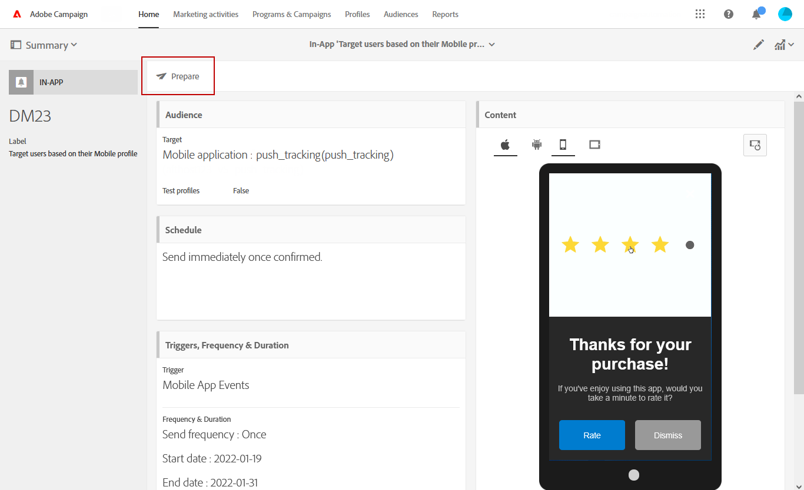

# Preparing and sending an In-App message{#preparing-and-sending-an-in-app-message}

>[!NOTE]
>
>應用程式內個人化依賴連結欄位，通常是CRM ID和/或行動應用程式登入ID。在與Adobe Campaign相關的情況下，您需自行負責確保連結欄位的安全。如果您無法確保連結欄位安全，您的個人化訊息可能會受到傷害。若貴使用戶未遵守安全連結欄位構成、管理和保護慣例，Adobe將不負責因未經授權存取或使用任何個人檔案資料而造成的損害。

Adobe Campaign提供三種應用程式內訊息：

* **[!UICONTROL Target users based on their Campaign profile (inAppProfile)]**：此訊息類型可讓您定位已訂閱您行動應用程式的Adobe Campaign設定檔(CRM設定檔)。此訊息類型可與Adobe Campaign中所有可用的描述檔屬性個人化，但需要在Mobile SDK和Campaign的應用程式內傳訊服務之間安全地交握，以確保僅授權使用者使用具有個人及敏感資訊的訊息。

   若要在使用者裝置上下載此訊息類型，Mobile SDK必須傳送連結欄位，將行動個人檔案連接至Adobe Campaign中的CRM描述檔。For more information on SDK APIs required to support In-App, refer to this [page](https://aep-sdks.gitbook.io/docs/using-mobile-extensions/adobe-campaign-standard/adobe-campaign-standard-api-reference).

* **[!UICONTROL Target all users of a Mobile app (inAppBroadcast)]**：此訊息類型可讓您傳送訊息給行動應用程式的所有使用者(目前或未來)，即使他們沒有Adobe Campaign中的現有設定檔。自訂訊息時，不可能將訊息自訂為使用者描述檔甚至不存在於Adobe Campaign中。
* **[!UICONTROL Target users based on their Mobile profile (inApp)]**：此訊息類型可讓您針對Adobe Campaign中具有行動設定檔的行動應用程式，鎖定所有已知或匿名的使用者。此訊息類型只能使用非個人和非敏感性屬性個人化，而且不需要在Mobile SDK和Adobe Campaign的應用程式內傳訊服務之間安全握手。

   For more information on how to handle personal and sensitive data, refer to [Handling mobile profile fields with personal and sensitive data](../../channels/using/preparing-and-sending-an-in-app-message.md#handling-mobile-profile-fields-with-personal-and-sensitive-data).

## Handling mobile profile fields with personal and sensitive data {#handling-mobile-profile-fields-with-personal-and-sensitive-data}

In Adobe Campaign, mobile profile attributes data sent from mobile device are stored in **[!UICONTROL Subscriptions to an application (appSubscriptionRcp)]** resource which allows you to define the data that you want to collect from your applications' subscribers.

此資源需要延伸，以收集您要從行動裝置傳送至Adobe Campaign的資料。To do so, refer to this [page](../../developing/using/extending-the-subscriptions-to-an-application-resource.md) for the detailed steps.

為了提供更安全的應用程式內訊息個人化功能，您需要據此設定這項資源的行動設定檔欄位。In your **[!UICONTROL Subscriptions to an application (appSubscriptionRcp)]**, when creating your new mobile profiles fields, check **[!UICONTROL Personal and Sensitive]** to make them unavailable during In-App messages personalization.

>[!NOTE]
>
>如果您已在此表格上使用自訂資源擴充功能實施現有實作，建議您先對欄位進行標籤，再利用它們來個人化應用程式內訊息。

Once your **[!UICONTROL Subscriptions to an application]** custom resource is configured and published, you can start preparing your In-App delivery using the **[!UICONTROL Target users based on their Mobile profile (inApp)]** template. Only non-personal and non-sensitive fields will be available from **[!UICONTROL Subscriptions to an application (appSubscriptionRcp)]** resource for personalization.

If you require personalization with **Personal and Sensitive** fields, we recommend using the **[!UICONTROL Target users based on their Campaign profile (inAppProfile)]** template which has additional security mechanism to ensure that your users' PII data remains secure.

## Preparing your In-App message {#preparing-your-in-app-message}

建立獨立應用程式內訊息的步驟包括：

1. From Adobe Campaign home page, click the **[!UICONTROL In-App messaging]** card.

   You can also create an In-App from the **Marketing activities** tab, by clicking the **[!UICONTROL Create]** button.

   請注意，您也可以從促銷活動或Adobe Campaign首頁或工作流程中建立應用程式內訊息。

1. Select **In-App message**.

   

1. 根據您的受眾定位需求，選擇適當的範本。

   

   根據預設，您可以選取下列三個立即可用的範本之一：

   * **[!UICONTROL Target users based on their Campaign CRM profile (inAppProfile)]**
   * **[!UICONTROL Target all users of a Mobile app (inAppBroadcast)]**
   * **[!UICONTROL Target users based on their Mobile profile (inApp)]**

1. Enter the In-App message properties and select your mobile app in the **[!UICONTROL Associate a Mobile App to a delivery]** field.

   

1. 選取您要針對應用程式內訊息定位的對象。系統會根據與此傳送相關聯的行動應用程式預先篩選您的觀眾。

   Note that this step is not needed with the **[!UICONTROL Broadcast an In-App message (inAppBroadcast)]** since it targets all users of a mobile application.

   

1. **[!UICONTROL Triggers]** 在標籤中拖放將觸發訊息的事件。選擇觸發器會選擇由使用者執行的動作，會導致顯示應用程式內訊息。

   可使用四種事件類別：

   * **[!UICONTROL Mobile Application events]**：在您的行動應用程式中實施的自訂事件。

      For more on events creations, refer to this [page](https://helpx.adobe.com/campaign/kb/configuring-app-sdk.html).

   * **[!UICONTROL Life Cycle events]**：Adobe Mobile SDK支援的立即可用生命週期事件。

      For more on life cycle events, refer to this [page](https://marketing.adobe.com/resources/help/en_US/mobile/android/metrics.html).

   * **[!UICONTROL Analytics Events]**：根據行動應用程式中所創作的內容，支援下列三個類別：Adobe Analytics、上下文資料或檢視狀態。

      請注意，如果您有Adobe Analytics授權，這些事件才可供使用。

   * **[!UICONTROL Places]**：以下三個類別運用即時位置資料來提供情境相關的行動體驗：放置上下文資料、置入自訂中繼資料或地標事件類型。

      For more information on Adobe Places, refer to the [Places documentation](https://placesdocs.com/).
   

1. If you use an **[!UICONTROL Analytics Events]**, Adobe Analytics and View state events will be automatically populated based on the report suites configured in the Analytics extension in Adobe Experience Platform Launch whereas Context data events have to be manually added.

   請注意，如果您有Adobe Analytics授權，這些事件才可供使用。

   

1. If you use a **[!UICONTROL Places]** trigger, Places context data, Places custom metadata or Places event type will be automatically populated based on all the Libraries and their Points of Interest created in Adobe Places.

   請注意，此觸發器僅適用於Experience Platform Launch中位置延伸模組中所選取之資料庫中的地標。For more information on the Places extension and how to install it, refer to this [documentation](https://aep-sdks.gitbook.io/docs/using-mobile-extensions/places-extension-1/places-extension).

1. **[!UICONTROL Frequency & duration]** 在標籤中，選擇觸發的頻率、開始和結束日期、每周的某天，以及在應用程式內訊息有效的當天。

   

1. 編輯訊息的內容並定義進階選項。See [Customizing an In-App message](https://helpx.adobe.com/campaign/standard/channels/using/customizing-a-push-notification.html).

   

1. Click **[!UICONTROL Create]**.

您的應用程式內訊息現在可以傳送給目標對象。

**相關主題：**

* [自訂應用程式內訊息](../../channels/using/customizing-an-in-app-message.md)
* [應用程式內報告](../../reporting/using/in-app-report.md)
* [在工作流程中傳送應用程式內訊息](../../automating/using/in-app-delivery.md)

## Sending your In-App message {#sending-your-in-app-message}

完成準備完成後，並完成核准步驟後，您就可以傳送訊息。

1. Click **[!UICONTROL Prepare]** to compute the target and generate the messages.

   

1. 完成準備工作後，**「部署」**&#x200B;視窗就會顯示下列 KPI: **「目標」**&#x200B;和&#x200B;**「交付」**。

   You can check the Deployment window by clicking the  button for potential exclusions or errors in your delivery.

   

1. Click **[!UICONTROL Confirm]** to start sending your In-App message.

   

1. 透過訊息控制面板和記錄檔檢查傳送狀態。For more on this, refer to this [section](../../sending/using/monitoring-a-delivery.md).

   **[!UICONTROL Delivered]** 和 **[!UICONTROL Sent]** KPI計數是根據從促銷活動到訊息傳送服務成功傳送的項目。請注意，這些KPI並不表示從訊息傳送服務獲得或下載訊息的行動裝置計數。

   

1. 透過傳送報告評估應用程式內訊息的影響力。For more on reporting, refer to [this section](../../reporting/using/in-app-report.md).

**相關主題：**

* [應用程式內報告](../../reporting/using/in-app-report.md)
* [在工作流程中傳送應用程式內訊息](../../automating/using/in-app-delivery.md)

