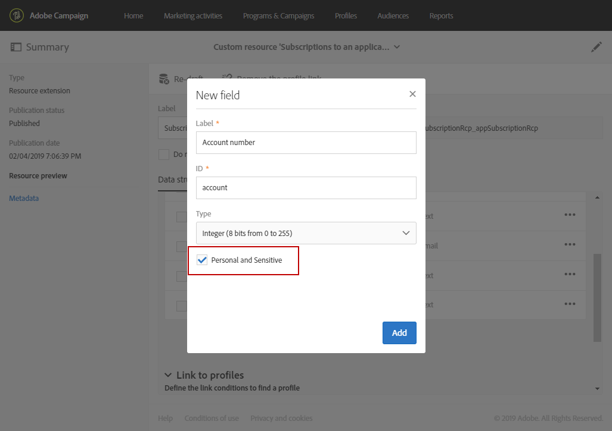

# 準備和傳送應用程式內訊息{#preparing-and-sending-an-in-app-message}

>[!NOTE]
>
>應用程式內個人化需仰賴連結欄位，連結欄位通常是 CRM ID 和/或行動應用程式登入 ID。當您與 Adobe Campaign 搭配使用時，應自行負責保護此連結欄位。如果您無法確保連結欄位的安全，您的個人化訊息可能會很脆弱。如果您未遵守安全的連結欄位構成、管理和保護實務，Adobe 將不負責因未經授權存取或使用任何描述檔資料而造成的損害。

Adobe Campaign 提供兩種類型的清單：

* **[!UICONTROL Target users based on their Campaign profile (inAppProfile)]**：此訊息類型可讓您定位已訂閱您行動應用程式的 Adobe Campaign 設定檔（CRM 設定檔）。此訊息類型可與 Adobe Campaign 中所有可用的描述檔屬性個人化，但需要 Mobile SDK 與 Campaign 應用程式內訊息服務之間的安全握手，以確保只有授權使用者才會使用包含個人和敏感資訊的訊息。

   若要在使用者的裝置上下載此訊息類型，Mobile SDK 必須傳送連結欄位，用以將行動設定檔連結至 Adobe Campaign 中的 CRM 設定檔。如需支援應用程式內部所需 SDK API 的詳細資訊，請參閱本 [頁面](https://aep-sdks.gitbook.io/docs/using-mobile-extensions/adobe-campaign-standard/adobe-campaign-standard-api-reference)。

* **[!UICONTROL Target all users of a Mobile app (inAppBroadcast)]**：此訊息類型可讓您傳送訊息給行動應用程式的所有使用者（目前或未來），即使他們在 Adobe Campaign 中沒有現有的設定檔亦然。因此，當自訂訊息時，無法個人化，因為 Adobe Campaign 中可能甚至不存在使用者設定檔。
* **[!UICONTROL Target users based on their Mobile profile (inApp)]**：此訊息類型可讓您鎖定在 Adobe Campaign 中具有行動設定檔的行動應用程式的所有已知或匿名使用者。此訊息類型僅能使用非個人和非敏感屬性進行個人化，而且不需要 Mobile SDK 與 Adobe Campaign 的應用程式內訊息服務之間的安全交握。

   有關如何處理個人和敏感資料的詳細資訊，請參閱使用[個人和敏感資料處理行動設定檔欄位](#handling-mobile-profile-fields-with-personal-and-sensitive-data)。

## 使用個人和敏感資料處理行動設定檔欄位 {#handling-mobile-profile-fields-with-personal-and-sensitive-data}

在 Adobe Campaign 中，由行動裝置傳送的行動設定檔屬性資料會儲存在 **[!UICONTROL Subscriptions to an application (appSubscriptionRcp)]** 資源中，您可藉此定義要從應用程式訂閱者收集的資料。

需要擴充此資源，才能收集您要從行動裝置傳送至 Adobe Campaign 的資料。要執行此操作，請參閱本[頁面](../../developing/using/extending-the-subscriptions-to-an-application-resource.md)以取得詳細步驟。

為了提供更安全的應用程式內訊息個人化功能，您需要據此設定這項資源的行動設定檔欄位。在您的 **[!UICONTROL Subscriptions to an application (appSubscriptionRcp)]** 中，建立新行動設定檔欄位時，請和取 **[!UICONTROL Personal and Sensitive]** 在應用程式內訊息個人化期間使用這些設定檔。

>[!NOTE]
>
>如果此表格上已有具有自訂資源擴充功能的現有實作，我們建議您在將欄位用於個人化應用程式內訊息之前，先適當地標籤欄位。

在設定並發佈 **[!UICONTROL Subscriptions to an application]** 自訂資源後，您就可以開始使用 **[!UICONTROL Target users based on their Mobile profile (inApp)]** 範本準備應用程式內傳送內容。個人化 **[!UICONTROL Subscriptions to an application (appSubscriptionRcp)]** 資源將僅提供非個人和非敏感欄位。

若需使用 **Personal and Sensitive** 欄位來達到個人化目的，建議您使用 **[!UICONTROL Target users based on their Campaign profile (inAppProfile)]** 範本，此範本提供額外的安全機制，能確保使用者的 PII 資料安全無虞。

## 準備應用程式內訊息 {#preparing-your-in-app-message}

使用 Adobe Campaign 建立獨立應用程式內訊息的步驟如下：

1. 從 Adobe Campaign 首頁，按一下 **[!UICONTROL In-App messaging]** 資訊卡。

   您也可以按一下 **[!UICONTROL Create]** 按鈕，從 **Marketing activities** 索引標籤建立應用程式內。

   請注意，您也可以從行銷活動或 Adobe Campaign 首頁或工作流程建立應用程式內訊息。

1. 選取&#x200B;**應用程式內訊息**。

   

1. 根據受眾定位需求選取適當的範本。

   

   依預設，您可以選取下列三個立即可用的範本之一：

   * **[!UICONTROL Target users based on their Campaign CRM profile (inAppProfile)]**
   * **[!UICONTROL Target all users of a Mobile app (inAppBroadcast)]**
   * **[!UICONTROL Target users based on their Mobile profile (inApp)]**

1. 輸入應用程式內訊息屬性，並在 **[!UICONTROL Associate a Mobile App to a delivery]** 欄位中選取您的行動應用程式。請注意，如果您未使用 Adobe Campaign Standard 設定行動應用程式，該應用程式將不會出現在清單中。如需行動應用程式設定的詳細資訊，請參閱本[頁面](https://helpx.adobe.com/tw/campaign/kb/configuring-app-sdk.html#ChannelspecificapplicationconfigurationinAdobeCampaign)。

   

1. 選取您要針對應用程式內訊息鎖定的對象。您的對象會根據與此傳送相關聯的行動應用程式預先篩選。

   請注意，此步驟不是行動應用程 **[!UICONTROL Broadcast an In-App message (inAppBroadcast)]** 式的必要步驟，因為其目標是行動應用程式的所有使用者。

   

1. 在 **[!UICONTROL Triggers]** 索引標籤中，拖放將觸發訊息的事件。選取觸發器後，您就會選取使用者執行的動作，以顯示應用程式內訊息。

   有四類事件可供使用：

   * **[!UICONTROL Mobile Application events]**：在行動應用程式中實作的自訂事件。

      有關詳細資訊，請參見本[頁面](https://helpx.adobe.com/tw/campaign/kb/configuring-app-sdk.html)。

   * **[!UICONTROL Life Cycle events]**：Adobe Mobile SDK 支援的現成可用生命週期事件。

      有關生命週期事件的詳細資訊，請參閱本[頁面](https://docs.adobe.com/content/help/en/mobile-services/android/metrics.html)。

   * **[!UICONTROL Analytics Events]**：根據您的行動應用程式中所創作的內容，支援下列三個類別： Adobe Analytics、內容資料或檢視狀態。

      請注意，這些事件僅在您擁有Adobe Analytics授權時才可用。

   * **[!UICONTROL Places]**：以下三個類別運用即時位置資料來提供情境相關的行動體驗：放置內容資料、放置自訂中繼資料或放置事件類型。

      如需 Adobe Places 的詳細資訊，請參閱 [Places 檔案](https://placesdocs.com/)。
   

1. 如果您使用 **[!UICONTROL Analytics Events]**，Adobe Analytics和檢視狀態事件將會根據 Adobe Experience Platform Launch 中 Analytics 擴充功能中設定的報表套裝自動填入，而內容資料事件則必須手動新增。

   請注意，這些事件僅在您擁有Adobe Analytics授權時才可用。

   

1. 如果您使用 **[!UICONTROL Places]** 觸發器，Places 內容資料、Places 自訂中繼資料或 Places 事件類型將會根據所有在 Adobe Places 中建立的 Libraries 及其 Points of Interest 自動填入。

   請注意，此觸發器僅會套用至 Experience Platform Launch 中 Places 擴充功能中選取之 Libraries 的 Points of Interest。有關 Places 擴充功能以及如何安裝的詳細資訊，請參閱本[文件](https://docs.adobe.com/content/help/zh-Hant/places/using/places-ext-aep-sdks/places-extension/places-extension.html)。

1. 在 **[!UICONTROL Frequency & duration]** 索引標籤中，選取觸發的頻率、開始和結束日期、一週中的某天，以及應用程式內訊息生效的當天時間。

   

1. 編輯訊息的內容並定義進階選項。請參閱[自訂應用程式內訊息](https://helpx.adobe.com/campaign/standard/channels/using/customizing-an-in-app-message.html)。

   

1. 按一下 **[!UICONTROL Create]**。

您的應用程式內訊息現在已準備好傳送給您的目標對象。

**相關主題：**

* [自訂應用程式內訊息](../../channels/using/customizing-an-in-app-message.md)
* [應用程式內報告](../../reporting/using/in-app-report.md)
* [在工作流程中傳送應用程式內訊息](../../automating/using/in-app-delivery.md)

## 傳送您的應用程式內訊息 {#sending-your-in-app-message}

在您完成傳送準備並執行核准步驟後，就可以傳送訊息。

1. 按一下 **[!UICONTROL Prepare]** 可計算目標並產生訊息。

   

1. 完成準備工作後，**「部署」**&#x200B;視窗就會顯示下列 KPI：**「目標」**&#x200B;和&#x200B;**「交付」**。

   您也可以按一下  按鈕來核取「部署」視窗，以檢視傳送中的可能排除或錯誤。

   

1. 按一下 **[!UICONTROL Confirm]** 以開始傳送您的應用程式內訊息。

   

1. 透過訊息儀表板和記錄檔檢查您的傳送狀態。如需詳細資訊，請參閱本[區段](../../sending/using/monitoring-a-delivery.md)。

   **[!UICONTROL Delivered]** 及 **[!UICONTROL Sent]** KPI 計數則以成功從行銷活動傳送至訊息傳送服務的項目為基礎。請注意，這些 KPI 並不表示從訊息傳送服務成功接收或下載訊息的行動裝置計數。

   

1. 使用傳遞報告測量應用程式內訊息的影響。如需報告的詳細資訊，請參閱[本區段](../../reporting/using/in-app-report.md)。

**相關主題：**

* [應用程式內報告](../../reporting/using/in-app-report.md)
* [在工作流程中傳送應用程式內訊息](../../automating/using/in-app-delivery.md)

