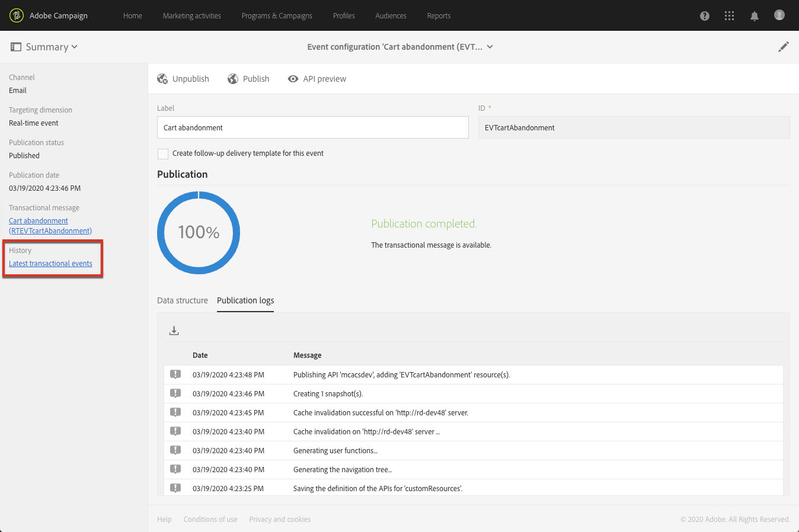

# 發佈事務性事件{#publishing-transactional-event}

完成[configuration](../../channels/using/configuring-transactional-event.md)後，該事件即可發佈。 預覽、發佈、取消發佈和刪除事件的步驟如下。

>[!IMPORTANT]
>
>只有[職能管理員](../../administration/using/users-management.md#functional-administrators) <!--being part of the **[!UICONTROL All]** [organizational unit](../../administration/using/organizational-units.md) -->擁有發佈事件配置的適當權限。

[本節](../../channels/using/publishing-transactional-message.md)提供了一個圖表，說明整個事務性消息傳遞發佈過程，包括發佈和取消發佈事件配置。

發佈完成後：
* 自動建立相應的事務消息。 請參閱[編輯事務性消息](../../channels/using/editing-transactional-message.md)。
* 網站開發人員將使用的API已部署，交易事件現在可以傳送。 請參閱[整合事件觸發](../../channels/using/getting-started-with-transactional-msg.md#integrate-event-trigger)。

## 預覽和發佈事件{#previewing-and-publishing-the-event}

您必須先預覽並發佈事件，才能使用事件。

1. 按一下&#x200B;**[!UICONTROL API preview]**&#x200B;按鈕，查看網站開發人員在發佈之前將會使用的REST API模擬。

   發佈事件後，此按鈕也可讓您在生產中檢視API的預覽。 請參閱[整合事件觸發](../../channels/using/getting-started-with-transactional-msg.md#integrate-event-trigger)。

   

   >[!NOTE]
   >
   >REST API會依所選渠道和所選定的定位維度而有所不同。 有關各種配置的詳細資訊，請參閱[本節](../../channels/using/configuring-transactional-event.md#transactional-event-specific-configurations)。

1. 按一下&#x200B;**[!UICONTROL Publish]**&#x200B;啟動發佈。

   

   網站開發人員將使用的API已部署，交易事件現在可以傳送。

1. 您可以在對應的頁籤中查看發佈日誌。

   

   >[!IMPORTANT]
   >
   >每次修改事件時，您必須再按一下&#x200B;**[!UICONTROL Publish]**，以產生網站開發人員將使用的更新REST API。

   發佈事件後，會自動建立連結至新事件的[交易訊息](../../channels/using/editing-transactional-message.md)。

1. 您可以透過位於左側區域的連結直接存取此交易性訊息。

   

   >[!NOTE]
   >
   >要觸發事件發送事務性消息，您必須修改並發佈剛建立的消息。 請參閱[編輯](../../channels/using/editing-transactional-message.md)和[發佈事務性消息](../../channels/using/publishing-transactional-message.md)部分。 您也必須將此觸發事件[整合至您的網站。](../../channels/using/getting-started-with-transactional-msg.md#integrate-event-trigger)

1. 一旦Adobe Campaign開始接收與此事件設定相關的事件，您就可以按一下&#x200B;**[!UICONTROL History]**&#x200B;區段下的&#x200B;**[!UICONTROL Latest transactional events]**&#x200B;連結，存取您的協力廠商服務所傳送並由Adobe Campaign處理的最新事件。

事件（以JSON格式）會從最新到最舊列出。 此清單可讓您檢查資料（例如內容或事件狀態），以利控制和除錯。

## 取消發佈事件{#unpublishing-an-event}

**[!UICONTROL Unpublish]**&#x200B;按鈕可讓您取消事件的發佈，該發佈會從REST API中刪除與先前建立的事件對應的資源。

現在，即使事件是透過網站觸發，也不會再傳送相對應的訊息，也不會將之儲存在資料庫中。

>[!NOTE]
>
>如果您已經發佈了相應的事務性消息，事務性消息發佈也將被取消。 請參閱[取消發佈事務性消息](../../channels/using/publishing-transactional-message.md#unpublishing-a-transactional-message)。

按一下&#x200B;**[!UICONTROL Publish]**&#x200B;按鈕以生成新的REST API。

<!--## Transactional messaging publication process {#transactional-messaging-pub-process}

The chart below illustrates the transactional messaging publication process.

For more on publishing, pausing and unpublishing a transactional message, see [this section](../../channels/using/publishing-transactional-message.md).-->

## 刪除事件{#deleting-an-event}

事件一經解除發佈，或事件尚未發佈後，您即可從事件設定清單中刪除。 操作步驟：

1. 按一下左上方的標誌 **[!UICONTROL Adobe Campaign]**，然後選取 **[!UICONTROL Marketing plans]** > **[!UICONTROL Transactional messages]** > **[!UICONTROL Event configuration]**。
1. 將滑鼠指標暫留在您選擇的事件設定上，然後選取&#x200B;**[!UICONTROL Delete element]**&#x200B;按鈕。

   

   >[!NOTE]
   >
   >請確定事件配置具有&#x200B;**[!UICONTROL Draft]**&#x200B;狀態，否則您將無法刪除它。 **[!UICONTROL Draft]**&#x200B;狀態適用於尚未發佈或[未發佈](#unpublishing-an-event)的事件。

1. 按一下 **[!UICONTROL Confirm]** 按鈕。

   

>[!IMPORTANT]
>
>刪除已發佈且已使用的事件配置也會刪除對應的事務性消息及其發送和跟蹤日誌。
