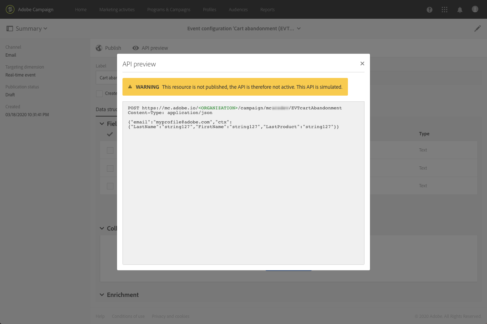

# 發佈異動事件 {#publishing-transactional-event}

完成[configuration](../../channels/using/configuring-transactional-event.md)後，該事件即可發佈。 以下說明預覽、發佈、取消發佈和刪除事件的步驟。

>[!IMPORTANT]
>
>只有[功能管理員](../../administration/using/users-management.md#functional-administrators) <!--being part of the **[!UICONTROL All]** [organizational unit](../../administration/using/organizational-units.md) -->具有發佈事件設定的適當權限。

[此小節](../../channels/using/publishing-transactional-message.md)中提供一個圖表，說明整個交易式訊息發佈過程，包括發佈和取消發佈事件配置。

發佈完成後：
* 會自動建立對應的交易式訊息。 請參閱[編輯交易式訊息](../../channels/using/editing-transactional-message.md)。
* 系統已部署網站開發人員將使用的API，且現在可以傳送交易事件。 請參閱[整合事件觸發](../../channels/using/getting-started-with-transactional-msg.md#integrate-event-trigger)。

## 預覽和發佈事件 {#previewing-and-publishing-the-event}

您必須先預覽並發佈事件，才能使用事件。

1. 按一下&#x200B;**[!UICONTROL API preview]**&#x200B;按鈕，查看網站開發人員在發佈REST API前所使用的模擬。

   發佈事件後，此按鈕也可讓您在生產環境中查看API的預覽。 請參閱[整合事件觸發](../../channels/using/getting-started-with-transactional-msg.md#integrate-event-trigger)。

   

   >[!NOTE]
   >
   >REST API會根據選取的管道和選取的目標維度而有所不同。 有關各種配置的詳細資訊，請參閱[此部分](../../channels/using/configuring-transactional-event.md#transactional-event-specific-configurations)。

1. 按一下&#x200B;**[!UICONTROL Publish]**&#x200B;以開始發佈。

   

   系統已部署網站開發人員將使用的API，且現在可以傳送交易事件。

1. 您可以在對應索引標籤中檢視發佈記錄檔。

   

   >[!IMPORTANT]
   >
   >每次修改事件時，必須再次按一下&#x200B;**[!UICONTROL Publish]**，以產生網站開發人員將使用的更新REST API。

   發佈事件後，會自動建立連結至新事件的[交易式訊息](../../channels/using/editing-transactional-message.md)。

1. 您可以透過左側區域的連結直接存取此交易式訊息。

   

   >[!NOTE]
   >
   >為了讓事件觸發傳送交易式訊息，您必須修改並發佈剛建立的訊息。 請參閱[編輯](../../channels/using/editing-transactional-message.md)和[發佈交易式訊息](../../channels/using/publishing-transactional-message.md)區段。 您也必須將此觸發事件](../../channels/using/getting-started-with-transactional-msg.md#integrate-event-trigger)整合至您的網站。[

1. Adobe Campaign開始接收與此事件設定相關的事件後，您可以按一下&#x200B;**[!UICONTROL History]**&#x200B;區段下的&#x200B;**[!UICONTROL Latest transactional events]**&#x200B;連結，以存取您的第三方服務傳送並由Adobe Campaign處理的最新事件。

事件（JSON格式）會從最近到最舊列出。 此清單可讓您檢查資料（例如內容或事件狀態），以利控制和偵錯。

## 取消發佈事件 {#unpublishing-an-event}

**[!UICONTROL Unpublish]**&#x200B;按鈕可讓您取消事件的發佈，該發佈會從與REST API（與您先前建立之事件相對應的資源）刪除。

現在，即使事件是透過網站觸發，也不會再傳送相對應的訊息，也不會將之儲存在資料庫中。

>[!NOTE]
>
>如果您已發佈對應的交易式訊息，交易式訊息發佈也會被取消。 請參閱[取消發佈交易式訊息](../../channels/using/publishing-transactional-message.md#unpublishing-a-transactional-message)。

按一下&#x200B;**[!UICONTROL Publish]**&#x200B;按鈕以產生新的REST API。

<!--## Transactional messaging publication process {#transactional-messaging-pub-process}

The chart below illustrates the transactional messaging publication process.

For more on publishing, pausing and unpublishing a transactional message, see [this section](../../channels/using/publishing-transactional-message.md).-->

## 刪除事件 {#deleting-an-event}

取消發佈事件或尚未發佈事件後，您可以從事件設定清單中刪除該事件。 操作步驟：

1. 按一下左上角的&#x200B;**Adobe**&#x200B;標誌，然後選擇&#x200B;**[!UICONTROL Marketing plans]** > **[!UICONTROL Transactional messages]** > **[!UICONTROL Event configuration]**。
1. 將滑鼠移至所選事件配置上，然後選取&#x200B;**[!UICONTROL Delete element]**&#x200B;按鈕。

   

   >[!NOTE]
   >
   >請確定事件設定具有&#x200B;**[!UICONTROL Draft]**&#x200B;狀態，否則您將無法將其刪除。 **[!UICONTROL Draft]**&#x200B;狀態適用於尚未發佈或已[unpublished](#unpublishing-an-event)的事件。

1. 按一下 **[!UICONTROL Confirm]** 按鈕。

   

>[!IMPORTANT]
>
>刪除已發佈且已使用的事件設定也會刪除對應的交易式訊息及其傳送和追蹤記錄。
