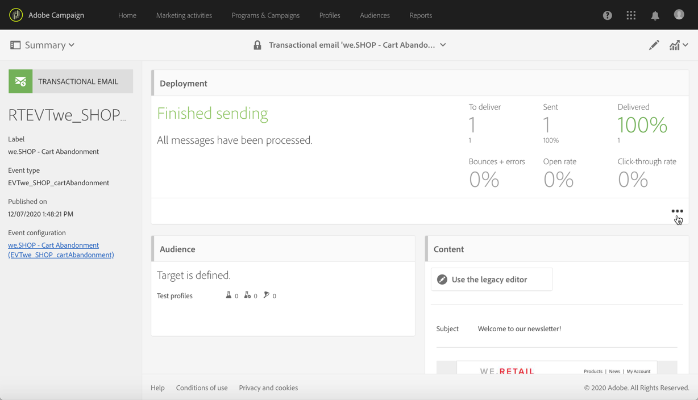
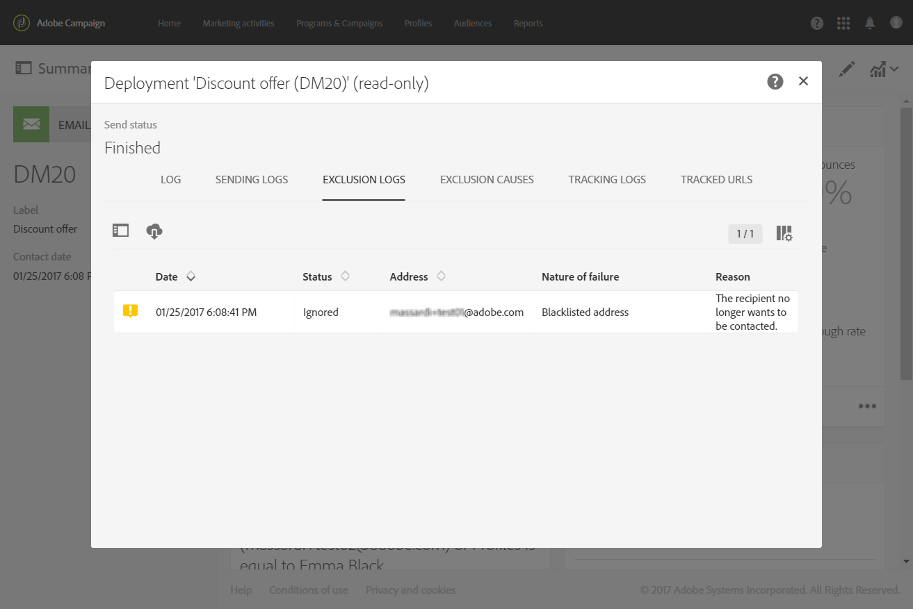

# 事務性消息生命週期{#publishing-transactional-message}

當[事務性消息](../../channels/using/editing-transactional-message.md)準備好發送時，可以發佈該消息。

發佈、暫停、取消發佈和刪除交易性訊息的步驟如下。

>[!IMPORTANT]
>
>只有[Administration](../../administration/using/users-management.md#functional-administrators)角色的用戶才能訪問和發佈事務性消息。

## 交易式訊息發佈程序 {#transactional-messaging-pub-process}

下圖說明了整個事務性消息傳遞發佈流程。

**相關主題：**
* [發佈交易式訊息](#publishing-a-transactional-message)
* [暫停交易訊息](#suspending-a-transactional-message-publication)
* [取消發佈交易式訊息](#unpublishing-a-transactional-message)
* [發佈事件](../../channels/using/publishing-transactional-event.md)

<!--## Testing a transactional message {#testing-a-transactional-message}

You first need to create a specific test profile that will allow you to properly check the transactional message.

### Defining a specific test profile {#defining-specific-test-profile}

Define a test profile that will be linked to your event, which will allow you to preview your message and send a relevant proof.

1. From the transactional message dashboard, click the **[!UICONTROL Create test profile]** button.

   

1. Specify the information to send in JSON format in the **[!UICONTROL Event data used for personalization]** section. This is the content that will be used when previewing the message and when the test profile receives the proof.

   

   >[!NOTE]
   >
   >You can also enter the information relating to the profile table. See [Enriching the event](../../channels/using/configuring-transactional-event.md#enriching-the-transactional-message-content) and [Personalizing a transactional message](../../channels/using/editing-transactional-message.md#personalizing-a-transactional-message).

1. Once created, the test profile will be pre-specified in the transactional message. Click the **[!UICONTROL Test profiles]** block of the message to check the target of your proof.

   

You can also create a new test profile or use one that already exists in the **[!UICONTROL Test profiles]** menu. To do this:

1. Click the **[!UICONTROL Adobe Campaign]** logo, in the top left corner, then select **[!UICONTROL Profiles & audiences]** > **[!UICONTROL Test profiles]**.
1. In the **[!UICONTROL Event]** section, select the event that you have just created. In this example, select "Cart abandonment (EVTcartAbandonment)".
1. Specify the information to send in JSON format in the **[!UICONTROL Event data]** text box.

   

1. Save your changes.
1. Access the message that you created and select the updated test profile.

**Related topics:**

* [Managing test profiles](../../audiences/using/managing-test-profiles.md)
* [Creating audiences](../../audiences/using/creating-audiences.md)

### Sending the proof {#sending-proof}

Once you have created one or more specific test profiles and saved your transactional message, you can send a proof to test it.

The steps for sending a proof are detailed in the [Sending proofs](../../sending/using/sending-proofs.md) section.-->

## 發佈交易式訊息 {#publishing-a-transactional-message}

編輯並測試您的交易訊息後，您就可以發佈它。 只需按一下&#x200B;**[!UICONTROL Publish]**&#x200B;按鈕。

現在，觸發「購物車放棄率」事件之後，則會自動提示訊息，其中包含收件者的職務及姓氏、購物車 URL、上次諮詢的產品或產品清單（如果您已定義產品清單），以及要傳送的購物車總金額。

若要存取關於交易式訊息的報告，請使用 **[!UICONTROL Reports]** 按鈕。請參閱[動態報表](../../reporting/using/about-dynamic-reports.md)。

**相關主題**：
* [編輯事務性消息](../../channels/using/editing-transactional-message.md)
* [測試交易式訊息](../../channels/using/testing-transactional-message.md)
* [整合事件觸發](../../channels/using/getting-started-with-transactional-msg.md#integrate-event-trigger)

## 暫停交易式訊息發佈 {#suspending-a-transactional-message-publication}

您可以使用　**[!UICONTROL Pause]**　按鈕以暫停發佈交易式訊息，例如，修改訊息中所包含的資料。因此，系統將不會再處理這些事件，而會將之保留在 Adobe Campaign 資料庫的佇列中。

佇列的事件會在REST API中定義的時段內保留（請參閱[REST API檔案](../../api/using/managing-transactional-messages.md)），或在使用「觸發器」核心服務時的觸發器事件（請參閱[關於Adobe Experience Cloud觸發器](../../integrating/using/about-adobe-experience-cloud-triggers.md)）。

按一下　**[!UICONTROL Resume]**　時，則會處理所有佇列的事件（前提是這些事件並未過期）。它們現在會包含暫停範本發佈時進行的所有修改。

## 取消發佈交易式訊息 {#unpublishing-a-transactional-message}

按一下 **[!UICONTROL Unpublish]** 可讓您取消交易式訊息發佈，同時也可取消相對應事件的發佈，這會從與　REST API（與您先前建立之事件相對應的資源）刪除。

現在，即使事件是透過網站觸發，也不會再傳送相對應的訊息，也不會將之儲存在資料庫中。

>[!NOTE]
>
>若要再次發佈訊息，您必須返回對應的事件設定[發佈事件](../../channels/using/publishing-transactional-event.md)，然後[發佈訊息](#publishing-a-transactional-message)。

如果您解除發佈已暫停的交易式訊息，則可能必須等候長達 24 小時，才能再次發佈。這是為了讓 **[!UICONTROL Database cleanup]** 工作流程清除已傳送至佇列的所有事件。

在「[暫停交易式訊息發佈](#suspending-a-transactional-message-publication)」一節中會詳細說明暫停訊息的步驟。

可透過 **[!UICONTROL Administration]** > **[!UICONTROL Application settings]** > **[!UICONTROL Workflows]** 存取每天凌晨 4:00 執行的工作流程 **[!UICONTROL Database cleanup]**。

## 刪除交易式訊息 {#deleting-a-transactional-message}

在取消發佈交易式訊息之後，或尚未發佈交易式訊息時，您可以從交易式訊息清單中刪除該訊息。操作步驟：

1. 按一下左上方的標誌 **[!UICONTROL Adobe Campaign]**，然後選取 **[!UICONTROL Marketing plans]** > **[!UICONTROL Transactional messages]** > **[!UICONTROL Transactional messages]**。
1. 將滑鼠游標移到您選取的訊息上。
1. 按一下 **[!UICONTROL Delete element]** 按鈕。

但是，只能在特定條件下刪除交易式訊息：

* 請確定交易式訊息的狀態為 **[!UICONTROL Draft]** 狀態，否則您無法將之刪除。**[!UICONTROL Draft]** 狀態適用於尚未發佈或已[取消發佈](#unpublishing-a-transactional-message)（而且並未[暫停](#suspending-a-transactional-message-publication)）的訊息。

* **交易式訊息**：除非將另一個交易式訊息連結到相對應的事件，否則如果已取消發佈交易式訊息，也需要取消發佈事件設定，才能成功刪除交易式訊息。如需詳細資訊，請參閱「[取消發佈事件](../../channels/using/publishing-transactional-event.md#unpublishing-an-event)」。

   >[!IMPORTANT]
   >
   >刪除已傳送通知的交易式訊息也會刪除其發送與追蹤日誌。

* **來自現成事件範本的交易式訊息（內部交易式訊息）**：如果內部交易式訊息是唯一與相對應內部事件關聯的訊息，則無法刪除該訊息。您必須先建立另一個交易式訊息，方法是複製該訊息或透過 **[!UICONTROL Resources]** > **[!UICONTROL Templates]** > **[!UICONTROL Transactional message templates]** 功能表進行。

<!--## Monitoring transactional message delivery {#monitoring-transactional-message-delivery}

Once the message is published and your site integration is done, you can monitor the delivery.

To monitor transactional messaging, you need to access **execution deliveries**. An execution delivery is a non-actionable and non-functional technical message created once a month for each transactional message, and each time a transactional message is edited and published again.

1. To view the message delivery log, click the icon at the bottom right of the **[!UICONTROL Deployment]** block.

   

1. Click the **[!UICONTROL Execution list]** tab.

   

1. Select the execution delivery of your choice.

   

1. Click again the icon at the bottom right of the **[!UICONTROL Deployment]** block.

   

   For each execution delivery, you can consult the delivery logs as you would do for a standard delivery. For more on accessing and using the logs, see [Monitoring a delivery](../../sending/using/monitoring-a-delivery.md).

**Related topics**:
* [Publishing a transactional message](#publishing-a-transactional-message)
* [Integrate the event triggering](../../channels/using/getting-started-with-transactional-msg.md#integrate-event-trigger)

### Profile-based transactional message specificities {#profile-transactional-message-monitoring}

For profile-based transactional messages, you can monitor the following profile information.

Select the **[!UICONTROL Sending logs]** tab. In the **[!UICONTROL Status]** column, **[!UICONTROL Sent]** indicates that a profile has opted in.

Select the **[!UICONTROL Exclusions logs]** tab to view recipients who have been excluded from the message target, such as addresses on denylist.

For any profile that has opted out, the **[!UICONTROL Address on denylist]** typology rule excluded the corresponding recipient.

This rule is part of a specific typology that applies to all transactional messages based on the **[!UICONTROL Profile]** table.

**Related topics**:

* [About typologies and typology rules](../../sending/using/about-typology-rules.md)
* [Monitoring a delivery](../../sending/using/monitoring-a-delivery.md)

## Transactional message retry process {#transactional-message-retry-process}

A temporarily undelivered transactional message is subject to automatic retries that are performed until the delivery expires. For more on the delivery duration, see [Validity period parameters](../../administration/using/configuring-email-channel.md#validity-period-parameters).

When a transactional message fails to be sent, there are two retry systems:

* At the transactional messaging level, a transactional message can fail before the event is assigned to an execution delivery, meaning between the event reception and the delivery preparation. See [Event processing retry process](#event-processing-retry-process).
* At the sending process level, once the event has been assigned to an execution delivery, the transactional message can fail due to a temporary error. See [Message sending retry process](#message-sending-retry-process).

The definition of **execution delivery** can be found in the [Monitoring transactional message delivery](#monitoring-transactional-message-delivery) section.

### Event processing retry process {#event-processing-retry-process}

When an event is triggered, it is assigned to an execution delivery.

If the event cannot be assigned to an execution delivery, the event processing is postponed. Retries are then performed until it is assigned to a new execution delivery.

>[!NOTE]
>
>A postponed event does not appear in the transactional message sending logs, because it is not assigned to an execution delivery yet.

For example, the event could not be assigned to an execution delivery because its content was not correct, there was an issue with access rights or branding, an error was detected on applying typology rules, etc. In this case, you can pause the message, edit it to fix the problem and publish it again. The retry system will then assign it to a new execution delivery.

### Message sending retry process {#message-sending-retry-process}

Once the event has been assigned to an execution delivery, the transactional message can fail due to a temporary error, if the recipient's mailbox is full for example. For more on this, see [Retries after a delivery temporary failure](../../sending/using/understanding-delivery-failures.md#retries-after-a-delivery-temporary-failure).

>[!NOTE]
>
>When an event is assigned to an execution delivery, it appears in the sending logs of this execution delivery, and only at this time. The failed deliveries are displayed in the **[!UICONTROL Execution list]** tab of the transactional message sending logs.

### Retry process limitations {#limitations}

**Sending logs update**

In the retry process, the sending logs of the new execution delivery are not immediately updated (the update is performed through a scheduled workflow). It means that the message could be in **[!UICONTROL Pending]** status even if the transactional event has been processed by the new execution delivery.

**Failed execution delivery**

You cannot stop an execution delivery. However, if the current execution delivery fails, a new one is created as soon as a new event is received, and all new events are processed by this new execution delivery. No new events are processed by the failed execution delivery.

If some events already assigned to an execution delivery have been postponed as part of the retry process and if that execution delivery fails, the retry system does not assign the postponed events to the new execution delivery, which means that these events are lost. Check the [delivery logs](#monitoring-transactional-message-delivery) to see the recipients that may have been impacted.-->
