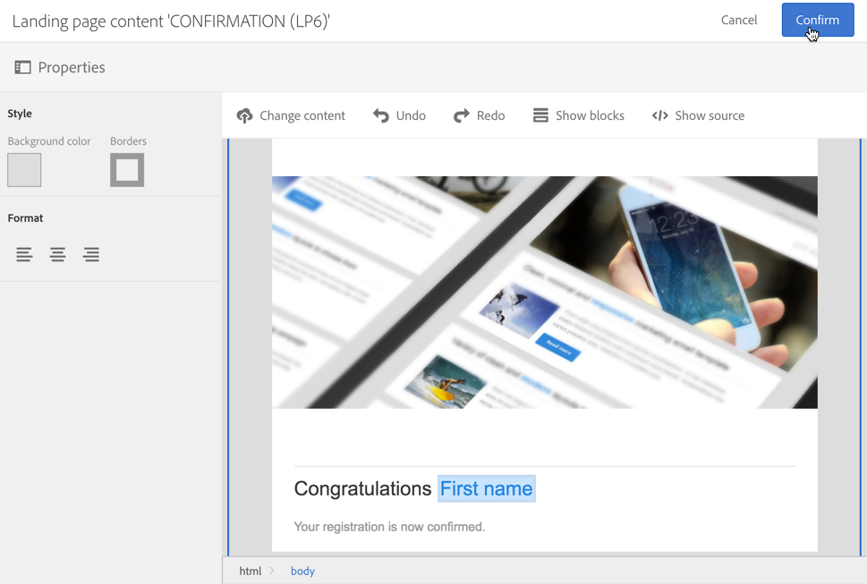
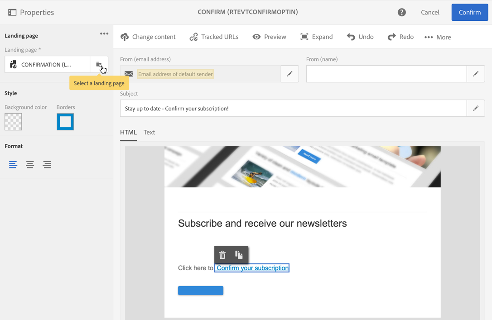
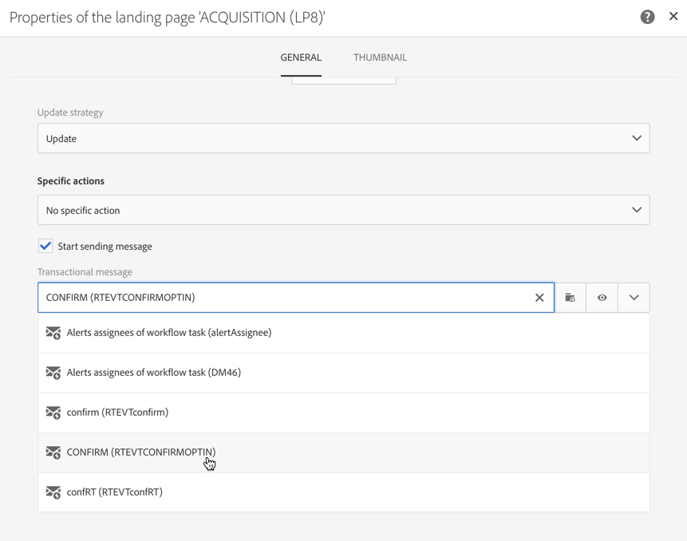
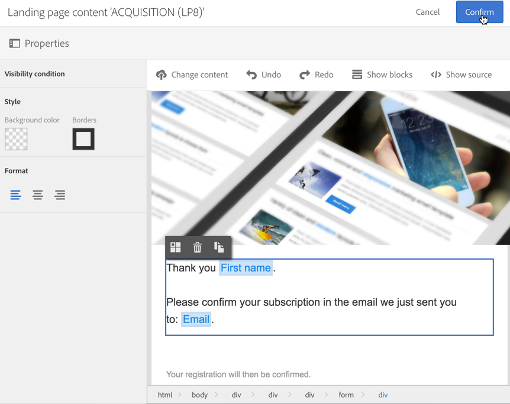

# 設定雙重加入程序{#setting-up-a-double-opt-in-process}

## 關於雙重選擇加入 {#about-double-opt-in}

傳送電子郵件時，最佳做法是雙重加入機制。 它可保護平台免受錯誤或無效的電子郵件地址、垃圾郵件機器人，並防止可能的垃圾郵件投訴。

原則是先傳送電子郵件確認訪客的同意，再將其儲存為「描述檔」至您的促銷活動資料庫：訪客填寫線上登陸頁面，接著收到電子郵件，必須按一下確認連結才能完成訂閱。

若要設定此設定，您必須：

1. 建立並發佈著陸頁面，讓訪客可以註冊並訂閱。 此著陸頁面可從網站取得。 填寫並送出此著陸頁面的訪客會儲存在資料庫中，但是會「列入黑名單」，以便在最終驗證之前不會收到任何通訊(請參閱「管理促銷活動中的黑名單 」)。
1. 使用確認連結自動建立及傳送選擇加入的電子郵件。 此電子郵件將定位提交登陸頁面的訪客。 它將以電子郵件範本為基礎，可以定位「選擇退出」描述檔。
1. 重新導向至確認登陸頁面。 此最終登陸頁面將建議一個確認按鈕：訪客必須按一下它。 您可以設計歡迎電子郵件，在確認完成時傳送，例如在電子郵件中為新收件者新增特殊選件。

這些步驟必須以特定順序在Adobe Campaign中設定，才能正確啟用所有參數。

## 步驟1:建立確認登陸頁面 {#step-1--create-the-confirmation-landing-page}

設定雙重選擇加入機制的程式，從建立確認登陸頁面開始：當訪客點按確認電子郵件以進行註冊時，會顯示此頁面。

若要建立及設定此著陸頁面，您必須：

1. 根據范 [本設計新的著陸](../../channels/using/getting-started-with-landing-pages.md) 頁 **[!UICONTROL Profile acquisition (acquisition)]** 面。 輸入標籤「**CONFIRMATION**」。

   如果您需要使 [用服務](../../audiences/using/about-subscriptions.md)，也可以使用范 **[!UICONTROL Subscription (sub)]** 本。

1. 編輯著陸頁面屬性，並在 **[!UICONTROL Access and loading]** 區段下方取消選取選 **[!UICONTROL Authorize unidentified visitors]**&#x200B;項， **[!UICONTROL Preload visitor data]** 選取（此選項非必要）。

   

1. 在>區 **[!UICONTROL Job]** 段中 **[!UICONTROL Additional data]** ，按一 **[!UICONTROL Add an element]** 下並輸入下列內容路徑：

   /context/profile/blackList

   將值設為 **false** ，然後按一 **[!UICONTROL Add]**&#x200B;下。

   

   此上下文會移除黑名單欄位，以便能夠傳送電子郵件。 我們稍後會看到，第一個著陸頁面在確認前將此欄位設 **為true** ，以防止傳送電子郵件至未確認的描述檔。 如需詳細資訊，請參閱 [步驟3:建立贏取登陸頁面](#step-3--create-the-acquisition-landing-page)。

1. 自訂著陸頁面的內容：例如，您可以顯示個人化資料，並將確認按鈕的標籤變更為「按一下此處確認我的訂閱」。

   

1. 調整確認頁面的內容，通知您的訂閱者他們已註冊。

   

1. [測試並發佈](../../channels/using/testing-publishing-landing-page.md) 著陸頁面。

## 步驟2:建立確認電子郵件 {#step-2--create-the-confirmation-email}

建立確認登陸頁面後，您就可以設計確認電子郵件：此電子郵件會自動傳送給驗證贏取登陸頁面的每位訪客。 此驗證會視為事件，而電子郵件則是交易性訊息，連結至特定的排版規則，以鎖定選擇退出人口。

建立這些元素的步驟如下所述。 在建立贏取登陸頁面之前，您必須先追蹤這些範本，因為此電子郵件範本將會在其中參照。

### 建立事件 {#create-the-event}

確認電子郵件是交 [易性訊息](../../channels/using/about-transactional-messaging.md) ，當它回應事件時：表單的驗證。 您必須先建立事件，然後建立交易式訊息的範本。

1. 從> **[!UICONTROL Marketing plans]** >功能表 **[!UICONTROL Transactional messages]** 建立可從Adobe Campaign標誌存取的事件，然後輸入標籤「 **[!UICONTROL Event configuration]** CONFIRM ****」。
1. 選取定位 **[!UICONTROL Profile]** 維度，然後按一下 **[!UICONTROL Create]**。

   

1. 在該節 **[!UICONTROL Fields]** 中，單 **[!UICONTROL Create element]** 擊並添加 **[!UICONTROL email]** 資料結構中的以啟用協調。
1. 在該部 **[!UICONTROL Enrichment]** 分中，單 **[!UICONTROL Create element]** 擊並選擇 **[!UICONTROL Profile]** 目標資源。 然後，您可以根據 **[!UICONTROL email]** 您的需 **[!UICONTROL Join definition]** 求，映射區段中的欄位或任何其他複合協調鍵。

   

   如果您需要使用服務，請在欄位 **[!UICONTROL Service]** 上新增目標資源和 **[!UICONTROL serviceName]** 地圖。 有關此方面的更多資訊，請參閱。

1. 在下 **[!UICONTROL Profile]** 拉式清 **[!UICONTROL Targeting enrichment]** 單中選擇作為。
1. 按一 **[!UICONTROL Publish]** 下以發佈事件。

活動已就緒。 您現在可以設計電子郵件範本。 此範本必須包含先前建立之 **CONFIRMATION** 著陸頁面的連結。 有關詳細資訊，請參 [閱設計確認消息](#design-the-confirmation-message)。

### 建立類型 {#create-the-typology-rule}

您需要建立特定 [的排版](../../sending/using/about-typology-rules.md)，方法是複製現成可用的排版。 分類法將允許傳送訊息給尚未確認同意且仍列入黑名單的個人檔案。 依預設，排除選擇退出（即黑名單）描述檔的類型。 若要建立此類型，請依照下列步驟進行：

1. 從Adobe Campaign標誌中，選取 **[!UICONTROL Administration]** > **[!UICONTROL Channels]** >並 **[!UICONTROL Typologies]** 按一下 **[!UICONTROL Typologies]**。
1. 複製現成可用的印刷樣式 **[!UICONTROL Transactional message on profile (mcTypologyProfile)]**。
1. 複製確認後，請編輯新的類型學，並輸入 **PROFILE標籤**。
1. 移除黑名單 **地址規則** 。
1. 按一下 **[!UICONTROL Save]**.

此類型現在可與確認電子郵件關聯。

### 設計確認訊息 {#design-the-confirmation-message}

確認電子郵件是根據先前建立的事件進行交易的訊息。 請依照下列步驟建立此訊息：

1. 從Adobe Campaign標誌中，選取 **[!UICONTROL Marketing plans]** >並 **[!UICONTROL Transactional messages]** 按一下 **[!UICONTROL Transactional messages]**。
1. 編輯 **CONFIRM** email範本並加以個人化。 您可以上傳現有內容或使用現成範本。
1. 新增連結至「確 **認** 」登陸頁面，然後按一 **[!UICONTROL Confirm]** 下以儲存修改。

   

1. 編輯電子郵件範本屬性。 在「 **[!UICONTROL Advanced parameters]** > 」部 **[!UICONTROL Preparation]** 分中，選擇 **以前建立的PROFILE** 類型學。
1. 儲存並發佈交易式訊息。

## 步驟3:建立贏取登陸頁面 {#step-3--create-the-acquisition-landing-page}

您必須建立初始贏取登陸頁面：此選擇加入表格將會發佈在您的網站上。

若要建立及設定此著陸頁面，您必須：

1. 根據范 [本設計新的著陸](../../channels/using/getting-started-with-landing-pages.md) 頁 **[!UICONTROL Profile acquisition (acquisition)]** 面。 輸入標籤「**ACQUISITION**」。
1. 編輯著陸頁面屬性：在 **[!UICONTROL Job]** >區 **[!UICONTROL Additional data]** 段中，按一 **[!UICONTROL Add an element]** 下並輸入下列內容路徑：

   /context/profile/blackList

   並將值設為 **true**。

   這是強制強制黑名單並避免傳送訊息給未確認同意的訪客。 驗證CONFIRMATION著陸頁面後，會在確認後將此欄位設 **為** false。 如需詳細資訊，請參閱 [步驟1:建立確認登陸頁面](#step-1--create-the-confirmation-landing-page)。

1. 在>區 **[!UICONTROL Job]** 段 **[!UICONTROL Specific actions]** 中，選取選項 **[!UICONTROL Start sending messages]**。
1. 在關聯的下拉清單中，選擇您建立的 **CONFIRM** 事務性消息模板。

   

1. 根據您的品牌和您需要取得的資料，自訂登陸頁面的內容。 例如，您可以顯示個人化資料，並將確認按鈕的標籤變更 **為「確認我的訂閱** 」。

   

1. 自訂確認頁面，通知新訂閱者他需要驗證訂閱。

   

1. [測試並發佈](../../channels/using/testing-publishing-landing-page.md) 著陸頁面。

現在已設定雙重加入機制。 您可以從此登陸頁面的公用URL開始，從頭到尾執行並測試程 **[!UICONTROL ACQUISITION]** 序。 此URL會顯示在著陸頁面控制面板中。
