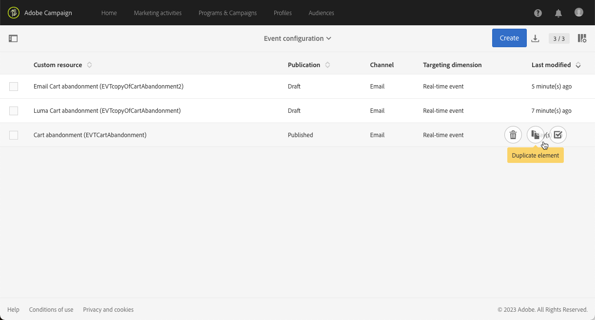

# 異動事件改善 {#transactional-event-improvements}

>[!AVAILABILITY]
>
>這些功能目前僅適用於一組組織（可用性限制）。 如需詳細資訊，請聯絡您的Adobe代表。

目前，在Adobe Campaign Standard中，沒有Administrator安全性群組的使用者無法存取、建立或發佈交易式事件，導致需要設定和發佈事件但缺少Administrator許可權的業務使用者出現問題。 此外，也不可能重複異動事件。

我們已對異動訊息存取控制實施下列改善：

* 新 **[!UICONTROL Role]**，已呼叫 **MC使用者**&#x200B;已新增，以允許非管理員使用者管理異動事件設定。 此 **MC使用者** 角色會授予這些使用者存取、建立、發佈和取消發佈異動事件和訊息的能力。

* 執行傳送（即每次編輯並再次發佈交易式訊息，或預設為每月一次時建立的技術訊息）現在設定為 **[!UICONTROL Organizational unit]** 建立事件之使用者所屬的安全性群組，而非限制於 **[!UICONTROL Organizational unit]** 的 **訊息中心代理程式(mcExec)** 安全性群組。

* **管理員** 現在可以複製已發佈的交易式事件，以及具有的使用者 **MC使用者** 角色（前提是它們位於相同位置） **組織單位** 階層，建立事件的使用者。

## 指派MC使用者角色 {#assign-role}

若要指派 **MC使用者** 角色至您的安全性群組：

1. 建立新的 **[!UICONTROL Security group]** 或更新現有的一個。 [了解更多](../../administration/using/managing-groups-and-users.md)。

1. 按一下 **[!UICONTROL Create element]** 將角色指派給您的安全性群組。

   

1. 選取MC使用者 **[!UICONTROL Role]** 並按一下 **[!UICONTROL Confirm]**.

   >[!IMPORTANT]
   >
   > 在指派MC使用者角色給操作員時，請務必謹慎，因為這樣可讓操作員取消發佈事件。

   

1. 設定後，按一下 **[!UICONTROL Save]**.

連結至此的使用者 **[!UICONTROL Security group]** 現在可以存取、建立和發佈異動事件和訊息。

## 指派MC使用者安全性群組 {#assign-group}

1. 在Admin Console中，選取 **產品** 標籤。

1. 選取 **Adobe Campaign Standard** 然後選擇您的執行個體。

1. 從 **產品設定檔** 清單中，選取 **MC使用者** 群組。

1. 按一下 **新增使用者** 並輸入您要新增至此產品設定檔的設定檔名稱、使用者群組或電子郵件地址。

1. 新增後，按一下 **儲存**.

新增至此的使用者 **[!UICONTROL Security group]** 現在可以存取、建立和發佈異動事件和訊息。

## 重複的交易式事件 {#duplicate-transactional-events}

使用者具有 **管理員** 安全性群組<!--([Functional administrators](../../administration/using/users-management.md#functional-administrators)?)--> 現在可以複製事件設定，如果事件已 **已發佈**.

此外，非管理員使用者使用 **MC使用者** 角色現在可以存取事件設定，但其複製許可權由 **組織單位** 他們屬於。 如果目前使用者和建立事件的使用者屬於相同的組織單位階層，則允許複製。

例如，如果屬於「France Sales」組織單位的使用者建立了事件組態：

* 組織單位為「Paris Sales」的另一個使用者將能夠複製此事件，因為「Paris Sales」是「France Sales」組織單位的一部分。

* 但是，組織單位為「San Francisco Sales」的使用者將無法這麼做，因為「San Francisco Sales」在「US Sales」組織單位底下，該組織單位與「France Sales」組織單位不同。

若要複製事件設定，請遵循下列步驟。

1. 按一下 **Adobe** 標誌，在左上角，然後選取 **[!UICONTROL Marketing plans]** > **[!UICONTROL Transactional messages]** > **[!UICONTROL Event configuration]**.

1. 將滑鼠停留在您選取的已發佈事件設定上，並選取 **[!UICONTROL Duplicate element]** 按鈕。

   

   >[!CAUTION]
   >
   >您無法複製未發佈的事件設定。 [了解更多](publishing-transactional-event.md)

1. 系統會自動顯示重複的事件。 它包含您為原始事件定義的相同組態，但具有 **[!UICONTROL Draft]** 狀態。

   

1. 對應的交易式訊息會自動建立。 若要存取，請前往 **[!UICONTROL Transactional messages]** > **[!UICONTROL Transactional messages]**.

   

1. 開啟新複製的訊息。 它包含您為原始訊息定義的相同設計，但具有 **[!UICONTROL Draft]** 狀態，即使原始交易式訊息已發佈。

   

1. 您現在可以編輯和個人化此訊息。 另請參閱 [編輯異動訊息](../../channels/using/editing-transactional-message.md).

## 影響 {#impacts}

下表概述這些改善專案的影響：

| 物件 | 在此變更之前 | 在此變更之後 |
|:-: | :--: | :-:|
| 異動事件 | 僅限內的使用者 **管理員** 安全性群組可以建立和發佈事件。 | 此 **MC使用者** 角色可讓使用者建立和發佈事件。 |
| 異動訊息 | 異動訊息會設為 **組織單位** 的 **訊息中心代理程式(mcExec)** 安全性群組。 | 異動訊息會設為 **組織單位** 建立交易式事件/訊息之使用者所屬的安全性群組。 |
| 執行傳送 | 執行傳遞設定為 **組織單位** 的 **訊息中心代理程式(mcExec)** 安全性群組。 | 執行傳遞設定為 **組織單位** 建立交易式事件/訊息之使用者所屬的安全性群組。 |
| 已發佈的交易式事件 | 任何使用者都不能複製。 | <ul><li>使用者具有 **管理員** 安全性群組可以複製已發佈的事件。</li> <li>使用者具有 **MC使用者** 角色可以複製已發佈的事件，前提是事件相同 **組織單位** 階層，建立事件的使用者。</li></ul> |

<!--Transactional Message Templates| Transactional Message templates are set to the Organizational unit **All**. | Transaction Message Template will be set to the **Organizational unit** of the security group to which the user creating the message template belongs.-->