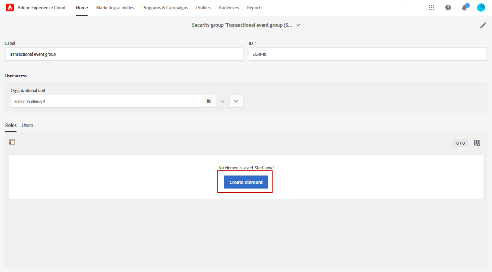

# 事務性事件改進 {#transactional-event-improvements}

>[!AVAILABILITY]
>
>這些功能目前僅適用於一組組織（有限可用性）。 有關詳細資訊，請與Adobe代表聯繫。

目前，在Adobe Campaign Standard，沒有管理員安全組的用戶無法訪問、建立或發佈事務性事件，這給需要配置和發佈事件但缺少管理員權限的業務用戶帶來了問題。 另外，不能複製事務性事件。

我們對事務性消息訪問控制實施了以下改進：

* 新 **[!UICONTROL Role]**&#x200B;調用 **MC用戶**，已添加以允許非管理員用戶管理事務事件配置。 的 **MC用戶** 角色允許這些用戶訪問、建立、發佈和取消發佈事務性事件和消息。

* 執行交付（即每次編輯和再次發佈事務性消息時建立的技術消息，或預設情況下每月一次）現在設定為 **[!UICONTROL Organizational unit]** 建立事件的用戶所屬的安全組，而不是僅限於 **[!UICONTROL Organizational unit]** 的 **消息中心代理(mcExec)** 安全組。

* **管理員** 現在可以複製已發佈的事務性事件以及具有 **MC用戶** 角色(如果它們位於相同 **組織單位** 層次結構：建立事件的用戶。

## 分配MC用戶角色 {#assign-role}

分配 **MC用戶** 角色到安全組：

1. 新建 **[!UICONTROL Security group]** 或更新現有的。 [了解更多](../../administration/using/managing-groups-and-users.md)。

1. 按一下 **[!UICONTROL Create element]** 為安全組分配角色。

   

1. 選擇MC用戶 **[!UICONTROL Role]** 按一下 **[!UICONTROL Confirm]**。

   >[!IMPORTANT]
   >
   > 將MC用戶角色分配給操作員時，請小心操作，因為這樣可以使他們取消發佈事件。

   

1. 配置後，按一下 **[!UICONTROL Save]**。

連結到此的用戶 **[!UICONTROL Security group]** 現在可以訪問、建立和發佈事務性事件和消息。

## 分配MC用戶安全組 {#assign-group}

1. 在Admin Console中，選擇 **產品** 頁籤。

1. 選擇 **Adobe Campaign Standard** 然後選擇實例。

1. 從 **產品配置檔案** ，選擇 **MC用戶** 組。

1. 按一下 **添加用戶** 並輸入要添加到此產品配置檔案的配置檔案的名稱、用戶組或電子郵件地址。

1. 添加後，按一下 **保存**。

添加到此的用戶 **[!UICONTROL Security group]** 現在可以訪問、建立和發佈事務性事件和消息。

## 重複事務事件 {#duplicate-transactional-events}

具有 **管理員** 安全組<!--([Functional administrators](../../administration/using/users-management.md#functional-administrators)?)--> 現在，如果事件已被複製，則可以複製事件配置 **出版**。

此外，非管理員用戶 **MC用戶** 角色現在可以訪問事件配置，但其複製權限由 **組織單位** 他們屬於。 如果當前用戶和建立事件的用戶屬於同一組織單位層次結構，則允許重複。

例如，如果屬於「法國銷售」組織單位的用戶建立事件配置：

* 組織單位為「巴黎銷售」的另一個用戶將能夠複製此事件，因為「巴黎銷售」是「法國銷售」組織單位的一部分。

* 但是，組織單位為&quot;舊金山銷售&quot;的用戶將無法這樣做，因為&quot;舊金山銷售&quot;位於&quot;美國銷售&quot;組織單位之下，該組織單位與&quot;法國銷售&quot;組織單位分開。

要複製事件配置，請執行以下步驟。

1. 按一下 **Adobe** 徽標，在左上角，然後選擇 **[!UICONTROL Marketing plans]** > **[!UICONTROL Transactional messages]** > **[!UICONTROL Event configuration]**。

1. 將滑鼠懸停在所選的已發佈事件配置上，然後選擇 **[!UICONTROL Duplicate element]** 按鈕

   

   >[!CAUTION]
   >
   >不能複製未發佈的事件配置。 [了解更多](publishing-transactional-event.md)

1. 自動顯示重複事件。 它包含與您為原始事件定義的配置相同的配置，但它具有 **[!UICONTROL Draft]** 狀態。

   

1. 自動建立相應的事務消息。 要訪問它，請轉到 **[!UICONTROL Transactional messages]** > **[!UICONTROL Transactional messages]**。

   

1. 開啟新複製的消息。 它包含您為原始消息定義的相同設計，但 **[!UICONTROL Draft]** 狀態，即使原始事務性消息已發佈。

   

1. 您現在可以編輯並個性化此郵件。 請參閱 [編輯事務性消息](../../channels/using/editing-transactional-message.md)。

## 影響 {#impacts}

下表概述了這些改進的影響：

| 對象 | 此更改之前 | 此更改後 |
|:-: | :--: | :-:|
| 事務性事件 | 僅位於 **管理員** 安全組可以建立和發佈事件。 | 的 **MC用戶** 角色允許用戶建立和發佈事件。 |
| 事務性消息 | 事務性消息設定為 **組織單位** 的 **消息中心代理(mcExec)** 安全組。 | 事務性消息設定為 **組織單位** 建立事務事件/消息的用戶所屬的安全組。 |
| 執行交付 | 執行交貨設定為 **組織單位** 的 **消息中心代理(mcExec)** 安全組。 | 執行交貨設定為 **組織單位** 建立事務事件/消息的用戶所屬的安全組。 |
| 已發佈事務性事件 | 任何用戶都不能進行複製。 | <ul><li>具有 **管理員** 安全組可以複製已發佈的事件。</li> <li>具有 **MC用戶** 角色可以複製已發佈的事件(如果它們位於同一個 **組織單位** 層次結構：建立事件的用戶。</li></ul> |

<!--Transactional Message Templates| Transactional Message templates are set to the Organizational unit **All**. | Transaction Message Template will be set to the **Organizational unit** of the security group to which the user creating the message template belongs.-->