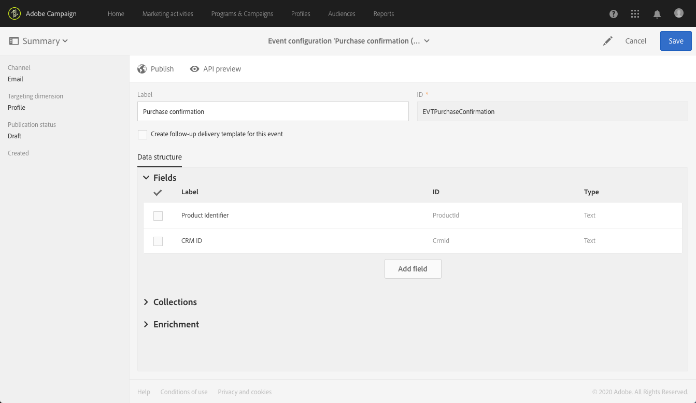

# 異動訊息使用案例 {#transactional-messaging-use-case}

在此範例中，您想使用Adobe Campaign交易傳訊功能，在您網站上每次購買後傳送確認電子郵件，透過客戶CRM ID識別客戶。

先決條件如下：

* 請確定&#x200B;**[!UICONTROL Profile]**&#x200B;資源已擴充，且新欄位與CRM ID對應。

* 建立並發佈與購買對應的自訂資源，並將其連結至&#x200B;**[!UICONTROL Profile]**&#x200B;資源。 這樣，您就可以從此資源中檢索資訊，以豐富郵件內容。

有關擴展、建立和發佈資源的詳細資訊，請參閱[本節](../../developing/using/key-steps-to-add-a-resource.md)。

實施此使用案例的主要步驟如下。

>[!NOTE]
>
>有關事務性消息傳遞一般進程的圖形表示，請參見[this schema](../../channels/using/getting-started-with-transactional-msg.md#key-steps)。

## 步驟1 —— 建立和發佈事件配置{#create-event-configuration}

1. 使用&#x200B;**[!UICONTROL Email]**&#x200B;頻道建立新事件。 請參閱[建立事件](../../channels/using/configuring-transactional-event.md#creating-an-event)。

1. 選擇&#x200B;**[!UICONTROL Profile]**&#x200B;定位維以建立[基於配置檔案的事務性消息](../../channels/using/configuring-transactional-event.md#profile-based-transactional-messages)。

1. 定義可用於個性化事務性消息的屬性。 在此範例中，新增「CRM ID」和「產品識別碼」欄位。 請參閱[定義事件屬性](../../channels/using/configuring-transactional-event.md#defining-the-event-attributes)。

   

1. 若要以客戶購買的相關資訊豐富訊息內容，請建立以&#x200B;**[!UICONTROL Purchase]**&#x200B;資源為目標的擴充功能。 請參閱[豐富事件](../../channels/using/configuring-transactional-event.md#enriching-the-transactional-message-content)。

   

1. 在先前新增至事件的「產品識別碼」欄位和&#x200B;**[!UICONTROL Purchase]**&#x200B;資源中的對應欄位之間建立連結條件。

   

1. 由於它對於基於配置檔案的事件是強制性的，因此您還必須建立一個以&#x200B;**[!UICONTROL Profile]**&#x200B;資源為目標的擴充。

1. 在先前新增至訊息的&quot;CRM ID&quot;欄位和您延伸之&#x200B;**[!UICONTROL Profile]**&#x200B;資源的對應欄位之間建立連接條件。<!--What's the purpose to have created a CRM ID for this event and to have the CRM ID as a join condition? could it be any other field provided you created it in the event?-->

   

1. 在&#x200B;**[!UICONTROL Targeting enrichment]**&#x200B;節中，選擇&#x200B;**[!UICONTROL Profile]**&#x200B;資源上的擴充，該擴充將在傳送執行期間用作消息目標。

   

1. 預覽並發佈事件。 請參閱[預覽和發佈事件](../../channels/using/publishing-transactional-event.md#previewing-and-publishing-the-event)。

## 步驟2 —— 編輯和發佈事務性消息{#create-transactional-message}

1. 前往發佈事件時自動建立的交易訊息。 請參閱[訪問事務性消息](../../channels/using/editing-transactional-message.md#accessing-transactional-messages)。

1. 編輯並個人化訊息。 請參閱[編輯配置式事務性消息](../../channels/using/editing-transactional-message.md#editing-profile-transactional-message)。

1. 透過與您新增至&#x200B;**[!UICONTROL Profile]**&#x200B;資源的「CRM ID」欄位進行協調，您可以直接存取所有描述檔資訊至[個人化](../../designing/using/personalization.md#inserting-a-personalization-field)您的訊息。

   

1. 透過與「產品識別碼」欄位的協調，您可以透過從&#x200B;**[!UICONTROL Purchase]**&#x200B;資源新增任何欄位，讓訊息內容更豐富客戶購買的相關資訊。

   

   若要這麼做，請從內容相關工具列選取&#x200B;**[!UICONTROL Insert personalization field]**。 從&#x200B;**[!UICONTROL Context]** > **[!UICONTROL Transactional event]** > **[!UICONTROL Event context]**&#x200B;節點中，開啟與&#x200B;**[!UICONTROL Purchase]**&#x200B;自定義資源對應的節點並選擇任何欄位。

1. 您可以使用特定的測試設定檔來測試您的訊息。 請參閱[測試事務性消息](../../channels/using/testing-transactional-message.md#testing-a-transactional-message)。

1. 內容準備就緒後，請儲存變更並發佈訊息。 請參閱[發佈交易式訊息](../../channels/using/publishing-transactional-message.md#publishing-a-transactional-message)。

## 步驟3 —— 整合觸發{#integrate-event-trigger}的事件

將活動整合至您的網站。 請參閱[整合事件觸發](../../channels/using/getting-started-with-transactional-msg.md#integrate-event-trigger)。

## 步驟4 —— 消息傳遞{#message-delivery}

當所有這些步驟都完成後，當客戶從您的網站購買產品時，他們就會收到個人化確認電子郵件，包括其購買資訊。