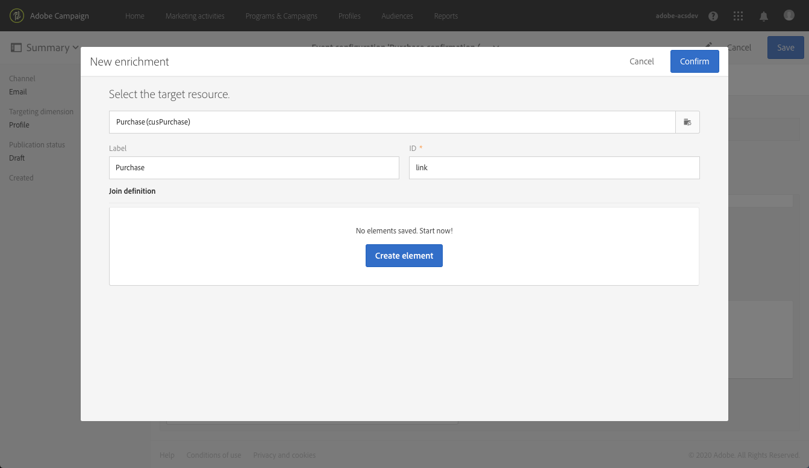

# 異動訊息使用案例 {#transactional-messaging-use-case}

在本示例中，您希望使用Adobe Campaign事務性消息傳遞功能在您網站上的每次購買後發送確認電子郵件，通過客戶的CRM ID識別您的客戶。

先決條件如下：

* 確保 **[!UICONTROL Profile]** 已使用與CRM ID對應的新欄位擴展資源。

* 建立並發佈與採購對應的自定義資源並將其連結到 **[!UICONTROL Profile]** 資源。 這樣，您將能夠從此資源檢索資訊以豐富消息內容。

有關擴展、建立和發佈資源的詳細資訊，請參見 [此部分](../../developing/using/key-steps-to-add-a-resource.md)。

下面介紹了實施此使用案例的主要步驟。

>[!NOTE]
>
>有關事務性消息傳遞一般流程的圖形表示，請參見 [此架構](../../channels/using/getting-started-with-transactional-msg.md#key-steps)。

## 步驟1 — 建立和發佈事件配置 {#create-event-configuration}

1. 使用 **[!UICONTROL Email]** 頻道。 請參閱[建立事件](../../channels/using/configuring-transactional-event.md#creating-an-event)。

1. 選擇 **[!UICONTROL Profile]** 目標維以建立 [基於配置檔案的事務性消息](../../channels/using/configuring-transactional-event.md#profile-based-transactional-messages)。

1. 定義可用於個性化事務性消息的屬性。 在此示例中，添加「CRM ID」和「產品標識符」欄位。 請參閱 [定義事件屬性](../../channels/using/configuring-transactional-event.md#defining-the-event-attributes)。

   

1. 要使用有關客戶購買的資訊豐富消息內容，請建立以客戶 **[!UICONTROL Purchase]** 資源。 請參閱 [豐富活動內容](../../channels/using/configuring-transactional-event.md#enriching-the-transactional-message-content)。

   

1. 在先前添加到事件的「產品標識符」欄位與來自 **[!UICONTROL Purchase]** 資源。

   

1. 因為它對於基於配置檔案的事件是必需的，所以您還必須建立一個針對 **[!UICONTROL Profile]** 資源。

1. 在以前添加到消息的「CRM ID」欄位與來自 **[!UICONTROL Profile]** 資源。 <!--What's the purpose to have created a CRM ID for this event and to have the CRM ID as a join condition? could it be any other field provided you created it in the event?-->

   

1. 在 **[!UICONTROL Targeting enrichment]** ，選擇 **[!UICONTROL Profile]** 資源，在傳遞執行期間將用作消息目標。

   

1. 預覽並發佈事件。 請參閱[預覽和發佈事件](../../channels/using/publishing-transactional-event.md#previewing-and-publishing-the-event)。

## 步驟2 — 編輯和發佈事務性消息 {#create-transactional-message}

1. 轉到發佈事件時自動建立的事務性消息。 請參閱 [訪問事務性消息](../../channels/using/editing-transactional-message.md#accessing-transactional-messages)。

1. 編輯郵件並個性化。 請參閱 [編輯配置檔案事務性消息](../../channels/using/editing-transactional-message.md#editing-profile-transactional-message)。

1. 通過與添加到的「CRM ID」欄位進行協調 **[!UICONTROL Profile]** 資源，您可以直接訪問 [個性化](../../designing/using/personalization.md#inserting-a-personalization-field) 你的留言。

   

1. 通過與「產品標識符」欄位進行協調，您可以通過從中添加任何欄位來豐富有關客戶採購的資訊的消息內容 **[!UICONTROL Purchase]** 資源。

   

   要執行此操作，請選擇 **[!UICONTROL Insert personalization field]** 的子菜單。 從 **[!UICONTROL Context]** > **[!UICONTROL Transactional event]** > **[!UICONTROL Event context]** 節點，開啟與 **[!UICONTROL Purchase]** 自定義資源並選擇任意欄位。

1. 您可以使用特定的test配置檔案test郵件。 請參閱 [測試事務性消息](../../channels/using/testing-transactional-message.md#testing-a-transactional-message)。

1. 內容準備好後，保存更改並發佈消息。 請參閱[發佈交易式訊息](../../channels/using/publishing-transactional-message.md#publishing-a-transactional-message)。

## 步驟3 — 整合事件觸發 {#integrate-event-trigger}

將活動整合到您的網站中。 請參閱 [整合事件觸發](../../channels/using/getting-started-with-transactional-msg.md#integrate-event-trigger)。

## 步驟4 — 消息傳遞 {#message-delivery}

所有這些步驟一經完成，客戶就會在從您的網站購買產品後，收到個性化確認電子郵件，包括其購買資訊。
