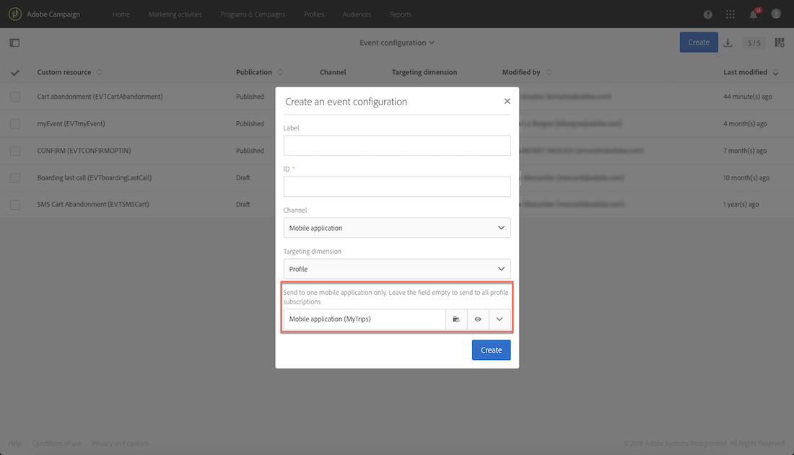

# 異動推送通知{#transactional-push-notifications}

您可以使用Adobe Campaign在iOS和Android行動裝置上傳送交易推播通知。 這些訊息會在您利用Experience Cloud行動SDK在Adobe Campaign中設定的行動應用程式上接收。

>[!NOTE]
>
>推播通道為選用。 請檢查您的授權合約。如需標準推播通知的詳細資訊，請參閱[關於推播通知](../../channels/using/about-push-notifications.md)。

若要傳送交易式推播通知，您必須據此設定Adobe Campaign。 請參閱[設定行動應用程式](../../administration/using/configuring-a-mobile-application.md)。

您可以傳送兩種類型的交易推播通知：

* [以事件為目標的交易式推播通知](#transactional-push-notifications-targeting-an-event)
* [交易式推播通知以來自](#transactional-push-notifications-targeting-a-profile) Adobe Campaign資料庫的設定檔為目標

## 以事件為目標的交易式推播通知 {#transactional-push-notifications-targeting-an-event}

您可以使用Adobe Campaign將&#x200B;**匿名交易推播通知傳送給已選擇從行動應用程式接收通知的所有使用者**。

在此情況下，只會使用事件本身包含的資料來定義傳送目標&#x200B;**。**&#x200B;不會利用來自Adobe Campaign整合設定檔資料庫的資料。

### 設定事件型交易式推播通知 {#configuring-event-based-transactional-push-notification}

若要傳送交易式推播通知給選擇從行動應用程式接收通知的所有使用者，您必須先建立並設定事件，以事件本身包含的資料為目標。

>[!NOTE]
>
>您仍可使用[事件屬性](../../channels/using/configuring-transactional-event.md#defining-the-event-attributes)（來自事件的資料）和[事件擴充](../../channels/using/configuring-transactional-event.md#enriching-the-transactional-message-content)（來自Campaign資料庫的資料），個人化事件型交易式推播通知的內容。 請參閱下方的[範例](#sending-event-based-transactional-push-notification)。

事件必須包含下列三個元素：

* **註冊權杖**，即一個行動應用程式和一個裝置的使用者ID。 它可能與Adobe Campaign資料庫中的任何設定檔不對應。
* **行動應用程式名稱**（所有裝置皆適用 — Android和iOS）。 這是Adobe Campaign中設定的行動應用程式ID，將用於接收使用者裝置上的推播通知。 有關詳細資訊，請參閱[設定行動應用程式](../../administration/using/configuring-a-mobile-application.md)。
* **推播平台**（Android適用的「gcm」或iOS適用的「apns」）。

若要設定事件，請遵循下列步驟：

1. 建立事件設定時，請選取&#x200B;**[!UICONTROL Push notification]**&#x200B;通道和&#x200B;**[!UICONTROL Real-time event]**&#x200B;目標維度（請參閱[建立事件](../../channels/using/configuring-transactional-event.md#creating-an-event)）。
1. 新增欄位至事件。 這可讓您個人化交易式訊息（請參閱[定義事件屬性](../../channels/using/configuring-transactional-event.md#defining-the-event-attributes)）。 在此示例中，定義&quot;gateNumber&quot;、&quot;lastname&quot;和&quot;firstname&quot;欄位。
1. 您也可以讓訊息的內容更豐富。 要執行此操作，請從連結到事件配置的表中添加欄位（請參閱[豐富事件](../../channels/using/configuring-transactional-event.md#enriching-the-transactional-message-content)）。

   <!--Event-based transactional messaging is supposed to use only the data that are in the sent event to define the recipient and the message content personalization. However, you can enrich the content of your transactional message using information from the Adobe Campaign database.-->

1. [預覽和發佈事件](../../channels/using/publishing-transactional-event.md#previewing-and-publishing-the-event)。

   預覽事件時，REST API包含「registrationToken」、「application」和「pushPlatform」屬性，這些屬性將用於鎖定傳送目標。

   

   發佈事件後，系統會自動建立連結至新事件的交易式推播通知。 您現在可以修改並發佈剛建立的訊息（請參閱[此區段](#sending-event-based-transactional-push-notification)）。

1. 將事件整合至您的網站（請參閱[整合觸發](../../channels/using/getting-started-with-transactional-msg.md#integrate-event-trigger)的事件）。

### 傳送事件型交易式推播通知 {#sending-event-based-transactional-push-notification}

例如，航空公司想要邀請其行動應用程式使用者前往相關登機口。

公司會透過單一裝置，使用一個行動應用程式，為每位使用者傳送一則交易式推播通知（以註冊Token識別）。

1. 移至建立的交易式訊息，以編輯其內容。請參閱[存取交易式訊息](../../channels/using/editing-transactional-message.md#accessing-transactional-messages)。

   

1. 按一下&#x200B;**[!UICONTROL Content]**&#x200B;區塊以修改訊息的標題和內文。

1. 您可以插入個人化欄位，以新增建立事件時定義的元素（請參閱[定義事件屬性](../../channels/using/configuring-transactional-event.md#defining-the-event-attributes)）。

   

   要查找這些欄位，請按一下項目旁的鉛筆，按一下&#x200B;**[!UICONTROL Insert personalization field]**&#x200B;並選擇&#x200B;**[!UICONTROL Context]** > **[!UICONTROL Real-time event]** > **[!UICONTROL Event context]**。

   

   如需編輯推播通知內容的詳細資訊，請參閱[準備和傳送推播通知](../../channels/using/preparing-and-sending-a-push-notification.md)。

1. 如果您想要使用Adobe Campaign資料庫的其他資訊，也可以擴充交易式訊息內容（請參閱[擴充事件](../../channels/using/configuring-transactional-event.md#enriching-the-transactional-message-content)）。

1. 儲存您的變更並發佈訊息。請參閱[發佈交易式訊息](../../channels/using/publishing-transactional-message.md#publishing-a-transactional-message)。

1. 使用Adobe Campaign Standard REST API，在Android(gcm)上使用一個行動應用程式(WeFlight)，將事件傳送至註冊Token(ABCDEF123456789)，其中包含上線資料：

   ```
   {
     "registrationToken":"ABCDEF123456789",
     "application":"WeFlight",
     "pushPlatform":"gcm",
     "ctx":
     {
       "gateNumber":"Gate B18",
       "lastname":"Green",
       "firstname":"Jane"
     }
   }
   ```

   有關將事件觸發整合到外部系統的詳細資訊，請參閱[整合事件觸發](../../channels/using/getting-started-with-transactional-msg.md#integrate-event-trigger)。

如果註冊Token存在，則對應的使用者會收到包含下列內容的交易式推播通知：

*「你好簡·格林，剛開始登機！請轉至B18門。&quot;*

## 以設定檔為目標的交易式推播通知 {#transactional-push-notifications-targeting-a-profile}

您可以傳送交易式推播通知&#x200B;**給已訂閱您行動應用程式**&#x200B;的Adobe Campaign設定檔。 此傳送可包含[個人化欄位](../../designing/using/personalization.md#inserting-a-personalization-field)，例如直接從Adobe Campaign資料庫擷取的收件者名字。

在此情況下，事件必須包含一些欄位&#x200B;**，以允許與Adobe Campaign資料庫**&#x200B;中的設定檔調解。

定位設定檔時，會根據行動應用程式和裝置傳送一個交易式推播通知。 例如，如果Adobe Campaign使用者已訂閱兩個應用程式，則此使用者會收到兩則通知。 如果使用者已訂閱具有兩部不同裝置的相同應用程式，則此使用者會在每部裝置上收到通知。

設定檔已訂閱的行動應用程式會列在此設定檔的&#x200B;**[!UICONTROL Mobile App Subscriptions]**&#x200B;標籤中。 要訪問此頁簽，請選擇配置檔案並按一下右側的&#x200B;**[!UICONTROL Edit profile properties]**&#x200B;按鈕。


有關訪問和編輯配置檔案的詳細資訊，請參閱[關於配置檔案](../../audiences/using/about-profiles.md)。

### 設定設定檔交易式推播通知 {#configuring-profile-based-transactional-push-notification}

若要傳送交易式推播通知給已訂閱您行動應用程式的Adobe Campaign設定檔，您必須先建立並設定以Adobe Campaign資料庫為目標的事件。

1. 建立事件設定時，請選取&#x200B;**[!UICONTROL Push notification]**&#x200B;通道和&#x200B;**[!UICONTROL Profile]**&#x200B;目標維度（請參閱[建立事件](../../channels/using/configuring-transactional-event.md#creating-an-event)）。

   依預設，交易式推播通知會傳送至收件者訂閱的所有行動應用程式。 若要將推播通知傳送至特定行動應用程式，請在清單中選取它。 其他行動應用程式將由訊息定位，但將排除在傳送之外。

   

1. 如果您想要個人化交易式訊息，請將欄位新增至事件（請參閱[定義事件屬性](../../channels/using/configuring-transactional-event.md#defining-the-event-attributes)）。

   >[!NOTE]
   >
   >您必須至少新增一個欄位，才能建立擴充。 您不需要建立其他欄位，例如&#x200B;**名字**&#x200B;和&#x200B;**姓氏**，因為您將能使用Adobe Campaign資料庫中的個人化欄位。

1. 建立擴充以將事件連結至&#x200B;**[!UICONTROL Profile]**&#x200B;資源（請參閱[擴充事件](../../channels/using/configuring-transactional-event.md#enriching-the-transactional-message-content)），並選取此擴充作為&#x200B;**[!UICONTROL Targeting enrichment]**。

   >[!IMPORTANT]
   >
   >此步驟對於設定檔事件為必要。

1. [預覽和發佈事件](../../channels/using/publishing-transactional-event.md#previewing-and-publishing-the-event)。

   預覽事件時，REST API不包含指定註冊Token、應用程式名稱和推播平台的屬性，因為這些將從&#x200B;**[!UICONTROL Profile]**&#x200B;資源中擷取。

   發佈事件後，系統會自動建立連結至新事件的交易式推播通知。 您現在可以修改並發佈剛建立的訊息（請參閱[此區段](#sending-profile-based-transactional-push-notification)）。

1. 將事件整合至您的網站（請參閱[整合觸發](../../channels/using/getting-started-with-transactional-msg.md#integrate-event-trigger)的事件）。

### 傳送設定檔交易式推播通知 {#sending-profile-based-transactional-push-notification}

例如，某家航空公司想要傳送最後一次登機電話給所有已訂閱其行動應用程式的Adobe Campaign使用者。

1. 移至建立的交易式訊息，以編輯其內容。請參閱[存取交易式訊息](../../channels/using/editing-transactional-message.md#accessing-transactional-messages)。

1. 按一下&#x200B;**[!UICONTROL Content]**&#x200B;區塊以修改訊息的標題和內文。

   與以即時事件為基礎的設定不同，您可以直接存取所有設定檔資訊，以個人化您的訊息。 請參閱[插入個人化欄位](../../designing/using/personalization.md#inserting-a-personalization-field)。

   如需編輯推播通知內容的詳細資訊，請參閱[準備和傳送推播通知](../../channels/using/preparing-and-sending-a-push-notification.md)。

1. 儲存您的變更並發佈訊息。請參閱[發佈交易式訊息](../../channels/using/publishing-transactional-message.md#publishing-a-transactional-message)。
1. 使用Adobe Campaign Standard REST API，將事件傳送至設定檔：

   ```
   {
     "ctx":
     {
       "email":"janegreen@email.com",
       "gateNumber":"D16",
     }
   }
   ```

有關將事件觸發整合到外部系統的詳細資訊，請參閱[整合事件觸發](../../channels/using/getting-started-with-transactional-msg.md#integrate-event-trigger)。

對應的使用者會收到交易式推播通知，包含從Adobe Campaign資料庫擷取的所有個人化元素。

>[!NOTE]
>
>沒有註冊Token、應用程式和推播平台欄位。 在此範例中，調解是使用電子郵件欄位執行。

## 變更交易式推播通知中的目標對應 {#change-target-mapping}

交易式推播通知使用特定的[目標對應](../../administration/using/target-mappings-in-campaign.md)，其中包含傳送此類傳送所需的技術設定。

若要變更此目標對應，請遵循下列步驟：

1. 從交易式訊息清單中，選取推播通知。

1. 在訊息控制面板中，按一下&#x200B;**[!UICONTROL Edit properties]**&#x200B;按鈕。

   

1. 展開&#x200B;**[!UICONTROL Advanced parameters]**&#x200B;區段。

1. 按一下&#x200B;**[!UICONTROL Select a 'Target mapping' element]**。

   

1. 從清單中選擇目標映射。

   >[!NOTE]
   >
   >若要在傳送&#x200B;**以設定檔為基礎的**&#x200B;交易式推播通知時取得最佳的傳送準備時間和效能，請使用&#x200B;**[!UICONTROL Profile - Real-time event for Push (mapRtEventAppSubRcp)]**&#x200B;目標對應。

   

1. 確認您的變更並發佈訊息。 請參閱[發佈交易式訊息](../../channels/using/publishing-transactional-message.md#publishing-a-transactional-message)。

   >[!IMPORTANT]
   >
   >您必須再次發佈訊息，變更才會生效，否則仍會使用先前的目標對應。


