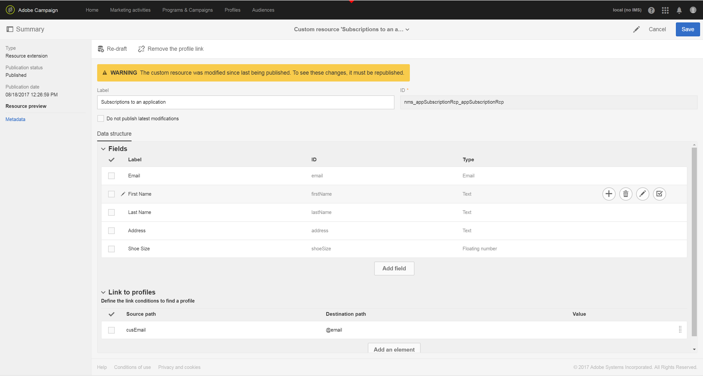

# 基於行動應用程式資料來建立和更新設定檔資訊

## 概觀

本頁說明在Mobile Application以排程方式傳送Collect PII資料後，建立／更新描述檔資料的工作流程的步驟。

* **** PII代表「個人識別資訊」。它可以是任何資料，包括促銷活動資料庫中未顯示在「設定檔」表格中的資訊，例如Analytics for Mobile [興趣點](../../integrating/using/about-campaign-points-of-interest-data-integration.md)。 PII由行動應用程式開發人員（通常與行銷人員）定義。
* **收集** PII是從行動應用程式對Adobe Campaign Standard中的Rest API進行HTTP-POST作業。

此使用案例的目的是建立或更新Campaign Standard描述檔（如果行動應用程式傳回的PII資料包含描述檔相關資料）。

## 必要條件

在「行動應用程式訂閱」資料建立或更新「設定檔」之前，請先執行數個設定步驟，以在「促銷活動標準」中啟用推播通知：

1. [建立行動應用程式](../../administration/using/configuring-a-mobile-application.md)
1. [將Adobe Mobile SDK與您的行動應用程式整合](https://helpx.adobe.com/tw/campaign/kb/integrate-mobile-sdk.html)。
1. [設定Adobe Campaign以傳送推播通知](https://helpx.adobe.com/tw/campaign/kb/configuring-app-sdkv4.html)。

## 步驟1 —— 擴充推播通知／訂閱的描述檔資源

若要能夠使用PII資料建立或更新描述檔資源，您必須先將描述檔資源擴充至所需欄位。 操作步驟：

* 識別行動應用程式所傳送的PII欄位。
* 確定用於協調的欄位，以將PII資料與配置檔案資料關聯。

在此範例中，**[!UICONTROL Fields]**&#x200B;區段反映行動應用程式傳送的PII資料。 **[!UICONTROL Link to profiles]**&#x200B;區段指出用於將PII與描述檔資料關聯的欄位，其中&#x200B;**cusEmail**&#x200B;對應至&#x200B;**@email**。

擴展&#x200B;**[!UICONTROL Subscriptions to an Application]**&#x200B;資源時的配置檔案資料映射為只讀。 用於協調。 必須將配置檔案輸入到系統中，並使用必要的資料來協調配置檔案與PII資料。 在我們的情況下，描述檔的電子郵件地址必須符合來自Collect PII的電子郵件，才能進行協調：

* 收集PII會從行動應用程式收到，其名字為「Jane」、「Last Name」（姓氏）為「Doe」且電子郵件地址為janedoe@doe.com的使用者。
* 另外，描述檔資料必須存在（例如，資料必須手動輸入或已來自其他資源），其中描述檔的電子郵件位址為janedoe@doe.com。

**相關主題：**

* [將訂閱擴充到應用程式資源](../../developing/using/extending-the-subscriptions-to-an-application-resource.md).
* [建立或擴展現有資源](../../developing/using/key-steps-to-add-a-resource.md)。

## 步驟2 —— 建立工作流程

使用Campaign Standard中的「工作流程」可讓管理員在AppSubscription（訂閱者）資料和描述檔或收件者資料之間唯一識別並同步資料。 雖然基於工作流的更新不會即時同步描述檔資料，但不應造成任何不當的資料庫鎖定或開銷。

建立工作流程的主要步驟為：

1. 使用&#x200B;**[!UICONTROL Query]**&#x200B;或&#x200B;**[!UICONTROL Incremental query]**&#x200B;活動來取得最新訂閱的清單。
1. 使用&#x200B;**[!UICONTROL Reconciliation]**&#x200B;活動將PII資料與描述檔對應。
1. 新增一些驗證程式。
1. 使用&#x200B;**[!UICONTROL Update data]**&#x200B;更新或建立包含PII資料的描述檔。

此工作流程會採用下列要求：

* 已擴展的任何／所有欄位都可用於建立／更新配置檔案表。
* 「描述檔」表格可以延伸，以支援不支援的欄位（例如T恤衫大小）。
* AppSubscription表格中空白的任何欄位都不應更新至描述檔表格中。
* AppSubscription表格中已更新的任何記錄都應包含在下次執行的工作流程中。

若要建立工作流程，請將下列活動拖放至工作區，並將它們連結在一起：**[!UICONTROL Start]**、**[!UICONTROL Scheduler]**、**[!UICONTROL Incremental query]**、**[!UICONTROL Update data]**。

然後，請依照下列步驟來設定每個活動。

### 配置&#x200B;**[!UICONTROL Scheduler]**&#x200B;活動

在&#x200B;**[!UICONTROL General]**&#x200B;標籤中，設定&#x200B;**[!UICONTROL Execution frequency]**（例如&quot;Daily&quot;）、**[!UICONTROL Time]**（例如&quot;1:00:00 AM&quot;）和&#x200B;**[!UICONTROL Start]**（例如，Todays&#39;s date）。

### 設定&#x200B;**[!UICONTROL Incremental query]**&#x200B;活動。

1. 在&#x200B;**[!UICONTROL Properties]**&#x200B;標籤中，按一下&#x200B;**[!UICONTROL Resource]**&#x200B;欄位的&#x200B;**[!UICONTROL Select an element]**&#x200B;表徵圖，然後選擇&#x200B;**[!UICONTROL Subscriptions to an application (nms:appSubscriptionRcp:appSubscriptionRcpDetail)]**&#x200B;元素。

   

1. 在&#x200B;**[!UICONTROL Target]**&#x200B;標籤中，拖曳&#x200B;**[!UICONTROL Mobile application]**&#x200B;篩選器，然後選取行動應用程式名稱。

   

1. 在&#x200B;**[!UICONTROL Processed data]**&#x200B;標籤中，選擇&#x200B;**[!UICONTROL Use a date field]**，然後將&#x200B;**[!UICONTROL Last modified (lastModified)]**&#x200B;欄位新增為&#x200B;**[!UICONTROL Path to the date field]**。

   

### 設定&#x200B;**[!UICONTROL Update data]**&#x200B;活動。

1. 在&#x200B;**[!UICONTROL Identification]**&#x200B;標籤中，請確定&#x200B;**[!UICONTROL Dimension to update]**&#x200B;欄位已設為&quot;Profiles(profile)&quot;，然後按一下&#x200B;**[!UICONTROL Create element]**&#x200B;按鈕以新增欄位作為協調標準。

   

1. 在&#x200B;**[!UICONTROL Source]**&#x200B;欄位中，從appSubscriptionRcp表格選取欄位作為協調欄位。 可以是描述檔的電子郵件、crmId、marketingCloudId等。 在此範例中，我們將使用「電子郵件(cusEmail)」欄位。

1. 在&#x200B;**[!UICONTROL Destination]**&#x200B;欄位中，從描述檔表格中選取欄位，以協調appSubscriptionRcp表格的資料。 它可以是描述檔的電子郵件，或任何延伸欄位，例如crmId、marketingCloudId等。 在此範例中，我們需要選取「電子郵件（電子郵件）」欄位，以從appSubscriptionRcp表格中將其對應至「電子郵件(cusEmail)」欄位。

   

1. 在&#x200B;**[!UICONTROL Fields to update]**&#x200B;標籤中，按一下&#x200B;**[!UICONTROL Create element]**&#x200B;按鈕，然後將appSubscriptionRcp表格（**[!UICONTROL Source]**&#x200B;欄位）中的欄位與您要在「描述檔」表格（**[!UICONTROL Destination]**&#x200B;欄位）中更新的欄位對應。

1. 在&#x200B;**[!UICONTROL Enabled if]**&#x200B;欄位中新增運算式，以確保只有在來源欄位包含值時，才會更新Profile表格中的對應欄位。 若要這麼做，請從清單中選取欄位，然後新增「!=&quot;&quot;運算式（如果「運算式」編輯器中的「來源」欄位為`[target/@cusEmail]`，請務必鍵入`[target/@cusEmail] != ''"`）。

   

>[!NOTE]
>
>在這種情況下，Workflow會執行UPSERT，但因為它基於&#x200B;**[!UICONTROL Incremental query]**資料，所以只會插入。 變更查詢會影響插入或更新的資料。
>此外，「要更新的欄位」標籤中的設定會決定在特定條件下插入或更新哪些欄位。 這些設定對於每個應用程式或客戶而言都是唯一的。
>設定這些設定時請務必小心，因為根據appSubscriptionRcp資料更新描述檔中的記錄可能會變更使用者的個人資訊，而不需驗證。

添加了要插入／更新配置檔案的所有欄位後，按一下&#x200B;**[!UICONTROL Confirm]**。

保存工作流，然後按一下&#x200B;**[!UICONTROL Start]**&#x200B;以執行工作流。

