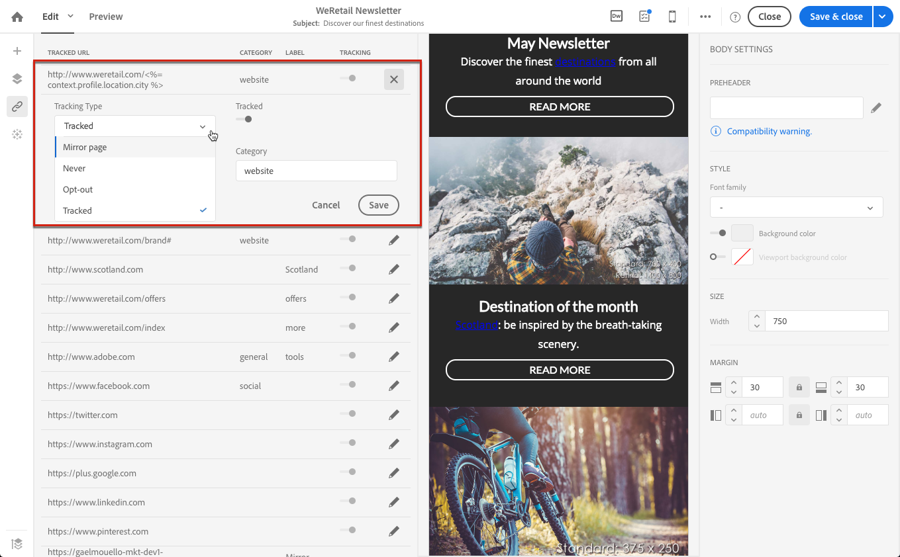

# About tracked URLs{#about-tracked-urls}

Adobe Campaign可讓您追蹤收件者點按電子郵件中包含的URL時的行為。For more on tracking, see [this section](../../sending/using/tracking-messages.md#about-tracking).

The **[!UICONTROL Links]** icon in the action bar automatically displays the list of all the URLs of your content that will be tracked.

>[!NOTE]
>
>預設會啓用追蹤。如果追蹤已在Adobe Campaign中啓動，則此功能僅適用於電子郵件。For more on the tracking parameters, refer to [this section](../../administration/using/configuring-email-channel.md#tracking-parameters).

可從清單中修改每個連結的URL、類別、標籤和追蹤類型。若要編輯連結，請按一下對應的鉛筆圖示。

對於每個追蹤的URL，您可以將追蹤模式設定為其中一個值：

* **追蹤**：啓用追蹤此URL。
* **Mirror頁面**：將此URL視為鏡像頁面URL。
* **永不**：絕不會啓動追蹤此URL。儲存此資訊：如果URL再次出現在未來的訊息中，則會自動停用其追蹤。
* **選擇退出**：將此URL視為退出或取消訂閱URL。

您也可以停用或啓用每個URL的追蹤。

>[!NOTE]
>
>By default in Adobe Campaign, all content URLs are tracked except **Mirror page URL** and **Unsubscription** link.

You can regroup your URLs by editing the **[!UICONTROL Category]** field, depending on the URLs used in the message. These categories can be displayed reports, as for example in [URLs and click streams](../../reporting/using/urls-and-click-streams.md).

When building a report, from the **[!UICONTROL Components]** tab, select **[!UICONTROL Dimension]** and scroll down the list to access the tracking components. For example, drag and drop **[!UICONTROL Tracking URL Category]** into the workspace to display results according to the tracking category of each clicked URL.

For more on building customized reports, see [this section](../../reporting/using/about-dynamic-reports.md).
