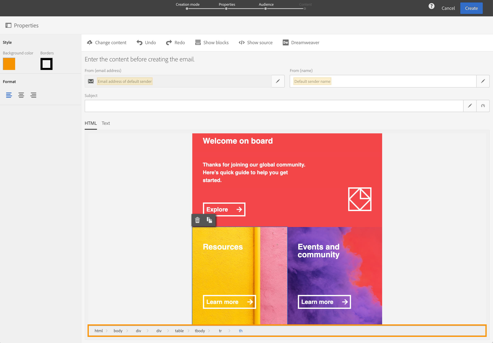

# 轉換舊版編輯器電子郵件內容 {#converting-an-html-content}

開始使用電子郵件設計工具，並從舊版編輯器中建立的電子郵件HTML中建立可重複使用的範本和片段。

此使用案例可讓您使用HTML電子郵件，並在電子郵件設計工具中將其分割為HTML元件，以建立電子郵件設計工具範本。

>[!NOTE]
>
>與相容性模式一樣，HTML元件也是可編輯的，有限的選項有：您只能執行就地版本。

>[!IMPORTANT]
>
>本節適用於熟悉HTML程式碼的進階使用者。

## 準備您的電子郵件內容

1. 選取HTML電子郵件。
1. 識別要分割HTML電子郵件的區段。
1. 從HTML中切出不同的區塊。

## 建立電子郵件結構

1. 開啟&#x200B;**[!UICONTROL Email Designer]**&#x200B;以建立空白的電子郵件內容。
1. 設定內文層級屬性：背景顏色、寬度等。 如需詳細資訊，請參閱[編輯電子郵件樣式](../../designing/using/styles.md)。
1. 添加任意數量的結構元件。 如需詳細資訊，請參閱「[編輯電子郵件結構](../../designing/using/designing-from-scratch.md#defining-the-email-structure)」。

## 新增HTML內容

1. 將HTML元件新增至每個結構元件。 如需詳細資訊，請參閱「[新增片段及元件](../../designing/using/designing-from-scratch.md#defining-the-email-structure)」。
1. 將HTML複製並貼到每個元件中。

## 管理電子郵件的樣式 {#manage-the-style-of-your-email}

1. 切換到&#x200B;**[!UICONTROL Mobile view]**。 如需詳細資訊，請參閱[本節](../../designing/using/plain-text-html-modes.md#switching-to-mobile-view)。

1. 若要修正此問題，請切換至原始碼模式，並將樣式區段複製並貼到新樣式區段中。 例如：

   ```
   <style type="text/css">
   a {text-decoration:none;}
   body {min-width:100% !important; margin:0 auto !important; padding:0 !important;}
   img {line-height:100%; text-decoration:none; -ms-interpolation-mode:bicubic;}
   ...
   </style>
   ```

   >[!NOTE]
   >
   >請務必在另一個自訂樣式標籤中，於此之後新增您的樣式。
   >
   >請勿修改電子郵件設計工具產生的CSS:
   >
   >* `<style data-name="default" type="text/css">(##)</style>`
   >* `<style data-name="supportIOS10" type="text/css">(##)</style>`
   >* `<style data-name="mediaIOS8" type="text/css">(##)</style>`
   >* `<style data-name="media-default-max-width-500px" type="text/css">(##)</style>`
   >* `<style data-name="media-default--webkit-min-device-pixel-ratio-0" type="text/css">(##)</style>`


1. 返回行動檢視，檢查您的內容是否正確顯示並儲存您的變更。

## 使用案例

讓我們嘗試將此在舊版編輯器中建立的電子郵件轉換為&#x200B;**[!UICONTROL Email Designer]**&#x200B;範本。

### 識別電子郵件的區段

我們可以在此電子郵件中識別11個區段。


若要識別哪個元素是HTML的哪個區段，您可以選取它。



若要查看電子郵件的HTML版本，請按一下&#x200B;**[!UICONTROL Show source]**。

### 建立電子郵件範本及其結構

1. 拖放反映電子郵件版面的&#x200B;**[!UICONTROL Structure components]**。

1. 視需要重複多次。 我們需要建立11個結構元件。

   

### 插入HTML內容元件

1. 在每個&#x200B;**[!UICONTROL Structure component]**&#x200B;中插入&#x200B;**[!UICONTROL HTML component]** 。

   

1. 對於每個區段，按一下&#x200B;**[!UICONTROL Show source code]** 。

   

1. 插入HTML區段。

1. 按一下&#x200B;**[!UICONTROL Save]**。

您現在可以檢查電子郵件的呈現。


### 管理樣式以符合行動檢視

1. 插入CSS元素，以確保您的電子郵件適合行動檢視。

1. 切換至原始碼，並將樣式區段複製並貼到新樣式區段中。

有關詳細資訊，請參閱[管理電子郵件的樣式](#manage-the-style-of-your-email)。

您的舊版電子郵件現在可在電子郵件設計工具中使用。
