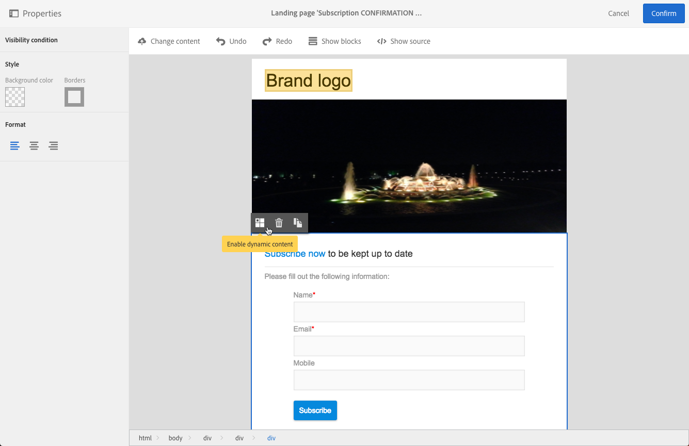
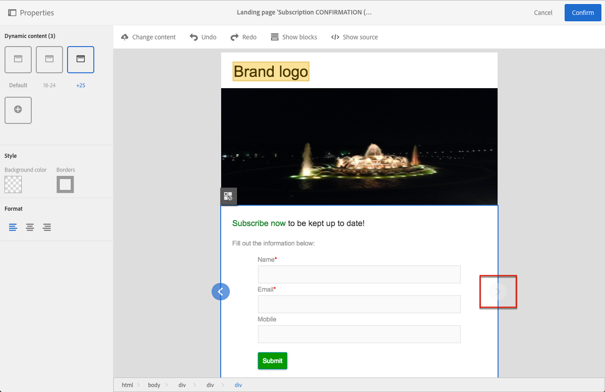

# Defining dynamic content in a landing page{#defining-dynamic-content-in-a-landing-page}

若要定義著陸頁面中的動態內容，請使用網站導覽路徑標示或直接按一下元素來選取區塊。

無法直接選取某些區塊(例如影像)。在此情況下，請使用階層連結選取父區塊。然後您可以修改此父元素中包含的所有元素，包括影像。條件會套用至父區塊內的所有子元素。

The breadcrumb is presented in the [Managing blocks](../../designing/using/managing-landing-page-structure-and-style.md) section.

定義著陸頁面中動態內容的下個步驟類似於追蹤電子郵件的步驟。See [this section](../../designing/using/defining-dynamic-content-in-an-email.md).

>[!NOTE]
>
>如果以紅色描述變體元素，表示尚未定義運算式。

## Previewing dynamic content in a landing page {#previewing-dynamic-content-in-a-landing-page}

您可以在區塊的不同動態內容之間導覽。若要這麼做：

1. 選取區塊。

   箭頭會顯示在影像的左右兩側。

1. 按一下向右鍵以瀏覽可用的動態內容。

   

   根據您是否到達最後一個或第一個可用動態內容，每個側邊的箭頭。

   

1. To delete all the conditions applied to a block, select that block and click the **[!UICONTROL Disable dynamic content]** icon.
1. 選擇您要保留的動態內容。

   

在浮動視窗中：

* 已輸入的運算式不會再以紅色呈現，它們會以灰色顯示。
* 目前選取的內容會以藍色顯示。

