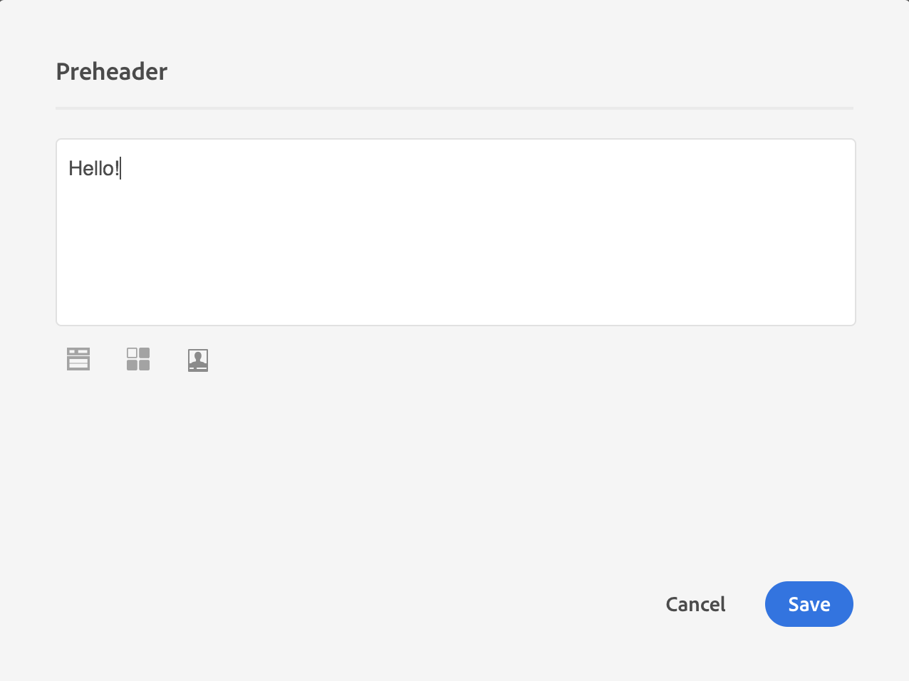

# 從頭開始設計電子郵件 {#designing-an-email-content-from-scratch}

瞭解如何掌握電子郵件內容版本。 透過電子郵件Designer，您可以建立以或不以您自己的預先定義內容開始的電子郵件和範本。

以下是使用Email Designer從頭開始建立和設計電子郵件內容的主要步驟：

1. 建立電子郵件並開啟其內容。
1. 新增結構元件以塑造電子郵件的形狀。 請參閱[編輯電子郵件結構](#defining-the-email-structure)。
1. 在結構元件中插入內容元件和片段。 請參閱[新增片段與內容元件](#defining-the-email-structure)。
1. 新增影像並編輯電子郵件的文字。 請參閱[插入影像](../../designing/using/images.md#inserting-images)。
1. 新增個人化欄位、連結等，以個人化您的電子郵件。 請參閱[插入個人化欄位](../../designing/using/personalization.md#inserting-a-personalization-field)、[插入連結](../../designing/using/links.md#inserting-a-link)和[定義電子郵件中的動態內容](../../designing/using/personalization.md#defining-dynamic-content-in-an-email)。
1. 定義電子郵件的主旨列。 請參閱[個人化電子郵件的主旨列](../../designing/using/subject-line.md#defining-the-subject-line-of-an-email)。
1. 預覽您的電子郵件。
1. 儲存您的內容，並在確定您已定義對象並正確排程傳送後繼續傳送訊息。

您也可以觀看此[簡介影片](https://video.tv.adobe.com/v/22771/?autoplay=true&hidetitle=true)。

>[!NOTE]
>
>為避免從草稿設計電子郵件內容，您可以使用現成可用的內容範本。 如需詳細資訊，請參閱[內容範本](../../designing/using/using-reusable-content.md#content-templates)。

## 定義電子郵件結構 {#defining-the-email-structure}

>[!CONTEXTUALHELP]
>id="ac_structure_components"
>title="關於結構元件"
>abstract="結構元件會定義電子郵件的版面。"

>[!CONTEXTUALHELP]
>id="ac_edition_columns"
>title="定義電子郵件欄"
>abstract="電子郵件設計工具可讓您透過定義欄結構輕鬆定義電子郵件的版面。"

電子郵件設計工具可讓您輕鬆定義電子郵件的結構。透過使用簡單的拖放動作新增和移動結構元素，您可以在數秒內設計電子郵件的形狀。

若要編輯電子郵件的結構：

1. 開啟現有內容或建立新的電子郵件內容。
1. 選取左邊的&#x200B;**+**&#x200B;圖示以存取&#x200B;**[!UICONTROL Structure components]**。

   

1. 拖放塑造電子郵件所需的結構元件。

   

   在放置結構元件之前，藍線會實體化結構元件的確切位置。 您可以將它拖曳到任何其他元件上方、之間或下方，但不可拖曳到內部。

   >[!NOTE]
   >
   >請注意，並非所有電子郵件程式都與欄堆疊相容。當不受支援時，將不會堆疊欄。
   >
   >放入電子郵件後，除非裡面已有內容元件或片段，否則無法移動或移除元件。

1. 可以使用由一或多欄組成的多個結構元件。

   選取&#x200B;**[!UICONTROL n:n column]**&#x200B;元件以定義您選擇的欄數（介於3到10之間）。 您也可以移動每個欄底部的箭頭來定義其寬度。

   

   >[!NOTE]
   >
   >每個欄的大小不能小於結構元件總寬度的 10%。如果欄不是空的，則無法移除。

定義結構後，您就可以將內容片段和元件新增到電子郵件中。

## 使用預覽文字 {#preheader}

>[!CONTEXTUALHELP]
>id="ac_edition_preheader"
>title="使用預覽文字"
>abstract="預覽文字讓您設定簡短的摘要文字，這會為您的電子郵件實現更高的開啟率。"

預覽文字是簡短摘要文字，從收件匣檢視電子郵件時緊接在主題行後面。 預先標頭可提供較高的開啟率。

選取&#x200B;**[!UICONTROL Preheader]**&#x200B;編輯方塊並完成內容。

您可以在預覽文字內容中新增&#x200B;**[!UICONTROL Content block]**、**[!UICONTROL Dynamic content]**&#x200B;或&#x200B;**[!UICONTROL Personalization fields]**。

>[!NOTE]
>
>請注意，並非所有電子郵件程式都與預覽文字相容。當不受支援時，將不會顯示預覽文字。

## 使用內容元件 {#about-content-components}

>[!CONTEXTUALHELP]
>id="ac_content_components"
>title="關於內容元件"
>abstract="內容元件指可進行編輯以建立電子郵件的空白內容預留位置。"

內容元件是原始的空白元件，放入電子郵件後，您就可以編輯這些元件。

您可以在結構元件中新增任意數量的內容元件。 您也可以在結構元件內部或另一個結構元件中移動它們。

以下是電子郵件Designer中可用元件的清單：

### **[!UICONTROL Button]**

如果您需要使用多個按鈕，而不是從頭開始編輯每個按鈕，您可以使用內容工具列複製&#x200B;**[!UICONTROL Button]**&#x200B;元件。

您也可以將按鈕儲存到可重複使用的片段中。 如需詳細資訊，請參閱[建立內容片段](../../designing/using/using-reusable-content.md#creating-a-content-fragment)和[將內容另存為片段](../../designing/using/using-reusable-content.md#saving-content-as-a-fragment)。

選取&#x200B;**[!UICONTROL Fallback view]**&#x200B;以在電子郵件Designer中顯示遞補影像。

### **[!UICONTROL Text]**

使用此元件在電子郵件中插入文字。 您可以在&#x200B;**[!UICONTROL Component Settings]**&#x200B;中調整文字的顏色、樣式和大小。

### **[!UICONTROL Divider]**

使用此元件可在電子郵件中插入分隔線。 您可以在&#x200B;**[!UICONTROL Component Settings]**&#x200B;中選取分隔線的顏色、樣式和大小。

### **[!UICONTROL HTML]**

使用此元件來複製貼上現有HTML的不同部分。 這可讓您建立免費的模組化HTML元件。

>[!NOTE]
>
>可用有限的選項編輯自由HTML元件。 如果所有樣式並非內嵌，請確定在HTML程式碼的&#x200B;**head**&#x200B;區段中新增正確的CSS，否則電子郵件將不會回應。 使用&#x200B;**[!UICONTROL Preview]**&#x200B;按鈕測試內容的回應能力（請參閱[預覽訊息](../../sending/using/previewing-messages.md)）。

若只要讓外部內容符合電子郵件Designer，Adobe建議從草稿建立訊息，並將現有電子郵件的內容複製到片段和元件中。

當您有無法重新建立的內容時，可以使用&#x200B;**[!UICONTROL Html]**&#x200B;內容元件從原始電子郵件複製貼上HTML代碼。 在繼續之前，請務必先熟悉HTML。

>[!NOTE]
>
>新內容不會與原始電子郵件完全相同，但下列步驟將引導您建立儘可能接近的郵件。

**在複製您的內容之前**

1. 在原始電子郵件中，識別區段中可重複使用的區段，這些區段對於您將傳送的每封電子郵件都是唯一的。
1. 儲存您要使用的所有影像和資產。
1. 如果您熟悉HTML，請將原始HTML內容分割成不同的部分。

### 影片 {#video-settings}

>[!CONTEXTUALHELP]
>id="ac_edition_video"
>title="影片設定"
>abstract="使用此元件即可在您的電子郵件中插入影片。請注意，影片並非在所有電子郵件用戶端上都適用。我們建議設定備援影像。"
>additional-url="https://www.emailonacid.com/blog/article/email-development/a_how_to_guide_to_embedding_html5_video_in_email/" text="額外資訊"

將視訊元件插入電子郵件的結構元件中，並在&#x200B;**[!UICONTROL Component Settings]**&#x200B;中輸入視訊連結。

>[!NOTE]
>
>請注意，並非所有電子郵件程式都與視訊相容。當不受支援時，將會顯示遞補內容。

### 影像

使用此元件在電子郵件中插入影像。

將影像元件插入結構元件中，然後按一下「瀏覽」即可從電腦上傳影像檔案。

### **[!UICONTROL Social]**

使用此元件來插入電子郵件中的社群媒體頁面連結。 您可以選取要顯示哪些連結及其圖示在&#x200B;**[!UICONTROL Component Settings]**&#x200B;中的大小。

### 傳送 {#carousel-settings}

>[!CONTEXTUALHELP]
>id="ac_edition_carousel"
>title="輪播設定"
>abstract="了解如何在您的內容中插入和設定輪播。請注意，輪播並非在所有電子郵件用戶端上都適用，如果不支援輪播，則會顯示備援影像。"

1. 將&#x200B;**[!UICONTROL Carousel]**&#x200B;元件拖放到結構元件內。
1. 瀏覽以從電腦中選取影像。

   

1. 從&#x200B;**[!UICONTROL Settings]**&#x200B;窗格中，設定您想在轉盤中的縮圖數目。
1. 從電腦中選取一個後援影像。

   

轉盤元件並非與所有電子郵件程式相容。 當電子郵件不支援輪播時，上傳遞補以顯示影像。

>[!NOTE]
>
>轉盤元件與下列電子郵件平台相容：Apple Mail 7、Apple Mail 8、Outlook 2011 for Mac、Outlook 2016 for Mac、Mozilla Thunderbird、iPad和iPad mini iOS、iPhone iOS、Android、AOL (Chrome、Firefox和Safari)。

**相關主題**：

- [建立電子郵件](../../channels/using/creating-an-email.md)
- [在訊息中選取客群](../../audiences/using/selecting-an-audience-in-a-message.md)
- [排程訊息](../../sending/using/about-scheduling-messages.md)
- [預覽訊息](../../sending/using/previewing-messages.md)
- [電子郵件轉譯](../../sending/using/email-rendering.md)
