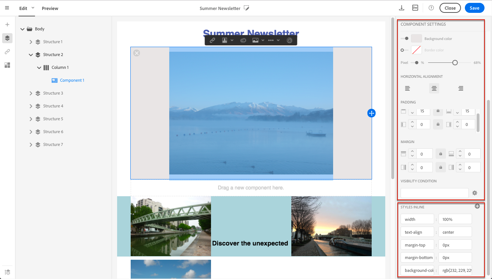

# Editing email styles{#editing-email-styles}

## Editing an element {#editing-an-element}

In the Email Designer, when selecting an element, several options specific to the type of content selected are displayed in the **[!UICONTROL Settings]** pane. 您可以使用這些選項輕鬆變更電子郵件的樣式。

### Selecting an element {#selecting-an-element}

若要在電子郵件設計人員介面中選取元素，您可以：

* 直接在電子郵件中按一下，
* or browse the structure tree available from the options located in the left **Palette**.

瀏覽結構樹狀結構可讓您進行更精確的選取。您可以選擇下列其中一種：

* 整個結構元件，
* 其中一欄組合了結構元件，
* 或僅位於欄內的元件。

若要選取欄，您也可以執行下列動作：

1. Select a structure component (directly in the email or using the structure tree available from the left **Palette**).
1. From the **contextual toolbar**, click **[!UICONTROL Select a column]** to choose the desired column.

See an example in [this section](../../designing/using/editing-email-styles.md#example--adjusting-vertical-alignment-and-padding).

### Adjusting style settings {#adjusting-style-settings}

1. 在您的電子郵件中選取元素。For more on this, see [Selecting an element](../../designing/using/editing-email-styles.md#selecting-an-element).
1. 根據您的需求調整設定。每個選取的元素都提供不同的設定集。

   You can insert backgrounds, change sizes, modify horizontal or vertical alignment, manage colors, add [padding or margin](../../designing/using/editing-email-styles.md#about-padding-and-margin), and so on.

   To do this, use the options displayed in the **[!UICONTROL Settings]** pane or [add inline styling attributes](../../designing/using/editing-email-styles.md#adding-inline-styling-attributes).

   

1. 儲存您的內容。

### About padding and margin {#about-padding-and-margin}

電子郵件設計人員介面可讓您快速調整填補空間和邊界設定。

**[!UICONTROL Padding]**：此設定可讓您管理元素邊框內的空格。

例如：

* 使用間距來設定影像左側和右側的邊界。
* Use top and bottom padding to add more spacing to a **[!UICONTROL Text]** or a **[!UICONTROL Divider]** component.
* 若要設定結構元素內欄之間的邊界，請為每欄定義間距。

**[!UICONTROL Margin]**：此設定可讓您管理元素邊框與下一元素之間的空間。

>[!NOTE]
>
>視您的選擇(結構元件、欄或內容元件)而定，結果不會相同。Adobe recommends setting the **[!UICONTROL Padding]** and **[!UICONTROL Margin]** parameters at the column level.

For both **[!UICONTROL Padding]** and **[!UICONTROL Margin]**, click the lock icon to break synchronization between top and bottom or right and left parameters. 這可讓您個別調整每個參數。

### About alignment {#about-alignment}

* **文字對齊**：將滑鼠游標置於某些文字上，並使用內容相關工具列加以對齊。

   

* **水平對齊** 可套用至文字、影像和按鈕-目前不適用於 **[!UICONTROL Divider]** 和 **[!UICONTROL Social]** 元件。

   

* To set **vertical alignment**, select a column inside a structure component and choose an option from the Settings pane.

   

### About backgrounds {#about-backgrounds}

Adobe建議您使用電子郵件設計工具來設定背景：

1. 視您的設計需要，將背景顏色套用至電子郵件的內文。
1. 在大多數情況下，請在欄層級設定背景顏色。
1. 不要在影像或文字元件上使用背景顏色，因為它們很難管理。

以下是可用的背景設定。

* Set a **[!UICONTROL Background color]** for the whole email. 請確定您在左側浮動視窗中可存取導覽樹狀結構中的內文設定。

   

* Set the same background color for all structure components by selecting **[!UICONTROL Viewport background color]**. 此選項可讓您從背景顏色選取不同的設定。

   

* 為每個結構元件設定不同的背景顏色。在導覽樹狀結構中可存取的導覽樹狀結構中選取結構，以僅套用特定背景顏色至該結構。

   

   請確定您未設定檢視區背景顏色，因為它可能隱藏結構背景顏色。

* Set a **[!UICONTROL Background image]** for the content of a structure component.

   

   >[!NOTE]
   >
   >有些電子郵件程式不支援背景影象。請確定您選取適當的後援背景顏色，以免顯示影像。

* 在欄層級設定背景顏色。

   

   >[!NOTE]
   >
   >這是最常見的使用案例。Adobe建議您在欄層級設定背景顏色，因為這可讓編輯整個電子郵件內容時更靈活。

   您也可以在欄層級設定背景影象，但很少使用。

### Example: adjusting vertical alignment and padding {#example--adjusting-vertical-alignment-and-padding}

您想要調整結構元件中由三欄組成的間距和垂直對齊。若要執行此動作，請執行下列步驟：

1. Select the structure component directly in the email or using the structure tree available from the left **Palette**.
1. From the **contextual toolbar**, click **[!UICONTROL Select a column]** and choose the one that you want to edit. 您也可以從結構樹狀結構中選取它。

   

   The editable parameters for that column are displayed in the **[!UICONTROL Settings]** pane on the right.

1. Under **[!UICONTROL Vertical alignment]**, select **[!UICONTROL Up]**.

   

   內容元件會顯示在欄之上。

1. Under **[!UICONTROL Padding]**, define the top padding inside the column. 按一下鎖定圖示，以中斷與底部填補的同步。

   定義該欄的左右間距。

   

1. 同樣地繼續進行，以調整其他欄的對齊和間距。

   

1. 儲存變更。

## Adding inline styling attributes {#adding-inline-styling-attributes}

在「電子郵件設計人員」介面中，當您選取元素並在側面板上顯示其設定時，可以自訂內嵌屬性及其值給該特定元素。

1. 選取內容中的元素。
1. On the side panel, look for the **[!UICONTROL Styles Inline]** settings.

   

1. Modify the values of the existing attributes, or add new ones using the **+** button. 您可以新增任何符合CSS標準的屬性和值。

然後將樣式套用至選取的元素。如果子元素未定義特定的樣式屬性，則繼承父元素的樣式。
