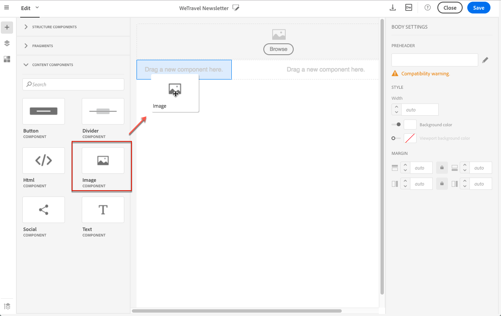

# 影像 {#images}

## 插入影像{#inserting-images}

您可以在電子郵件和登陸頁面中插入影像。

根據您的設定，可使用下列影像類型：

* 本機影像
* 從Adobe Experience cloud共用的影像——請參閱使 [用促銷活動和資產核心服務](../../integrating/using/working-with-campaign-and-assets-core-service.md) /隨選資產
* 來自Adobe Target的動態影像——請參閱使 [用Campaign和Target](../../integrating/using/about-campaign-target-integration.md)

如果啟用，您可以使用Adobe Creative SDK修改影像。 請參 [閱「使用Adobe Creative SDK修改影像」](images.md#modifying-images-with-the-adobe-creative-sdk)。

>[!CAUTION]
>
>如果您選擇編輯電子郵件的HTML版本以直接新增影像，則不得在HTML頁面的 **&lt;script** &gt;標籤中呼叫外部檔案。 這些檔案不會匯入至Adobe Campaign伺服器。

### 在電子郵件中插入影像 {#inserting-images-in-an-email}

1. 添加結構元件。 如需詳細資訊，請參閱「 [編輯電子郵件結構」](../../designing/using/designing-from-scratch.md#defining-the-email-structure)。
1. 在此結構元件中，新增內容 **[!UICONTROL Image]** 元件。

   

1. Click **[!UICONTROL Browse]**. 拖放影像，或按一下以從您的電腦選取檔案。

   

1. 選取您剛新增的內容元件。
1. 檢查影像屬性並視需要調整。

   

## 設定影像屬性{#setting-up-image-properties}

當您選取包含影像的區塊時，浮動視窗中會提供下列屬性：

* **啟用個人化** ，可讓您自訂影像來源。 請參 [閱個人化影像來源](../../designing/using/personalization.md#personalizing-an-image-source)。
* **「影像標題** 」可讓您定義影像的標題。
* **Alt text** （電子郵件）或 **Caption** （著陸頁面）可讓您定義連結至影像的標題(與 **alt** HTML屬性相對應)。
* 編輯電子郵件時， **Style** 可讓您指定影像大小、背景和邊框。
* 編輯著陸頁面時，「 **尺寸** 」可讓您指定影像大小（以像素為單位）。

編輯器可讓您處理格式與 **瀏覽器相容的所** 有影像類型。 為了與編輯器相容， **"Flash** "類型的動畫必須插入HTML頁面，如下所示：

```
<object type="application/x-shockwave-flash" data="http://www.mydomain.com/flash/your_animation.swf" width="200" height="400">
 <param name="movie" value="http://www.mydomain.com/flash/your_animation.swf" />
 <param name="quality" value="high" />
 <param name="play" value="true"/>
 <param name="loop" value="true"/> 
</object>
```

## 使用Adobe Creative SDK修改影像{#modifying-images-with-the-adobe-creative-sdk}

您可以編輯影像，並使用Adobe Creative SDK提供的完整功能集，在編輯電子郵件或登陸頁面時，直接在內容編輯器中增強您的影像。

影像編輯器提供功能強大、功能完整的影像編輯UI元件，可讓您編輯影像並套用特效和影格、原始的高品質貼紙、精美的覆蓋、傾斜位移和色彩閃現等有趣功能、專業級調整等。

若要使用Adobe Creative SDK修改影像：

1. 選取影像。
1. 在工具列中，按一下「Creative Cloud」圖示。

   

1. 選擇要通過窗口頂部表徵圖使用的工具來修改影像。

   

1. 完成 **[!UICONTROL Save]** 修改時，按一下。 更新的影像會儲存在Adobe Campaign伺服器上，供您使用。

>[!NOTE]
無法自訂影像編輯器中提供的工具。
